# K230 TRM 12.3 SPI 中文学习版（含 5.3 FMC 对照）

## 文档说明

- 原始手册：`K230_Technical_Reference_Manual_V0.3.1_20241118.pdf`
- 翻译范围：`12.3 SPI`，从 PDF 第 778 页开始，到第 808 页中部的 `12.4` 标题之前结束。
- 翻译原则：正文、标题、表头和说明译为简体中文；寄存器名、位域名、信号名、宏名和代码标识保留英文。
- 数值原则：地址、偏移、位范围、复位值、访问属性和枚举值保持 TRM 原值。
- 图片原则：框图和时序图直接使用 TRM 内嵌原图，不翻译或重绘图内文字。
- 内容边界：标为“学习提示”“SDK 对照”“当前 QEMU 实现”或“原文译注”的内容不是 TRM 原文。
- 答疑边界：标为“理解答疑（非 TRM 原文）”的内容是基于本章 TRM 与本地 K230 SDK 整理的学习补充，不属于手册译文。
- 对照范围：本文后半部分加入 `5.3 Flash Memory Controller` 与 `12.3 SPI` 的交叉核对，用于区分 K230 的 FMC/OPI 与普通 SPI/QOPI 实例；该部分不改变前文 12.3 原始翻译。

> [!NOTE]
> TRM 的书签顺序为 `12.3.5 Register Summary` 在前、`12.3.4 Register Descriptions` 在后。本文保留该顺序，便于与原手册逐项对照。

## 阅读导航

- 查寄存器、复位值、地址、5.3/12.3 冲突或 SDK 取舍：以本文为唯一技术事实来源。
- 查寄存器地址、访问属性、复位值、实现等级、掩码和 5.3/12.3 取舍：直接跳到 [12.3.5 寄存器汇总与 K230 实现裁决](#k230-register-summary)。
- 查 QEMU 下一步做什么、如何分阶段和怎样验收：看 [K230 SPI/QSPI QEMU 实施清单](k230-spi-qspi-flash-window-study-plan.md)。
- 实施清单只引用本文结论，不再重复展开 TRM 和 SDK 证据。

## 术语约定

| 英文术语 | 本文译法 |
|---|---|
| frame | 帧 |
| transfer mode | 传输模式 |
| receive sample delay | 接收采样延迟 |
| clock ratio | 时钟比率 |
| watermark / threshold | 水位阈值 |
| slave select | 从设备选择 |
| serial clock | 串行时钟 |
| enhanced SPI | 增强 SPI |
| transmit FIFO | 发送 FIFO |
| receive FIFO | 接收 FIFO |

## 12.3 SPI

### 12.3.1 概述

#### 12.3.1.1 一般说明

串行外设接口（SPI）控制器实现串行到并行、并行到串行的数据转换，并作为主设备，以同步串行方式与外设通信。

#### 12.3.1.2 特性

- 支持用于软件编程的 AHB Slave Interface（AMBA 3）。
- 支持用于内部 DMA 传输的 AXI Master Interface：
  - AMBA 3 AXI；
  - AXI 数据宽度：64 位；
  - AXI 地址宽度：32 位。
- 支持两个相互独立的 FIFO：一个 RX FIFO 和一个 TX FIFO，二者深度均为 256 个位置。
- 支持增强 Dual/Quad SPI：
  - 指令长度、地址长度、等待周期和数据帧长度可编程；
  - 用于 Master 配置。
- 串行数据帧长度可编程，范围为 4–32 位。
- 接收串行数据位 `rxd` 的采样时刻可编程延迟。
- 串行时钟位速率可编程。

> [!TIP]
> **理解答疑（非 TRM 原文）：SPI、QSPI、OPI 和 SSI 是什么关系？**
>
> - 本章的控制器本体是可配置的同步串行控制器，SDK 结构体和版本寄存器使用 `DWC_ssi` / `SSIC` 命名；SPI 是它在 K230 上采用的串行协议形态。
> - Standard、Dual、Quad、Octal 描述一次传输阶段使用 1、2、4、8 条数据线，并不表示软件面对四套完全不同的寄存器控制器。
> - K230 SDK 将 `spi0` 配置为最多 8 线，将 `spi1/spi2` 配置为最多 4 线。因此 OPI/QOPI 更接近实例能力和板级用途命名，具体一次事务仍由 `CTRLR0.SPI_FRF` 和 `SPI_CTRLR0.TRANS_TYPE` 决定各阶段怎样走线。

### 12.3.2 框图

图 12-3-1 给出了 SPI 控制器框图。

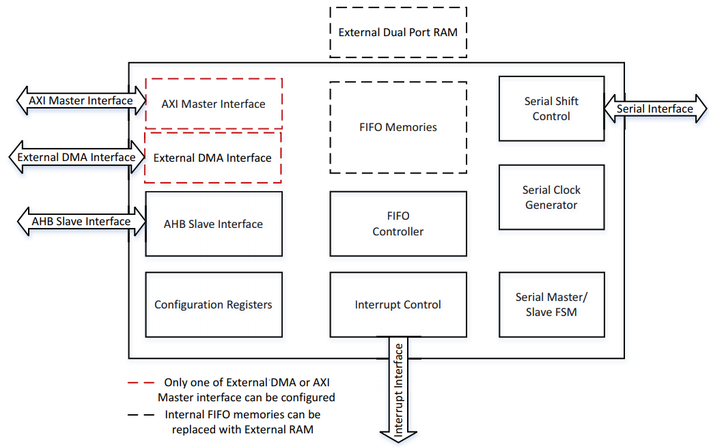

> [!NOTE]
> **学习提示：** 阅读该图时先分四层：左侧 AHB/AXI/DMA 是片上总线接口；中部 Configuration Registers、FIFO Controller 和 Interrupt Control 是控制器内部状态；右侧 Serial Shift Control、Serial Clock Generator 和 Master/Slave FSM 负责串行传输；最右侧 Serial Interface 才连接外部 SPI 设备。

> [!TIP]
> **理解答疑（非 TRM 原文）：CPU 配寄存器和内部 DMA 搬数据是否走同一条总线？**
>
> 不是。软件通过 AHB Slave Interface 访问控制器寄存器；启用内部 DMA 后，控制器作为 AXI Master 主动访问内存。FIFO 位于两者与串行移位逻辑之间：普通模式下软件经 `DRx` 填充或读取 FIFO，内部 DMA 模式下则由控制器通过 AXI 在内存与 FIFO 之间搬运数据。最终只有进入串行移位逻辑的数据才会出现在外部 SPI 引脚上。

### 12.3.3 功能说明

#### 12.3.3.1 外设总线时序

时钟极性配置参数 `SCPOL` 决定串行时钟空闲状态为高还是低。为了正确传输数据，通信双方必须配置相同的串行时钟相位 `SCPH` 和时钟极性 `SCPOL`。

当 `SCPH = 0` 时，从设备选择信号的下降沿启动数据传输。双方在串行时钟的第一个边沿采样第一个数据位，因此在第一个串行时钟边沿到来之前，`txd` 和 `rxd` 线上必须已经存在有效数据。图 12-3-2 给出了 `SCPH = 0` 时一次 SPI 数据传输的时序，并分别展示了 `SCPOL = 0` 和 `SCPOL = 1` 的串行时钟。

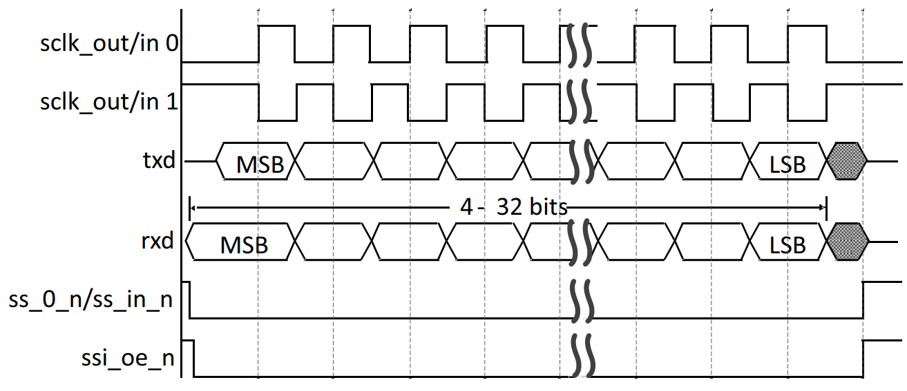

图中缩写含义如下：

- `MSB`：最高有效位（most significant bit）。
- `LSB`：最低有效位（least significant bit）。

当 `SCPH = 0` 时，连续数据传输支持两种工作方式，通过配置 `CTRLR0.SSTE` 选择：

- 当 `CTRLR0.SSTE = 1` 时，SPI 在相邻数据帧之间翻转从设备选择信号；从设备选择信号为高期间，串行时钟 `sclk` 保持默认值，如图 12-3-3 所示。

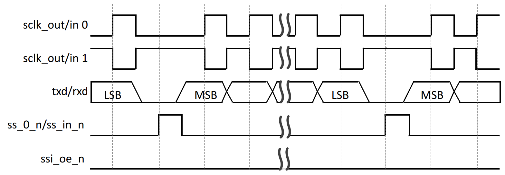

- 当 `CTRLR0.SSTE = 0` 时，从设备选择信号保持低电平，串行时钟在整个传输期间连续运行，如图 12-3-4 所示。

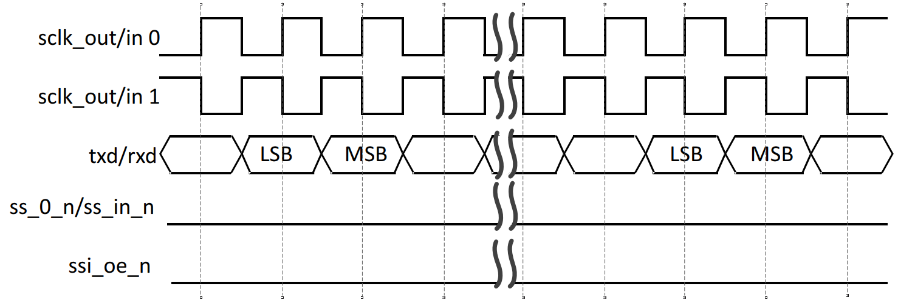

> [!NOTE]
> **原文译注：** TRM 此处的英文语序写成“CTRLR0 field of the SSTE register”，结合寄存器定义应理解为 `CTRLR0` 寄存器中的 `SSTE` 位域。

> [!TIP]
> **理解答疑（非 TRM 原文）：`SCPOL/SCPH`、`SSTE` 和 `SER` 分别控制什么？**
>
> - `SCPOL` 决定 `sclk` 的空闲电平，`SCPH` 决定第一个有效边沿用于采样还是用于推出数据；通信双方必须使用相同组合。
> - `SSTE` 只描述连续数据帧之间是否翻转从设备选择信号，主要影响帧与帧之间的边界形态。
> - `SER` 用来选择哪一条 `ss_x_n` 对应的外部设备可以参与传输。可以先把它理解为“选设备”，再由 `SSTE` 决定连续帧之间如何处理该设备的片选时序。

当 `SCPH = 1` 时，主设备和从设备在从设备选择线有效后的第一个串行时钟边沿开始发送数据，并在第二个（尾随）时钟边沿采样第一个数据位。主、从设备在串行时钟的前导边沿推出数据。连续传输多个数据帧时，从设备选择线可以一直保持低电平有效，直到最后一帧的最后一位被采样。图 12-3-5 给出了 `SCPH = 1` 时的 SPI 时序。

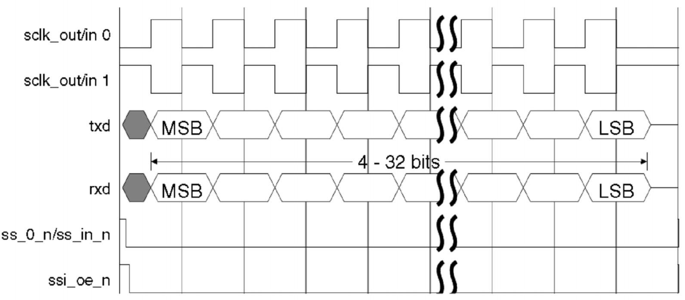

连续数据帧的传输方式与单帧相同：下一帧的 MSB 紧跟在当前帧的 LSB 之后。从设备选择信号在整个传输期间保持有效。图 12-3-6 给出了 `SCPH = 1` 时的连续传输时序。

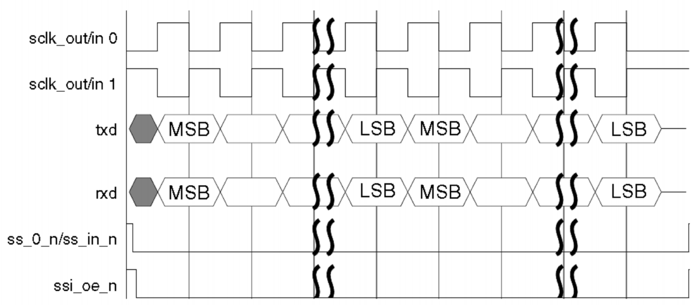

当 `CTRLR0.TMOD = 2'b00`，即发送并接收模式时，待发送到外部串行设备的数据写入 TX FIFO；从外部串行设备接收的数据压入 RX FIFO。图 12-3-7 展示了串行传输开始前和结束后的 FIFO 水位。示例中，SPI 连续发送两个数据字，外部设备同时返回两个数据字。

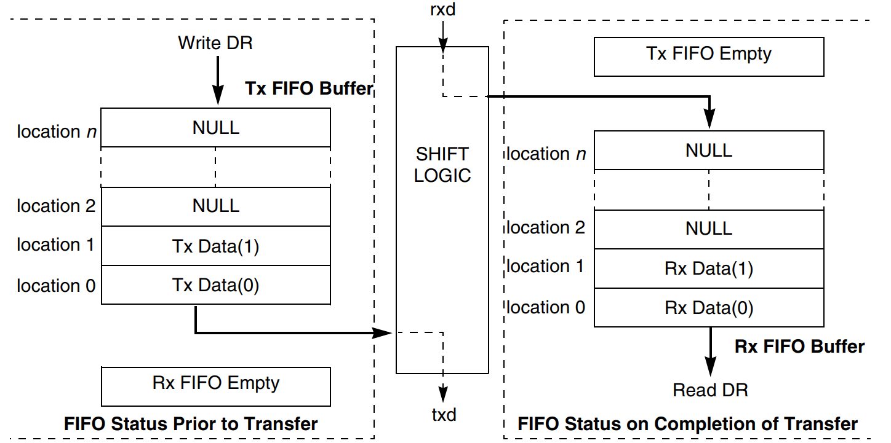

当 `CTRLR0.TMOD = 2'b01`，即仅发送模式时，待发送数据写入 TX FIFO；由于从外部串行设备接收的数据被视为无效，因此不会写入 RX FIFO。图 12-3-8 的示例连续发送两个数据字。

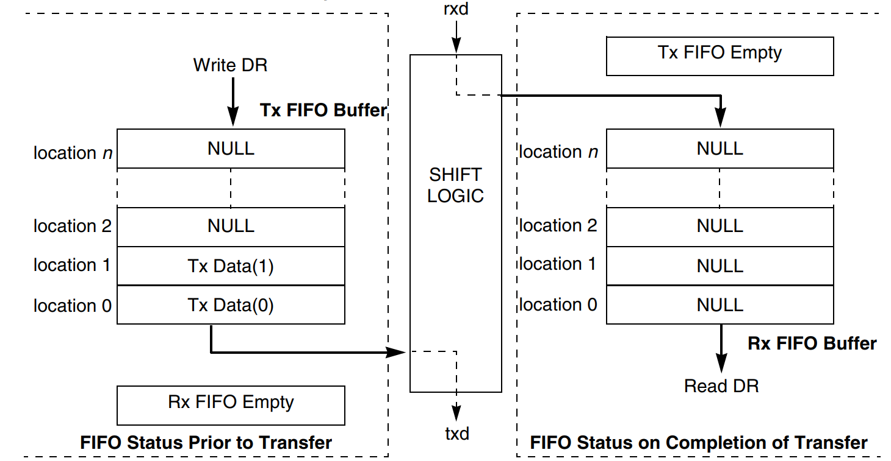

当 `CTRLR0.TMOD = 2'b10`，即仅接收模式时，发送到外部串行设备的数据无效。软件需要向 TX FIFO 写入一个 dummy word 以启动串行传输；整个传输期间，SPI 的 `txd` 输出保持固定逻辑电平。从外部设备接收的数据压入 RX FIFO。图 12-3-9 的示例连续接收两个数据字。

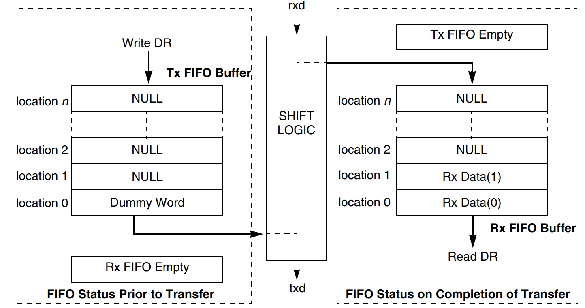

当 `CTRLR0.TMOD = 2'b11`，即 `eeprom_read` 模式时，操作码和/或 EEPROM 地址写入 TX FIFO。发送这些控制帧期间，SPI Master 不采集接收数据；控制帧发送完成后，来自 EEPROM 的数据才写入 RX FIFO。图 12-3-10 的示例向 EEPROM 发送一个操作码、地址高部和地址低部，然后读取 8 个数据帧并存入 SPI Master 的 RX FIFO。

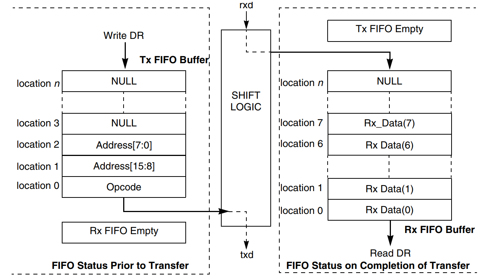

> [!NOTE]
> **学习提示：** `TMOD` 决定 TX FIFO 和 RX FIFO 中哪些数据有效。仅接收模式仍需用一个 dummy word 启动时钟；`eeprom_read` 则先发送指令/地址控制帧，再开始把返回数据存入 RX FIFO。

> [!TIP]
> **理解答疑（非 TRM 原文）：四种 `TMOD` 应怎样快速区分？dummy word 和 dummy cycle 是一回事吗？**
>
> | `TMOD` | TX FIFO 内容 | RX FIFO 内容 | 典型理解 |
> |---|---|---|---|
> | `0` | 有效 | 有效 | 每发送一帧，同时接收一帧 |
> | `1` | 有效 | 丢弃 | 只关心向外发送的数据 |
> | `2` | 仅用于启动时钟 | 有效 | 写入 dummy word 触发串行时钟，接收指定帧数 |
> | `3` | 指令/地址等控制帧 | 控制帧结束后有效 | 先发控制信息，再连续接收数据 |
>
> dummy word 是写入 TX FIFO 的一个数据帧，用来让普通 RX-only 模式产生时钟；dummy cycle 是增强 SPI 事务中由 `WAIT_CYCLES` 描述的若干空等待时钟。两者都与“等待接收”有关，但所在阶段、配置方式和计量单位不同。

#### 12.3.3.2 RXD 采样延迟

设计中可以加入额外逻辑，以延后 `rxd` 信号的默认采样时刻。该逻辑有助于提高串行总线可达到的最高频率。SPI 使用 `RX_SAMPLE_DLY` 配置改变 `rxd` 的采样点。

- 当 TRM 所述 `RX_SAMPLE_DLY` 边沿选择字段为 0 时，SPI 将采样点延迟配置的 `ssi_clk` 周期数。
- 当该字段为 1 时，SPI 将采样点延迟“配置的 `ssi_clk` 周期数 + `0.5 × ssi_clk` 周期”，即在 `ssi_clk` 下降沿采样，如图 12-3-11 所示。

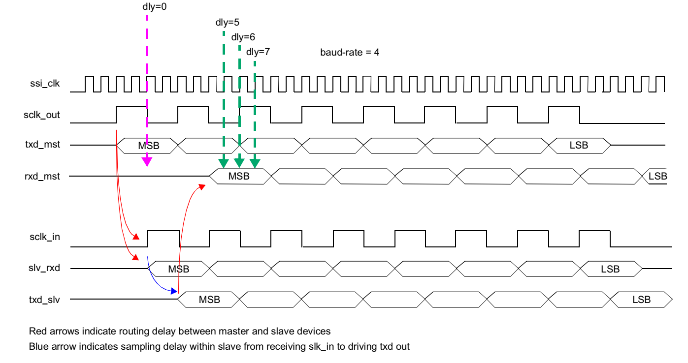

从设备以主设备输出的 `sclk_out` 作为选通信号，在串行总线上驱动 `rxd` 数据。`sclk_out` 到从设备的布线延迟、从设备内部响应延迟以及 `rxd` 返回主设备的布线延迟，可能导致主设备在默认采样时刻到来时，`rxd` 尚未稳定到正确值。图 12-3-11 展示了该类延迟如何造成错误采样。

只有当配置参数 `SSIC_HAS_RX_SAMPLE_DELAY = 2`（同时使用正边沿和负边沿）时，TRM 所述的半周期采样能力才可用。

> [!NOTE]
> **原文译注：** 该段多次写成“`RX_SAMPLE_DLY field of the SE register`”，且中途将图号写成“Figure 12-11”。本文按上下文保留其采样延迟语义；实际寄存器名称和位域应以本节后续 `RX_SAMPLE_DELAY` 寄存器定义为准。

> [!TIP]
> **理解答疑（非 TRM 原文）：为什么调整的是 `ssi_clk` 采样点，而不是直接写一个 `sclk_out` 相位？**
>
> `sclk_out` 是控制器向外设输出的串行时钟，`ssi_clk` 是控制器内部工作的时钟。外设依据 `sclk_out` 返回数据，但数据经过板级往返布线和外设响应后，最终仍由控制器内部的 `ssi_clk` 域采样。`RX_SAMPLE_DELAY.RSD` 以完整 `ssi_clk` 周期增加延迟，`SE` 再决定是否额外移动到下降沿；它补偿的是返回数据到达控制器内部采样点的时间，而不是改变 SPI 协议规定的 `SCPOL/SCPH`。

#### 12.3.3.3 时钟比率

`sclk_out` 的频率由下式得到：

```text
Fsclk_out = Fssi_clk / SCKDV
```

其中，`SCKDV` 是可编程寄存器值，可以设置为 0–65,534 范围内的任意偶数。

- `SCKDV = 0` 时，`sclk_out` 禁用。
- 只有存在有效传输时，`sclk_out` 才会翻转。
- 其他时间，`sclk_out` 保持串行协议定义的空闲状态。

图 12-3-12 给出了 `sclk_out` 与 `ssi_clk` 的最大频率比率。

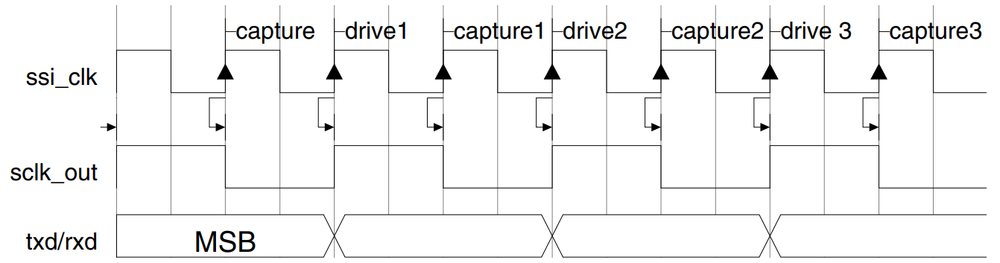

> [!NOTE]
> **学习提示：** `BAUDR.SCKDV` 不是任意整数分频器。有效分频值必须为偶数；值为 0 不是“不分频”，而是直接关闭 `sclk_out`。

> [!TIP]
> **理解答疑（非 TRM 原文）：请求一个 SPI 频率后，真正输出的一定等于该值吗？**
>
> 不一定。控制器只能使用偶数 `BAUDR`，实际频率为 `Fssi_clk / BAUDR`。因此软件需要先知道当前实例的 `ssi_clk`，再选择合法分频值；实例标注的 100 MHz 或 200 MHz 是 SDK 施加的最高频率上限，不代表每次配置都会输出该频率。

#### 12.3.3.4 内部 DMA 功能

SPI 内部 DMA 用于在内部存储器（或片上存储器）与外部 SPI 设备之间传输数据。

- 内部 DMA 仅支持 Dual/Quad SPI 工作模式。
- 启用内部 DMA 后，通过 AHB Slave Interface 读写数据寄存器 `DR` 会返回错误响应。
- 内部 DMA 模式不支持 Data Mask 功能。
- 内部 DMA 操作中，SPI 接口上的地址长度最大为 32 位。

##### 写操作

写操作中，内部存储器是源，SPI 设备是目的端。SPI 通过 AXI Master Interface 读取数据，再通过 SPI 接口发送给外部设备。编程步骤如下：

1. 设置 `CTRLR0.TMOD = 1`，选择 SPI 写操作。
2. 设置 `CTRLR0.SPI_FRF`，选择 SPI 传输的帧格式。
3. 通过 `CTRLR0`、`BAUDR`、`TXFTLR.TXFTHR` 和 `SPI_CTRLR0` 设置 SPI 传输特性。
4. 通过 `CTRLR1.NDF` 设置要发送给设备的数据量。
5. 设置 `DMACR.IDMAE`，启用 DMA 传输。
6. 通过 `DMACR.ATW` 设置源传输宽度。
7. 通过 `DMACR.AID`、`DMACR.AINC`、`DMACR.APROT`、`DMACR.ACACHE` 和 `AXIARLEN.ARLEN` 设置 AXI 传输特性。
8. 通过 `AXIAR0` 和 `AXIAR1` 设置源地址。
9. 通过 `SPIAR` 设置 SPI 设备目的地址。
10. 通过 `SPIDR.SPI_INST` 设置指令码。
11. 写 `SSIENR` 使能 SPI。使能后，SPI 根据 AXI 配置从源地址取数。AXI 按 `AXIARLEN.ARLEN` 配置的 burst 长度持续取数，直到 FIFO 剩余空间小于该 burst 长度的解码值。为了充分利用 TX FIFO，建议让单个 AXI burst 的读取量与 FIFO 深度形成整数倍关系。

当 `DMACR.AINC = 0` 时，每次 AXI burst 请求完成后，`AXIAR0` 中的 AXI 地址递增到下一个地址。TX FIFO 中的数据达到 `TXFTLR.TXFTHR` 指定的数量后，SPI 使用 `SPIDR.SPI_INST` 中的指令码和 `SPIAR.SDAR` 中的设备地址启动 SPI 操作，整个块传输在一次 block 中完成。

- 如果 TX FIFO 变空且未启用 clock stretching，SPI 撤销从设备选择并产生 TX FIFO underflow 中断。
- 如果启用了 clock stretching，SPI 会拉伸时钟，直到数据可用。
- 发送完要求的数据后，SPI 清除 `SSIENR`，并向软件提供 `ssi_done_intr(_n)` 中断。

在控制器开始 SPI 写操作之前，必须确保外部 SPI 从设备已经允许写入且不处于 busy 状态，否则从设备侧可能无法正确完成传输。

##### 读操作

SPI 读操作中，SPI 设备是源，内部存储器是目的端。SPI 从串行接口接收数据，再通过 AXI Master Interface 写入内部存储器。编程步骤如下：

1. 设置 `CTRLR0.TMOD = 2'b10`，选择 SPI 读操作。
2. 设置 `CTRLR0.SPI_FRF`，选择 SPI 传输的帧格式。
3. 通过 `CTRLR0`、`BAUDR` 和 `SPI_CTRLR0` 设置 SPI 传输特性。
4. 通过 `CTRLR1.NDF` 设置数据量。
5. 设置 `DMACR.IDMAE`，启用 DMA 传输。
6. 通过 `DMACR.ATW` 设置传输宽度。
7. 通过 `DMACR.AID`、`DMACR.AINC`、`DMACR.APROT`、`DMACR.ACACHE` 和 `AXIAWLEN.AWLEN` 设置 AXI 传输特性。
8. 按 TRM 原文，通过 `AXIAR0` 和 `AXIAR1` 设置地址。
9. 通过 `SPIAR` 设置 SPI 设备地址。
10. 通过 `SPIDR.SPI_INST` 设置指令码。
11. 写 `SSIENR` 使能 SPI。SPI 使用指令码和 `SPIAR.SDAR` 中的地址启动传输，接收的数据先进入 RX FIFO；当 RX FIFO 中的数据量大于或等于 `AXIAWLEN.AWLEN` 对应的数量时，SPI 开始 AXI 写操作。该过程持续到 `CTRLR1.NDF` 指定的整个数据块都写入 AXI 目的端。

当 `DMACR.AINC = 0` 时，每次 AXI burst 请求完成后，AXI 地址递增到下一个地址。若 RX FIFO 已满且未启用 clock stretching，SPI 撤销当前从设备选择，并从下一个连续地址重新开始读传输；若启用了 clock stretching，则 SPI 拉伸时钟，等待 FIFO 释放空间后继续接收。接收完要求的数据后，SPI 清除 `SSIENR` 并向软件产生中断。

##### AXI Master Interface

SPI 使用包含五个通道的 AXI 接口完成内部 DMA。AXI 使用独立时钟 `aclk` 和复位信号 `aresetn`，其控制信号由编程寄存器生成。

读传输（`CTRLR0.TMOD = 2'b10`）对应的 AXI 写通道映射如下：

| AXI 信号 | 寄存器字段/固定行为 |
|---|---|
| `awid/wid` | `DMACR.AID` |
| `awaddr[31:0]` | `AXIAR0`；地址应与 `awsize` 地址边界对齐 |
| `awaddr[63:32]` | `AXIAR1` |
| `awsize` | `DMACR.ATW` |
| `awburst` | `DMACR.AINC`：`AINC=0` 为 INCR burst，`AINC=1` 为 FIXED burst；不支持 WRAP |
| `awlock` | 固定为 `2'b00`；SPI 不支持 locked 或 exclusive access |
| `awcache` | `DMACR.ACACHE` |
| `awprot` | `DMACR.APROT` |

写传输（`CTRLR0.TMOD = 2'b01`）对应的 AXI 读通道映射如下：

| AXI 信号 | 寄存器字段/固定行为 |
|---|---|
| `arid` | `DMACR.AID` |
| `araddr[31:0]` | `AXIAR0`；地址应与 `arsize` 地址边界对齐 |
| `araddr[63:32]` | `AXIAR1` |
| `arsize` | `DMACR.ATW` |
| `arburst` | `DMACR.AINC`：`AINC=0` 为 INCR burst，`AINC=1` 为 FIXED burst；不支持 WRAP |
| `arlock` | 固定为 `2'b00`；SPI 不支持 locked 或 exclusive access |
| `arcache` | `DMACR.ACACHE` |
| `arprot` | `DMACR.APROT` |

AXI Write Response 或 Read Data 通道可能返回错误响应。发生该情况时，SPI 会立即撤销从设备选择、终止传输、禁用 SPI，并置位 `ssi_axie_intr(_n)`。内部 FIFO 中的数据会被清空。SPI 还会更新 `SR.CMPLTD_DF`，记录上一次 DMA 传输中成功完成的数据量；软件可利用该字段定位错误位置和已成功传输的数据量。

> [!NOTE]
> **学习提示：** 这里的“SPI 写/读”按外部 SPI 设备视角命名。SPI 写时，AXI 从内存读取后送入 TX FIFO；SPI 读时，RX FIFO 收到的数据通过 AXI 写回内存，所以两种方向分别使用 AXI 读通道和 AXI 写通道。

> [!TIP]
> **理解答疑（非 TRM 原文）：内部 DMA 与 `TDMAE/RDMAE` 所代表的 FIFO DMA 有什么区别？**
>
> `TDMAE/RDMAE` 是让控制器向外部 DMA 控制器发出 TX/RX FIFO 请求，数据搬运仍由外部 DMA 完成；`IDMAE` 则启用本章描述的内部 DMA，SPI 控制器自己作为 AXI Master 访问 `AXIAR0/1` 指向的内存。K230 SDK 定义 `SSIC_HAS_DMA = 2`，并在多线有数据传输时使用 `IDMAE`，所以其多线路径对应后者。判断数据方向时始终以外部 SPI 设备为参照：SPI 写对应 AXI 读内存，SPI 读对应 AXI 写内存。

#### 12.3.3.5 增强 SPI 模式

SPI 通过 `SSIC_SPI_MODE` 配置参数支持 Standard、Dual SPI 和 Quad SPI。选择 Dual 或 Quad 模式后，`txd`、`rxd` 和 `ssi_oe_n` 的信号宽度分别变为 2 或 4，数据可以同时通过多条线移入或移出，从而提高吞吐率。Dual SPI 与 Quad SPI 的功能基本一致，主要区别是这些信号的宽度。读写方向通过 `CTRLR0.TMOD` 选择。

##### 增强 SPI 写操作

写操作使用以下寄存器字段：

- `CTRLR0.SPI_FRF`：指定当前帧采用的传输格式。
- `SPI_CTRLR0`：指定指令、地址和数据相关长度。
- `SPI_CTRLR0.INST_L`：指定指令长度，可选 0、4、8 或 16 位。
- `SPI_CTRLR0.ADDR_L`：指定地址长度。
- `CTRLR0.DFS`：指定数据长度。

一条指令占用一个 FIFO 位置；地址可能占用多个 FIFO 位置。指令和地址都必须通过数据寄存器 `DR` 写入。

##### 增强 SPI 读操作

通过 `SPI_CTRLR0.WAIT_CYCLES` 配置等待周期。等待周期用于给目标从设备留出从输入模式切换到输出模式的时间，不同设备需要的等待周期可能不同。

执行读操作时，SPI 只发送一次指令和控制数据，然后等待接收 `CTRLR1.NDF` 指定数量的数据帧，最后撤销从设备选择信号。

启动 Dual/Quad/Octal 读操作时，TRM 要求根据模式设置 `CTRLR0.SPI_FRF`。设置传输类型后，每条读命令的数据均按 `CTRLR0.SPI_FRF` 指定的格式传输。

> [!NOTE]
> **原文译注：** TRM 先将 `SSIC_SPI_MODE` 的可选值描述为 Standard、Dual 和 Quad，随后又写到 Dual/Quad/Octal 读操作，并给出不完整的“01/10 respectively”取值说明。本文不据此补写缺失枚举；准确编码以 `CTRLR0.SPI_FRF` 的寄存器位域定义为准。

> [!TIP]
> **理解答疑（非 TRM 原文）：增强 SPI 的“一条命令”应拆成哪些阶段？**
>
> 可以按“指令 → 地址 → 等待 → 数据”四个阶段阅读。`INST_L` 和 `ADDR_L` 决定前两个阶段是否存在及长度，`WAIT_CYCLES` 决定接收数据前等待多少串行时钟，`DFS` 和 `NDF` 决定数据阶段每帧多少位、共有多少帧。`SPI_FRF` 指定增强数据格式，`TRANS_TYPE` 再决定指令和地址阶段继续使用 Standard SPI，还是改用同样的多线格式。所谓 Quad/Octal 事务不等于所有阶段必然都使用 4/8 条线。
>
> 还要避免混淆三个相近字段：`CTRLR0.FRF` 选择基础串行帧协议，本章列出的有效形态是 Motorola SPI；`CTRLR0.SPI_FRF` 选择 Standard/Dual/Quad/Octal 数据格式；`SPI_CTRLR0.TRANS_TYPE` 只进一步决定指令和地址阶段使用单线还是 `SPI_FRF` 指定的多线格式。

<a id="k230-register-summary"></a>

### 12.3.5 寄存器汇总与 K230 实现裁决

本节以 TRM 12.3 的寄存器表为骨架，直接合并 TRM 5.3 FMC、K230 SDK 和 QEMU 实现结论。`中文说明` 保留原寄存器用途；`读取实现` 明确 MMIO read 应返回的数据及读取副作用，`写入实现/触发行为` 明确 MMIO write 的掩码、状态变化和启动条件；`K230 采用/限制`、`等级` 和 `依据` 是学习与实现补充，不是 TRM 原始表头。

实现等级统一为：`A` 表示必须完整实现行为，`B` 表示 TRM/实例布局支持字段存在、先实现掩码与读回且复杂行为可后补，`C` 表示固定值/动态只读/读取清除，`D` 表示条件布局、互斥综合配置、DTS/IRQ 排除或真机证据支持当前 K230 profile 按 RAZ/WI，`E` 表示属于 SPI 控制器之外的 SoC 包装寄存器。软件没有使用某字段只能说明当前路径不依赖它，不能单独作为 `D` 级证据。

| 偏移地址 | 寄存器 | 中文说明 | 读取实现 | 写入实现/触发行为 | K230 采用/限制 | 等级 | 依据 |
|---|---|---|---|---|---|---:|---|
| `0x000` | `CTRLR0` | 控制寄存器 0 | 返回保存值与 implemented_mask 的交集；保留位和未实现位返回 0。 | 按 writable_mask 合并保存；配置 DFS/TMOD/SPI_FRF 等，影响后续事务，不单独启动传输。 | 可写掩码 `0x01cf7f1f`；`DFS/TMOD/SPI_FRF/SCPOL/SCPH` 进入事务行为，`CFS/SLV_OE/SRL/SSTE/SPI_HYPERBUS_EN` 保存读回；HyperBus 位当前不产生事务副作用 | `A/B` | `T12-R`、`RT/UB-ACT/LX-ACT/HW` |
| `0x004` | `CTRLR1` | 控制寄存器 1 | 返回保存的 NDF[15:0]，高 16 位返回 0。 | 只保存 NDF[15:0]；后续 RX-only、EEPROM read 或增强传输按 NDF+1 计算帧数。 | `NDF[15:0]` 可写，决定 `NDF+1` 帧 | `A` | `T12-R`、`RT/UB-ACT/LX-ACT` |
| `0x008` | `SSIENR` | SSI 使能寄存器 | 返回当前 SSIC_EN 状态。 | 写 0 立即停止传输并清空 TX/RX FIFO；写 1 使能控制器，在片选和数据条件满足时启动。 | 仅 bit 0；清零停止传输并清空 TX/RX FIFO | `A` | `T12-F/T12-R` |
| `0x00c` | `MWCR` | Microwire 控制寄存器 | 返回当前实现字段的保存值；未实现的 MHS 按裁决返回 0。 | 按实现字段掩码保存 MWMOD/MDD；当前 Motorola SPI 路径不产生 Microwire 行为。 | `MWMOD/MDD` 按 TRM R/W 保存读回，当前 Motorola SPI 路径不产生 Microwire 副作用；`MHS` 待集成证据 | `B/D` | `T12-R`、`RT/UB-ACT/LX-ACT/HW` |
| `0x010` | `SER` | 从设备使能寄存器 | 返回当前有效片选位；超出实例 num-cs 的位返回 0。 | 只保存实例有效片选位；改变下一传输使用的硬件片选，单独写 SER 不启动传输。 | 按实例 `num-cs` 生成有效掩码；Linux DTS 为 1，U-Boot DTS 的 spi1/spi2 为 5 | `A` | `DTS`、`RT/UB-ACT/LX-ACT` |
| `0x014` | `BAUDR` | 波特率选择寄存器 | 返回当前偶数分频值；bit 0 和高 16 位返回 0。 | 清除 bit 0 后保存偶数分频值；更新后续 sclk_out 频率，写 0 禁止串行时钟。 | 可写 `0x0000fffe`；bit 0 固定为 0，值 0 禁止输出串行时钟 | `A` | `T12-F/T12-R` |
| `0x018` | `TXFTLR` | TX FIFO 水位阈值寄存器 | 返回保存的 TXFTHR 与 TFT；字段间保留位返回 0。 | 按字段掩码保存；非法 TFT 保持原值；更新传输起步条件和 TXE 水位判断。 | `TXFTHR[26:16]`、`TFT[7:0]`，可写 `0x07ff00ff` | `A` | `T12-R`、`RT` |
| `0x01c` | `RXFTLR` | RX FIFO 水位阈值寄存器 | 返回保存的 RFT[7:0]，其余位返回 0。 | 保存合法 RFT；更新 RXF 水位判断，不直接搬运 FIFO 数据。 | `RFT[7:0]`，可写 `0xff` | `A` | `T12-R`、`RT` |
| `0x020` | `TXFLR` | TX FIFO 水位寄存器 | 实时返回 TX FIFO 当前有效项数，不读取普通保存数组。 | 写入忽略。 | 动态返回 256 项 TX FIFO 当前数量，需 9 位表示 0–256 | `C` | `T12-R`、`RT` |
| `0x024` | `RXFLR` | RX FIFO 水位寄存器 | 实时返回 RX FIFO 当前有效项数，不读取普通保存数组。 | 写入忽略。 | 动态返回 256 项 RX FIFO 当前数量 | `C` | `T12-R`、`RT` |
| `0x028` | `SR` | 状态寄存器 | 根据 BUSY、FIFO 状态、错误和 IDMA 完成帧数实时计算返回值。 | 写入忽略。 | 根据 FIFO、BUSY、错误和 IDMA 完成帧数动态计算 | `C` | `T12-R` |
| `0x02c` | `IMR` | 中断屏蔽寄存器 | 返回当前中断使能掩码与有效 mask 0x9bf 的交集。 | 只更新有效 mask 0x9bf 内的位，并立即重新计算九路外部 IRQ 输出。 | 有效掩码 `0x9bf`；复位裁决为 `0x3f` | `A` | `T12-R/T53-R`、`RT/DTS` |
| `0x030` | `ISR` | 中断状态寄存器 | 实时返回 RISR 与 IMR 屏蔽后的状态；读取本身不清除事件。 | 写入忽略；必须通过对应 RC 寄存器或解除水位条件清除状态。 | 动态返回 `RISR & IMR & 0x9bf` | `C` | `T12-R` |
| `0x034` | `RISR` | 原始中断状态寄存器 | 返回 FIFO 水位条件和锁存错误组成的原始中断状态；读取本身不清除。 | 写入忽略；必须处理事件根因或读取对应清除寄存器。 | 由 FIFO 水位和锁存事件产生，有效掩码 `0x9bf` | `C` | `T12-R`、`RT/DTS` |
| `0x038` | `TXEICR` | TX FIFO 错误中断清除寄存器 | 返回 TXO/TXU 锁存是否有效，并在本次读取后清除对应锁存。 | 写入忽略。 | 读取清除 TXO/TXU，写入忽略 | `C` | `T12-R` |
| `0x03c` | `RXOICR` | RX FIFO 溢出中断清除寄存器 | 返回 RXO 锁存状态，并在本次读取后清除 RXO。 | 写入忽略。 | 读取清除 RXO，写入忽略 | `C` | `T12-R` |
| `0x040` | `RXUICR` | RX FIFO 下溢中断清除寄存器 | 返回 RXU 锁存状态，并在本次读取后清除 RXU。 | 写入忽略。 | 读取清除 RXU，写入忽略 | `C` | `T12-R` |
| `0x044` | `MSTICR` | 多主机中断清除寄存器 | 返回 MST 锁存状态，并在本次读取后清除 MST。 | 写入忽略。 | 读取清除 MST，写入忽略 | `C` | `T12-R` |
| `0x048` | `ICR` | 中断清除寄存器 | 返回 TXO/RXU/RXO/MST 的聚合状态，并在读取后清除这些锁存。 | 写入忽略。 | 读取清除 TXO/RXU/RXO/MST；TXU 由 `TXEICR` 清除 | `C` | `T12-R` |
| `0x04c` | `DMACR` | DMA 控制寄存器 | 返回 DMACR 实现字段的保存值；保留位及互斥外部 DMA 位返回 0。 | 按 0x0007ff5c 保存；IDMAE 使能内部 DMA 配置，清零 IDMAE 停止后续 DMA 搬运。 | 内部 DMA profile；可写 `0x0007ff5c`，`IDMAE/AINC/ATW` 参与搬运 | `A/B` | `T12-F/T12-R`、`RT/UB-ACT/LX-ACT` |
| `0x050` | `DMATDLR` | 外部 DMA 发送水位寄存器 | 当前 K230 内部 DMA 布局下返回 0；同一偏移实际读取 AXIAWLEN。 | 写入忽略；同一偏移按 AXIAWLEN 规则处理。 | 与 K230 的 `SSIC_HAS_DMA=2` 内部 DMA 布局互斥，当前地址按 `AXIAWLEN` 实现 | `D` | `RT/UB-ACT` |
| `0x050` | `AXIAWLEN` | 内部 DMA目的端 burst 长度 | 返回保存的 AWLEN[15:8]，其他位返回 0。 | 只保存 AWLEN[15:8]；改变内部 DMA 写内存时的 AXI burst 配置。 | `AWLEN[15:8]` 可写，mask `0xff00` | `A` | `T12-R`、`RT/UB-ACT/LX-ACT` |
| `0x054` | `DMARDLR` | 外部 DMA 接收水位寄存器 | 当前 K230 内部 DMA 布局下返回 0；同一偏移实际读取 AXIARLEN。 | 写入忽略；同一偏移按 AXIARLEN 规则处理。 | 与 K230 的 `SSIC_HAS_DMA=2` 内部 DMA 布局互斥，当前地址按 `AXIARLEN` 实现 | `D` | `RT/UB-ACT` |
| `0x054` | `AXIARLEN` | 内部 DMA源端 burst 长度 | 返回保存的 ARLEN[15:8]，其他位返回 0。 | 只保存 ARLEN[15:8]；改变内部 DMA 读内存时的 AXI burst 配置。 | `ARLEN[15:8]` 可写，mask `0xff00` | `A` | `T12-R`、`RT/UB-ACT/LX-ACT` |
| `0x058` | `IDR` | 标识寄存器 | 固定返回 0xa1b2c3d5。 | 写入忽略。 | 固定只读 `0xa1b2c3d5` | `C` | `T12-R/T53-R` |
| `0x05c` | `SSIC_VERSION_ID` | 组件版本寄存器 | 固定返回 0x3130332a。 | 写入忽略。 | 固定只读 `0x3130332a` | `C` | `T12-R/T53-R` |
| `0x060–0x0ec` | `DR0–DR35` | 数据寄存器 | 从 RX FIFO 弹出并返回一帧；按 DFS+1 截断、右对齐，同时更新水位和状态。 | 按 DFS+1 截断后压入 TX FIFO；满时锁存 TXO，控制器已使能且片选有效时可推进传输。 | 36 个地址均为同一 FIFO 数据口别名；按 `DFS+1` 截断并右对齐 | `A` | `T12-R`、`RT dr[36]` |
| `0x068` | `SSI_CTRL` | TRM 混入的 SoC 控制寄存器 | 在 0x91585068 返回 HI_SYS_CONFIG 控制位与三个实例状态；SPI base+0x068 按 DR2 读取。 | 仅在 0x91585068 更新可写包装位，如 spi0_xip_en 与 RXDS 配置；SPI base+0x068 按 DR2 写入 TX FIFO。 | 不属于 SPI `base+0x068`；实际地址 `0x91585068`，SPI 此偏移是 `DR2` | `E` | `MAP`、`UB-ACT`、`RT` |
| `0x0f0` | `RX_SAMPLE_DELAY` | RX 采样延迟寄存器 | 返回保存的 SE[16] 与 RSD[7:0]，其他位返回 0。 | 只更新 SE[16] 与 RSD[7:0]；影响后续接收采样配置，不直接启动传输。 | `SE[16]`、`RSD[7:0]` 可写，mask `0x000100ff` | `A` | `T12-R`、`RT/UB-ACT/LX-ACT` |
| `0x0f4` | `SPI_CTRLR0` | SPI 控制寄存器 0 | 返回当前 profile 的实现位和保存值；未实现位返回 0。 | 按 profile 实现掩码保存；配置指令、地址、dummy、DDR 与 XIP 格式，影响后续增强事务。 | 实现位掩码 `0x6f3ffbbf`；`spi0` 复位 `0x28000200`，`spi1/2` 复位 `0x04000200` | `A/B` | `T12-R/T53-R`、`RT/UB-ACT/LX-ACT/HW` |
| `0x0f8` | `DDR_DRIVE_EDGE` | 发送驱动边沿寄存器 | 返回保存的 TDE[7:0]，高 24 位返回 0。 | 只保存 TDE[7:0]；用于后续 DDR 发送边沿配置。 | 低 8 位可写；先保证掩码与读回 | `B` | `T12-R/T53-R`、`UB-ACT/LX-ACT` |
| `0x0fc` | `XIP_MODE_BITS` | 5.3 XIP mode bits | 返回低 16 位 mode bits 保存值；高 16 位返回 0。 | 只保存低 16 位；spi0 后续 XIP mode-bits 阶段使用。 | 低 16 位；`spi0` 参与 XIP，`spi1/2` 仅保留读回 | `A/B` | `T53-R`、`RT` |
| `0x100` | `XIP_INCR_INST` | 5.3 XIP INCR 指令 | 返回低 16 位 INCR XIP 指令保存值。 | 只保存低 16 位；spi0 后续 INCR 类型 XIP 访问使用。 | 低 16 位；`spi0` XIP 指令 | `A/B` | `T53-R`、`RT` |
| `0x104` | `XIP_WRAP_INST` | 5.3 XIP WRAP 指令 | 返回低 16 位 WRAP XIP 指令保存值。 | 只保存低 16 位；spi0 后续 WRAP 类型 XIP 访问使用。 | 低 16 位；`spi0` XIP 指令 | `A/B` | `T53-R`、`RT` |
| `0x108` | `XIP_CTRL` | 5.3 concurrent XIP 控制 | 当前 profile 未启用 concurrent XIP，返回 0。 | 写入忽略，RAZ/WI。 | 当前 `SSIC_CONCURRENT_XIP_EN` 未启用，RAZ/WI | `D` | `T53-R`、`RT` 条件布局 |
| `0x10c` | `XIP_SER` | 5.3 XIP 片选 | 当前 profile 未启用 concurrent XIP，返回 0。 | 写入忽略，RAZ/WI。 | 当前 concurrent XIP profile 未启用，RAZ/WI | `D` | `T53-R`、`RT` |
| `0x110` | `XRXOICR` | 5.3 XIP RX overflow 清除 | 当前 profile 不产生 XRXO 事件，返回 0，也没有事件可清除。 | 写入忽略。 | 当前无 XRXO IRQ，RAZ/WI | `D` | `T53-R`、`RT/DTS` |
| `0x114` | `XIP_CNT_TIME_OUT` | 5.3 连续 XIP 超时 | 当前 profile 未启用 concurrent XIP，返回 0。 | 写入忽略，RAZ/WI。 | 当前 concurrent XIP profile 未启用，RAZ/WI | `D` | `T53-R`、`RT` |
| `0x118` | `SPI_CTRLR1` | 动态等待状态控制 | 当前 profile 未集成动态等待状态，返回 0。 | 写入忽略，RAZ/WI。 | SDK 将该地址保留，RAZ/WI | `D` | `T12-R/T53-R`、`RT` |
| `0x11c` | `SPITECR` | SPI 发送错误清除寄存器 | 当前 profile 不产生 SPITE 事件，返回 0。 | 写入忽略。 | 动态等待状态未集成，RAZ/WI | `D` | `T12-R/T53-R`、`RT` |
| `0x120` | `SPIDR` | 内部 DMA SPI 指令寄存器 | 返回保存的 SPI_INST[15:0]。 | 只保存 SPI_INST[15:0]；后续内部 DMA SPI 事务把它作为指令阶段内容。 | 低 16 位可写并参与 IDMA 事务 | `A` | `T12-R/T53-R`、`RT/UB-ACT/LX-ACT` |
| `0x124` | `SPIAR` | 内部 DMA SPI 地址寄存器 | 返回保存的 32 位外部 SPI 设备地址。 | 保存 32 位外部设备地址；后续内部 DMA SPI 事务使用。 | 32 位可写并参与 IDMA 事务 | `A` | `T12-R/T53-R`、`RT/UB-ACT/LX-ACT` |
| `0x128` | `AXIAR0` | 内部 DMA 内存地址低位 | 返回内部 DMA guest memory 地址低 32 位。 | 保存 guest memory 地址低 32 位；与 AXIAR1 组合供后续内部 DMA 使用。 | 与 `AXIAR1` 组合成 64 位 guest physical address | `A` | `T12-R`、`RT/UB-ACT/LX-ACT` |
| `0x12c` | `AXIAR1` | 内部 DMA 内存地址高位 | 返回内部 DMA guest memory 地址高 32 位。 | 保存 guest memory 地址高 32 位；与 AXIAR0 组合供后续内部 DMA 使用。 | 当前按高 32 位实现 | `A` | `T12-R`、`RT` |
| `0x130` | `AXIECR` | AXI Master 错误中断清除 | 返回 AXI error 锁存状态，并在本次读取后清除 AXIE。 | 写入忽略。 | 读取清除 AXIE，写入忽略 | `C` | `T12-R`、`RT/UB-ACT/LX-ACT` |
| `0x134` | `DONECR` | 传输完成中断清除 | 返回内部 DMA DONE 锁存状态，并在本次读取后清除 DONE。 | 写入忽略。 | 读取清除 DONE，写入忽略 | `C` | `T12-R`、`RT/UB-ACT/LX-ACT` |
| `0x138–0x13c` | 保留 | SDK 结构体保留区 | 返回 0。 | 写入忽略。 | RAZ/WI | `D` | `RT` |
| `0x140` | `XIP_WRITE_INCR_INST` | 5.3 XIP write INCR 指令 | 当前 profile 未启用 XIP write 扩展，返回 0。 | 写入忽略，RAZ/WI。 | `SSIC_XIP_WRITE_REG_EN` 未启用，RAZ/WI | `D` | `T53-R`、`RT` |
| `0x144` | `XIP_WRITE_WRAP_INST` | 5.3 XIP write WRAP 指令 | 当前 profile 未启用 XIP write 扩展，返回 0。 | 写入忽略，RAZ/WI。 | `SSIC_XIP_WRITE_REG_EN` 未启用，RAZ/WI | `D` | `T53-R`、`RT` |
| `0x148` | `XIP_WRITE_CTRL` | 5.3 XIP write 控制 | 当前 profile 未启用 XIP write 扩展，返回 0。 | 写入忽略，RAZ/WI。 | `SSIC_XIP_WRITE_REG_EN` 未启用，RAZ/WI | `D` | `T53-R`、`RT` |

> [!NOTE]
> **学习提示：** `0x050` 和 `0x054` 各有两种寄存器名称，反映普通 DMA 水位配置与内部 AXI DMA 配置对同一偏移的复用。使用时必须结合控制器配置和当前 DMA 模式判断。

> [!TIP]
> **理解答疑（非 TRM 原文）：为什么寄存器表中会出现同一偏移多个名字、参数化位宽甚至地址重叠？**
>
> 本章描述的是一套可以在集成阶段裁剪和配置的控制器 IP，表中的“随配置变化”、`x:y` 和复用偏移不表示一颗具体芯片同时实现所有形态。应先确认 K230 选择了哪套配置，再解释该地址。当前 SDK 选择 `SSIC_HAS_DMA = 2`，因此把 SPI 控制器内的 `0x050/0x054` 映射成 `AXIAWLEN/AXIARLEN`；SDK 还把 SPI 控制器的 `0x060–0x0ec` 连续映射成 `dr[36]`。U-Boot 另行把 `SSI_CTRL` 定义为 `0x91585000 + 0x68 = 0x91585068`，说明 TRM 汇总表把 HI_SYS_CONFIG 包装寄存器混入了 DWC SSI 寄存器表，而不是让同一个 SPI 地址同时承担 `DR2` 和 `SSI_CTRL` 两种功能。

#### 12.3.5.1 寄存器读写实现规则

QEMU 中不能把全部 MMIO 地址统一实现成 `regs[offset] = value`。应先根据寄存器类型选择访问模型：

| 类型 | 典型寄存器 | 读取 | 写入 |
|---|---|---|---|
| 普通 R/W | `CTRLR0`、`BAUDR`、`SPI_CTRLR0` | 返回实现位和保存值 | 只更新 `writable_mask` 内的位 |
| 动态只读 | `TXFLR/RXFLR/SR/ISR/RISR` | 根据 FIFO、状态和事件实时计算 | 忽略 |
| 固定只读 | `IDR/SSIC_VERSION_ID` | 返回固定 K230 值 | 忽略 |
| RC | `TXEICR`、`RXOICR`、`AXIECR`、`DONECR` | 返回锁存状态并清除对应事件 | 忽略 |
| FIFO 数据口 | `DR0–DR35` | 从 RX FIFO 弹出一帧 | 向 TX FIFO 压入一帧 |
| RAZ/WI | 保留位、未集成寄存器 | 返回 0 | 忽略 |
| SoC 包装寄存器 | `SSI_CTRL` | 由 HI_SYS_CONFIG 返回控制位和状态位 | 只更新包装层可写位 |

普通 R/W 寄存器至少需要三个常量：

```c
reset_value
implemented_mask
writable_mask
```

写入规则可以表示为：

```c
new_value = (old_value & ~writable_mask) |
            ((uint32_t)value & writable_mask);
new_value &= implemented_mask;
```

`REG32()` 和 `FIELD()` 只生成偏移、位移与掩码常量，不会自动执行上述限制，也不会自动实现读取清除、FIFO push/pop 或动态状态计算。声明了 `FIELD(A, X, 0, 4)` 只说明 `X` 占 4 位；是否允许 Guest 写入、非法值怎样处理、未实现位是否读零，仍必须在 MMIO read/write 路径中明确编码。

还要区分两种情况：

- **字段不存在**：例如有 RT 条件布局直接排除的动态等待状态和 XIP write 扩展，采用 RAZ/WI；HyperBus 仅有“当前软件未使用”的证据，不能据此断言硅上字段不存在，模型可不产生其副作用，但读回能力仍待 `HW` 裁决。
- **字段存在但当前模式不生效**：例如普通 QOPI 实例中的基础 XIP 配置值，可以按裁决保留读回，但绝不能因此创建 XIP window 或八线引脚。

部分控制寄存器要求在 `SSIENR=0` 时编程。实现时至少应保证 SDK 的共同顺序成立：先禁用并清空 FIFO，再配置 `CTRLR0/CTRLR1/BAUDR/FIFO 阈值/SPI_CTRLR0/DMACR`，随后设置 `SER`，最后通过 `SSIENR=1` 启动。

#### 12.3.5.2 逐寄存器位域说明（TRM 原编号：12.3.4 寄存器描述）

以下逐位表保留原 12.3.4 的位范围、访问属性、字段名、复位值和中文说明，并追加 K230 实现等级、实现注释和依据。TRM 5.3 独有的 XIP 相关寄存器也按偏移顺序插入；标为 `D` 的 5.3 通用能力只用于理解 IP，不表示当前 K230 profile 已集成。

##### `CTRLR0` — 控制寄存器 0

- 偏移：`0x000`
- 总复位值：`0x00004007`

| 位 | 访问 | 名称 | 复位值 | 中文说明 | K230等级 | K230实现注释 | 依据 |
|---|---|---|---|---|---:|---|---|
| 31 | 随配置变化 | `SSI_IS_MST` | `0x0` | 选择 SPI 工作在 Master 还是 Slave：`1=MASTER`，`0=SLAVE`。 | `C` | K230 功能说明和实际软件均按固定 Master 使用；不允许 Guest 切换角色，位 31 的真实只读值仍需 `HW` 裁决。 | `T12-F/T12-R/RT/UB-ACT/LX-ACT/HW` |
| 30:26 | R | `RSVD_CTRLR0_26_31` | `0x0` | 保留位，读取为 0。 | `D` | 保留位：读取为 0，写入忽略，不进入普通寄存器存储。 | `T12-R` |
| 25 | 随配置变化 | `SPI_DWS_EN` | `0x0` | SPI 动态等待状态使能：`0=DISABLE`，`1=ENABLE`。 | `D` | RT-Smart 将 `0x118` 明确保留为 `not support dyn ws`；当前 profile 读 0、写忽略。 | `T12-R/RT` |
| 24 | 随配置变化 | `SPI_HYPERBUS_EN` | `0x0` | HyperBus 帧格式使能：`0=DISABLE`，`1=ENABLE`。 | `B` | TRM 列出该条件字段，但当前软件不配置 HyperBus；保存/读回与真实集成状态仍需 `HW`，当前模型不产生 HyperBus 副作用。 | `T12-R/RT/UB-ACT/LX-ACT/HW` |
| 23:22 | 随配置变化 | `SPI_FRF` | `0x0` | SPI 帧格式：`0=SPI_STANDARD`，`1=SPI_DUAL`，`2=SPI_QUAD`，`3=SPI_OCTAL`。 | `A` | 按实例 profile 限制线宽：spi0 最多 Octal，spi1/spi2 最多 Quad。 | `T12-R` |
| 21:20 | R | `RSVD_CTRLR0_20_21` | `0x0` | 保留位，读取为 0。 | `D` | 保留位：读取为 0，写入忽略，不进入普通寄存器存储。 | `T12-R` |
| 19:16 | R/W | `CFS` | `0x0` | Control Frame Size。 | `B` | TRM 明确为 R/W；U-Boot 能力探测会写到该区域但不解释，当前 Motorola SPI 路径只要求保存和读回。 | `T12-R/UB-ACT/LX-ACT` |
| 15 | R | `RSVD_CTRLR0_15` | `0x0` | 保留位，读取为 0。 | `D` | 保留位：读取为 0，写入忽略，不进入普通寄存器存储。 | `T12-R` |
| 14 | R/W | `SSTE` | `0x1` | 从设备选择翻转使能。`1=TOGGLE_EN`：相邻帧之间翻转 `ss_n`，`ss_n` 为高时 `sclk` 保持默认值；`0=TOGGLE_DISABLE`：传输期间 `ss*_n` 保持低电平，`sclk` 连续运行。 | `B` | 保存和读回；RT/U-Boot/Linux 的常用整寄存器配置会写入 0，精确帧间片选时序不属于当前高层 SSI 数据路径。 | `T12-F/T12-R/RT/UB-ACT/LX-ACT` |
| 13 | 随配置变化 | `SRL` | `0x0` | Shift Register Loop，仅用于测试：`1=TESTING_MODE`，`0=NORMAL_MODE`。 | `B` | 保存和读回；当前 Linux 通用路径可由 `SPI_LOOP` 写该位，QEMU 接入内部回环数据路径后再补完整行为。 | `T12-R/LX-ACT` |
| 12 | R/W | `SLV_OE` | `0x0` | Slave Output Enable：`1=DISABLED`，`0=ENABLED`。 | `B` | TRM 明确为 R/W；当前实例固定执行 Master，字段保存和读回但不改变 Master 数据路径。 | `T12-F/T12-R/RT/UB-ACT/LX-ACT` |
| 11:10 | R/W | `TMOD` | `0x0` | 传输模式：`0=TX_AND_RX`；`1=TX_ONLY`，增强 SPI 中表示写；`2=RX_ONLY`，增强 SPI 中表示读；`3=EEPROM_READ`。`TX_AND_RX` 和 `EEPROM_READ` 不适用于增强 SPI；`TX_AND_RX` 在 `SSIC_HAS_TX_RX_EN=0` 时也不可用。 | `A` | 按字段掩码保存，并依照 TRM 语义参与 K230 SPI/IDMA 数据路径。 | `T12-R` |
| 9 | 随配置变化 | `SCPOL` | `0x0` | 串行时钟极性。TRM 枚举为：`0=INACTIVE_HIGH`，说明文字称空闲时钟为低；`1=INACTIVE_LOW`，说明文字称空闲时钟为高。 | `A` | 按字段掩码保存，并依照 TRM 语义参与 K230 SPI/IDMA 数据路径。 | `T12-R` |
| 8 | 随配置变化 | `SCPH` | `0x0` | 串行时钟相位：`1=START_BIT`，串行时钟在第一位开始处翻转；`0=MIDDLE_BIT`，在第一位中间翻转。 | `A` | 按字段掩码保存，并依照 TRM 语义参与 K230 SPI/IDMA 数据路径。 | `T12-R` |
| 7:6 | 随配置变化 | `FRF` | `0x0` | Frame Format：TRM 本章列出 `0=SPI`，即 Motorola SPI Frame Format。 | `C` | 当前 K230 实际路径只使用 Motorola SPI；按固定配置值 0 读取，写入其他编码不启用 SSP/Microwire。 | `T12-R/RT/UB-ACT/LX-ACT` |
| 5 | R | `RSVD_CTRLR0_5` | `0x0` | 保留位，读取为 0。 | `D` | 保留位：读取为 0，写入忽略，不进入普通寄存器存储。 | `T12-R` |
| 4:0 | R/W | `DFS` | `0x7` | Data Frame Size。增强 SPI 下，当 `SPI_FRF != 2'b00`：Dual 模式要求 `DFS` 为 2 的倍数；Quad 模式要求为 4 的倍数；Octal 模式要求为 8 的倍数。 | `A` | 按字段掩码保存，并依照 TRM 语义参与 K230 SPI/IDMA 数据路径。 | `T12-R` |

> [!NOTE]
> **K230 依据与 QEMU 读写实现：**
>
> - **软件与集成证据：** TRM 12.3.1 将控制器描述为 Master；RT-Smart、K230 U-Boot 和当前实际启用的 Linux `snps,dwc-ssi-1.01a` 路径都按 Master/Motorola SPI 使用。U-Boot 初始化时会向整个 `CTRLR0` 写 `0xffffffff` 再回读，但只解释 `DFS` 和 `SPI_FRF`；这证明读回掩码可见，不证明其他字段不存在。
> - **`bits[31] SSI_IS_MST`、`bits[30:26]`：** bit 31 是综合相关的角色字段，不作为 Guest 运行时开关；K230 内部固定执行 Master。TRM 总复位值又给出 bit 31 为 0，与字段枚举存在矛盾，因此读取先遵循文档复位值并标记 `HW`，写入忽略。bits[30:26] 按保留位读 0、写忽略。
> - **`bits[25] SPI_DWS_EN`、`bits[24] SPI_HYPERBUS_EN`：** dynamic wait 有 RT 条件布局的直接排除证据，按 RAZ/WI；HyperBus 只有“软件未使用”的旁证，不足以证明硅上 RAZ/WI，因此 bit 24 允许写入、保存和读回，当前模型不产生 HyperBus 事务副作用，真实集成状态仍标记待 `HW`。
> - **`bits[23:22] SPI_FRF`、`bits[21:20]`：** `SPI_FRF` 直接参与 U-Boot 能力探测和 RT/U-Boot/Linux 多线传输，必须按实例限制为 spi0 最多 8 线、spi1/spi2 最多 4 线；bits[21:20] 固定读 0。
> - **`bits[19:16] CFS`、`bits[15]`、`bits[14] SSTE`、`bits[13] SRL`、`bits[12] SLV_OE`：** `CFS/SSTE/SLV_OE` 在 TRM 中均为 R/W，不能因当前软件不使用完整效果而判 RAZ/WI；它们与 `SRL` 均保存和读回。bit 15 固定读 0。`SRL` 仅在 `SPI_LOOP` 时产生内部回环；固定 Master 模式下 `SLV_OE` 不产生从机输出副作用。
> - **`bits[11:10] TMOD`、`bits[9] SCPOL`、`bits[8] SCPH`、`bits[7:6] FRF`、`bits[5]`、`bits[4:0] DFS`：** `TMOD/SCPOL/SCPH/DFS` 是实际软件写入字段并进入事务状态机；`FRF` 固定为 Motorola SPI 编码 0，非零写值不启用 SSP/Microwire；bit 5 固定读 0。
> - **读取实现：** 返回保存字段、固定配置字段和保留位掩码后的组合值；`SPI_DWS_EN` 与保留位读 0，`FRF` 读固定 0，bit 31 暂按 TRM 复位值返回并保留 `HW` 待验项。
> - **写入实现：** 仅在 `SSIENR=0` 时更新可写字段；推荐 `writable_mask=0x01cf7f1f`，保留 `DFS/SCPH/SCPOL/TMOD/SLV_OE/SRL/SSTE/CFS/SPI_FRF/SPI_HYPERBUS_EN`。其中 `SPI_HYPERBUS_EN` 只保存和读回，不产生 HyperBus 行为；固定 `FRF`、dynamic wait 和保留位不进入掩码。`SPI_FRF=3` 在 spi1/spi2 上不得创建八线能力。
> - **副作用与依赖：** `DFS/TMOD/SPI_FRF` 与 `CTRLR1/SPI_CTRLR0` 共同决定帧宽、方向和多线阶段；`SCPH/SCPOL` 决定模式；`SSTE/SRL` 的精确行为可独立完善，但读回必须稳定。
> - **复位与迁移：** 复位为 `0x00004007`；保存型字段进入 VMState，固定 profile 字段由实例属性重建，活动事务状态不由该寄存器值单独恢复。

> [!NOTE]
> **原文译注：** `SCPOL` 的枚举标签 `INACTIVE_HIGH/INACTIVE_LOW` 与紧随其后的电平说明看起来相反。本文原样记录两者，不代替 TRM 判断哪一项是排版错误；实际使用时应结合时序图和 SDK 配置验证。

##### `CTRLR1` — 控制寄存器 1

- 偏移：`0x004`
- 总复位值：`0x0`

| 位 | 访问 | 名称 | 复位值 | 中文说明 | K230等级 | K230实现注释 | 依据 |
|---|---|---|---|---|---:|---|---|
| 31:16 | R | `RSVD_CTRLR1` | `0x0` | 保留位，读取为 0。 | `D` | 保留位：读取为 0，写入忽略，不进入普通寄存器存储。 | `T12-R` |
| 15:0 | R/W | `NDF` | `0x0` | Number of Data Frames。当 `TMOD=2'b10` 或 `2'b11` 时，SPI 连续接收 `NDF + 1` 个数据帧，最多可连续接收 64 KB。若 `SPI_CTRLR0.CLK_STRETCH_EN=1` 且 `TMOD=2'b01`，该字段指定连续发送的数据帧数；TX FIFO 中途变空时，SPI 屏蔽 `sclk_out` 并等待剩余数据，直到完成配置数量。SPI 配置为串行从设备时，传输持续到从设备选择撤销，因此该字段无意义，并可在 Slave 配置中不存在。 | `A` | 按字段掩码保存，并依照 TRM 语义参与 K230 SPI/IDMA 数据路径。 | `T12-R` |

> [!NOTE]
> **K230 依据与 QEMU 读写实现：**
>
> - **软件与集成证据：** RT-Smart 在多线 IDMA 和单线接收路径写入 `length - 1`；U-Boot/Linux 在 RX-only、EEPROM-read 和增强传输中同样按帧数减 1 编程。K230 为 Master，因此 TRM 所述 Slave 配置下字段缺失的分支不适用当前实例。
> - **`bits[31:16]`、`bits[15:0] NDF`：** 高 16 位始终读 0、写忽略；`NDF` 完整保存 16 位，编码值 0 表示 1 帧，最大值 `0xffff` 表示 65536 帧。
> - **读取实现：** 返回 `NDF & 0xffff`，不从 FIFO 当前数量反推。
> - **写入实现：** 仅更新 bits[15:0]，`writable_mask=0x0000ffff`；应在 `SSIENR=0` 时配置，控制器运行中写入不改变已启动事务。
> - **副作用与依赖：** 只有 `CTRLR0.TMOD` 为 RX-only/EEPROM-read，或 TX-only 且启用 clock stretch 时，`NDF+1` 才限定连续帧数；它不替代 `TXFTLR/RXFTLR` 水位。
> - **复位与迁移：** 复位为 0；保存值进入 VMState，正在进行的剩余帧计数属于事务状态，应与 FIFO/状态机一同迁移而不是覆盖 `NDF`。

> [!TIP]
> **理解答疑（非 TRM 原文）：`DFS` 和 `NDF` 都带“Frame”，为什么不能混用？**
>
> `DFS` 回答“一个数据帧有多少位”，`NDF` 回答“连续传输多少个数据帧”。K230 SDK 分别写入 `data_width - 1` 和 `length - 1`，因此软件看到的实际数据位数和帧数都比寄存器编码多 1。`NDF` 主要在 RX-only、EEPROM read，以及启用 clock stretching 的 TX-only 场景中约束连续帧数；它不替代 FIFO 水位，也不表示字节数。总字节数还需要结合每帧位数计算。

##### `SSIENR` — SSI 使能寄存器

- 偏移：`0x008`
- 总复位值：`0x0`

| 位 | 访问 | 名称 | 复位值 | 中文说明 | K230等级 | K230实现注释 | 依据 |
|---|---|---|---|---|---:|---|---|
| 31:1 | R | `RSVD_SSIENR` | `0x0` | 保留位，读取为 0。 | `D` | 保留位：读取为 0，写入忽略，不进入普通寄存器存储。 | `T12-R` |
| 0 | R/W | `SSIC_EN` | `0x0` | SPI 总使能。禁用会立即停止全部串行传输，并清空 TX/RX FIFO；部分控制寄存器只能在禁用时编程。禁用后，`ssi_sleep` 输出经过延迟置位，通知系统可以关闭 `ssi_clk` 以降低功耗。`1=ENABLED`，`0=DISABLE`。 | `A` | 按字段掩码保存，并依照 TRM 语义参与 K230 SPI/IDMA 数据路径。 | `T12-R` |

> [!NOTE]
> **K230 依据与 QEMU 读写实现：**
>
> - **软件与集成证据：** RT-Smart、U-Boot 和 Linux 都先写 0 完成配置，再设置 `SER` 并写 1 启动；传输结束后软件会再次写 0。该顺序是 K230 软件最稳定的配置边界。
> - **`bits[31:1]`、`bit[0] SSIC_EN`：** bits[31:1] 固定读 0；bit 0 是唯一可写位。
> - **读取实现：** 返回当前使能状态的 bit 0，其他位为 0。
> - **写入实现：** `writable_mask=0x1`。`1→0` 必须停止当前串行/IDMA 活动、撤销片选并清空 TX/RX FIFO；`0→1` 在配置、片选和数据条件满足时允许状态机启动。重复写相同值不得重复制造事件。
> - **副作用与依赖：** 禁用是 `CTRLR0/CTRLR1/BAUDR/FIFO 阈值/SPI_CTRLR0/DMACR` 的安全编程条件；使能后由 `SER`、FIFO/IDMA 寄存器共同决定是否真正产生传输。
> - **复位与迁移：** 复位为 0并清空 FIFO、活动片选和事务状态；迁移需保存使能位及进行中的设备状态，恢复后重新计算 IRQ/CS 输出。

##### `MWCR` — Microwire 控制寄存器

- 偏移：`0x00c`
- 总复位值：`0x0`

| 位 | 访问 | 名称 | 复位值 | 中文说明 | K230等级 | K230实现注释 | 依据 |
|---|---|---|---|---|---:|---|---|
| 31:3 | R | `RSVD_MWCR` | `0x0` | 保留位，读取为 0。 | `D` | 保留位：读取为 0，写入忽略，不进入普通寄存器存储。 | `T12-R` |
| 2 | 随配置变化 | `MHS` | `0x0` | Microwire Handshaking：`1=ENABLED`，`0=DISABLE`。 | `D` | 目标 K230 profile 不提供 Microwire handshaking，访问契约按 RAZ/WI；K230 硅上是否综合该条件位仍需 `HW`。 | `T12-R/RT/UB-ACT/LX-ACT/HW` |
| 1 | R/W | `MDD` | `0x0` | Microwire 数据方向：`1=TRANSMIT`，SSI 发送数据；`0=RECEIVE`，SSI 接收数据。 | `B` | TRM 明确为 R/W；保存和读回，当前固定 Motorola SPI 数据路径不产生 Microwire 副作用。 | `T12-R/UB-ACT/LX-ACT` |
| 0 | R/W | `MWMOD` | `0x0` | Microwire 传输模式：`1=SEQUENTIAL`，`0=NON_SEQUENTIAL`。 | `B` | TRM 明确为 R/W；保存和读回，当前固定 Motorola SPI 数据路径不产生 Microwire 副作用。 | `T12-R/UB-ACT/LX-ACT` |

> [!NOTE]
> **K230 依据与 QEMU 读写实现：**
>
> - **软件与集成证据：** K230 RT-Smart、U-Boot 和实际 Linux 路径均把 `CTRLR0.FRF` 配置为 Motorola SPI，没有 Microwire 事务；这证明当前软件不依赖 MWCR 行为，但不能反向否定 TRM 明确列出的 R/W 位。
> - **`bits[31:3]`、`bit[2] MHS`、`bit[1] MDD`、`bit[0] MWMOD`：** bits[31:3] 固定读 0；`MHS` 是综合条件字段，目标访问契约按 RAZ/WI 并保留 `HW` 待验；`MDD/MWMOD` 保存和读回。
> - **读取实现：** 返回 bits[1:0] 保存值，bit 2 和保留位返回 0。
> - **写入实现：** `writable_mask=0x3`，仅在 `SSIENR=0` 时更新；bit 2 和高位写入忽略。
> - **副作用与依赖：** 只有未来允许 `CTRLR0.FRF=Microwire` 时，`MDD/MWMOD/MHS` 才能影响数据方向和握手；当前 Motorola SPI 路径不得误解释这些位。
> - **复位与迁移：** 复位为 0；bits[1:0] 保存进 VMState，固定/保留位无需迁移。

##### `SER` — 从设备使能寄存器

- 偏移：`0x010`
- 总复位值：`0x0`

| 位 | 访问 | 名称 | 复位值 | 中文说明 | K230等级 | K230实现注释 | 依据 |
|---|---|---|---|---|---:|---|---|
| 31:y | R | `RSVD_SER` | `0x0` | 保留位，读取为 0。 | `D` | 高于实例 `num-cs-1` 的位读取为 0、写入忽略；范围由实例属性固定。 | `T12-R/DTS/RT/QEMU` |
| x:0 | R/W | `SER` | `0x0` | Slave Select Enable Flag。每一位对应 SPI Master 的一条 `ss_x_n`。置 1 后，对应从设备选择线会在串行传输开始时有效。开始传输前，应置位目标从设备对应的位；非 broadcast 模式下，该字段只应有一位置 1。对该寄存器置位或清零不会在当前传输中立即改变对应输出，而是在后续传输边界生效。 | `A` | 按实例 `num-cs` 生成有效掩码；当前 Linux DTS 和 QEMU machine 使用 1，U-Boot DTS 对 spi1/spi2 另列 5，不能据单一路径推导硅上固定宽度。 | `T12-R/DTS/RT/UB-ACT/LX-ACT/QEMU` |

> [!NOTE]
> **K230 依据与 QEMU 读写实现：**
>
> - **软件与集成证据：** Linux K230 DTS 为三个实例都设置 `num-cs=<1>`；U-Boot DTS 为 spi0 设置 1、为 spi1/spi2 设置 5；RT 驱动按 `1 << cs` 写入。由此只能确定软件视图会随实例配置变化，不能把 K230 硬件一概写成只有 bit 0。
> - **`bits[31:y]`、`bits[x:0] SER`：** `x=num_cs-1`，有效范围由 QEMU 实例属性冻结；高于 `x` 的位为保留位。
> - **读取实现：** 返回 `ser & MAKE_64BIT_MASK(0, num_cs)`。
> - **写入实现：** 仅保存实例有效片选位。当前 profile 不声明 broadcast：写入多个有效位时仍按掩码保存并可读回，但启动事务时记录 guest error、拒绝任意选择其中一个 CS；写 0 表示后续事务无目标从设备。
> - **副作用与依赖：** `SER` 只选择后续传输可使用的外设；实际 CS 输出还取决于 `SSIENR`、FIFO/IDMA 是否启动以及 `SSTE`。写 SER 后必须重新计算 CS，但不得在不安全的传输中途随意切换设备。
> - **复位与迁移：** 复位为 0并撤销全部片选；保存 SER 和活动片选索引，`num_cs` 由设备属性重建。

> [!NOTE]
> **原文译注：** `SER` 位范围使用参数化符号 `x:0`，保留位使用 `31:y`；具体宽度取决于控制器配置的从设备选择线数量。

> [!TIP]
> **理解答疑（非 TRM 原文）：`SSIENR`、`SER` 和 `DRx` 中谁才是“启动按钮”？**
>
> 三者职责不同，不能把其中任意一个理解成适用于所有模式的一次性启动位。`SSIENR=0` 建立安全配置边界并清空 FIFO；`SER` 选择允许参与下一次传输的外部设备；`SSIENR=1` 使控制器可以工作。普通 FIFO 路径还需要通过 `DRx` 提供发送帧或 RX-only 所需的 dummy word；内部 DMA 路径则在地址、长度、指令、片选等条件准备好后，由使能动作开始控制器自主搬运。SDK 的共同顺序是先禁用并配置，再选片，最后使能。

##### `BAUDR` — 波特率选择寄存器

- 偏移：`0x014`
- 总复位值：`0x0`

| 位 | 访问 | 名称 | 复位值 | 中文说明 | K230等级 | K230实现注释 | 依据 |
|---|---|---|---|---|---:|---|---|
| 31:16 | R | `RSVD_BAUDR_16_31` | `0x0` | 保留位，读取为 0。 | `D` | 保留位：读取为 0，写入忽略，不进入普通寄存器存储。 | `T12-R` |
| 15:1 | R/W | `SCKDV` | `SSIC_DFLT_BAUDR/2`（TRM 标注 `0x0`） | SSI 时钟分频值。最低位始终为 0，写操作不能改变，因此完整 `BAUDR={SCKDV,1'b0}` 始终是偶数。值为 0 时禁用 `sclk_out`。有效分频范围为 2–65534，`Fsclk_out=Fssi_clk/BAUDR`。例如 `Fssi_clk=3.6864 MHz`、`BAUDR=2` 时，`Fsclk_out=1.8432 MHz`。 | `A` | 仅 bits[15:1] 可写，bit 0 固定为 0；完整分频值始终为偶数。 | `T12-R` |
| 0 | R | `RSVD_BAUDR_0` | `0x0` | 保留位，读取为 0。 | `D` | 保留位：读取为 0，写入忽略，不进入普通寄存器存储。 | `T12-R` |

> [!NOTE]
> **K230 依据与 QEMU 读写实现：**
>
> - **软件与集成证据：** RT-Smart、U-Boot 和 Linux 都把输入时钟除以目标频率，向 BAUDR 写偶数分频值；U-Boot/Linux 明确用 `& 0xfffe` 清除最低位。
> - **`bits[31:16]`、`bits[15:1] SCKDV`、`bit[0]`：** 高 16 位和 bit 0 固定读 0；有效完整分频值位于 bits[15:1] 与固定 0 组合形成的 16 位偶数。
> - **读取实现：** 返回保存的 `baudr & 0x0000fffe`。
> - **写入实现：** `writable_mask=0x0000fffe`，仅在 `SSIENR=0` 时更新；奇数写值自动丢弃 bit 0。值 0 合法，表示不输出串行时钟。
> - **副作用与依赖：** 值非 0 时串行位速率为输入 SSI 时钟除以 BAUDR；QEMU SSI 抽象若不模拟精确时间，仍必须正确保存和读回，且不能把 0 当作除数。
> - **复位与迁移：** TRM 总复位值为 0；保存值进入 VMState，输入时钟频率由时钟/profile 重建。

##### `TXFTLR` — TX FIFO 水位阈值寄存器

- 偏移：`0x018`
- 总复位值：`0x0`

| 位 | 访问 | 名称 | 复位值 | 中文说明 | K230等级 | K230实现注释 | 依据 |
|---|---|---|---|---|---:|---|---|
| 31:y | R | `RSVD_TXFTHR` | `0x0` | 保留位，读取为 0。 | `D` | 保留位：读取为 0，写入忽略，不进入普通寄存器存储。 | `T12-R/RT` |
| x:16 | 随配置变化 | `TXFTHR` | `0x0` | Transfer Start FIFO Level。TX FIFO 中有效项超过该值后，控制器才在串行线上启动传输，确保写操作开始前 FIFO 已有足够数据。内部 DMA 模式下，该字段指定 SPI 开始传输所需的最小 FIFO 数据帧数量。 | `A` | K230 按 bits[26:16]；TX FIFO 项数超过该值后才允许开始串行传输。 | `T12-R/RT` |
| 15:y | R | `RSVD_TXFTLR` | `0x0` | 保留位，读取为 0。 | `D` | 保留位：读取为 0，写入忽略，不进入普通寄存器存储。 | `T12-R/RT` |
| x:0 | R/W | `TFT` | `0x0` | TX FIFO 中断阈值。FIFO 深度可配置为 8–256。若写入值大于或等于 FIFO 深度，写入无效并保留原值。当 TX FIFO 有效项数量小于或等于 `TFT` 时，触发 TX FIFO empty interrupt。 | `A` | K230 按 8 位；TX FIFO 项数小于等于 TFT 时触发 TXE 水位条件。 | `T12-R/RT` |

> [!NOTE]
> **K230 依据与 QEMU 读写实现：**
>
> - **软件与集成证据：** RT 定义 TX FIFO 深度 256，并同时写高位 `TXFTHR` 与低位 `TFT`；U-Boot 会遍历低位阈值探测 FIFO 深度，并在增强/IDMA 路径向高位写入最大 `0x3ff`。
> - **`bits[31:y]`、`bits[x:16] TXFTHR`、`bits[15:y]`、`bits[x:0] TFT`：** 当前裁决采用 `TXFTHR[26:16]` 与 `TFT[7:0]`；bits[31:27] 和 bits[15:8] 固定读 0。参数化符号必须在实现中冻结，不能保留为不确定的 `x/y`。
> - **读取实现：** 返回两个保存字段组合值，掩码 `0x07ff00ff`。
> - **写入实现：** 仅更新两个字段；若 `TFT >= fifo_depth`，按 TRM 保留旧 TFT。`TXFTHR` 超出可实现 FIFO/起步策略时可以保存合法位值，但比较必须避免整数溢出。
> - **副作用与依赖：** `TFT` 决定 TXE 水位条件；`TXFTHR` 决定串行/IDMA 何时允许消费 TX FIFO。每次写入、FIFO push/pop 和复位后都要重新计算水位中断与启动条件。
> - **复位与迁移：** 两字段复位为 0并进入 VMState；阈值派生的 IRQ 可在迁移恢复后根据 FIFO 数量重算。

##### `RXFTLR` — RX FIFO 水位阈值寄存器

- 偏移：`0x01c`
- 总复位值：`0x0`

| 位 | 访问 | 名称 | 复位值 | 中文说明 | K230等级 | K230实现注释 | 依据 |
|---|---|---|---|---|---:|---|---|
| 31:y | R | `RSVD_RXFTLR` | `0x0` | 保留位，读取为 0。 | `D` | 保留位：读取为 0，写入忽略，不进入普通寄存器存储。 | `T12-R/RT` |
| x:0 | R/W | `RFT` | `0x0` | RX FIFO 中断阈值。FIFO 深度可配置为 8–256。若写入值大于 FIFO 深度，写入无效并保留原值。当 RX FIFO 有效项数量大于或等于 `RFT + 1` 时，触发 RX FIFO full interrupt。 | `A` | K230 按 8 位；RX FIFO 项数达到 RFT+1 时触发 RXF 水位条件。 | `T12-R/RT` |

> [!NOTE]
> **K230 依据与 QEMU 读写实现：**
>
> - **软件与集成证据：** RT 的 `SSIC_RX_ABW=256` 并写入 `count` 相关阈值；U-Boot 初始化后写 `fifo_len-1`，Linux 按传输配置更新 RFT。
> - **`bits[31:y]`、`bits[x:0] RFT`：** 当前 K230 profile 使用 `RFT[7:0]`，bits[31:8] 固定读 0。
> - **读取实现：** 返回保存的 `rft & 0xff`。
> - **写入实现：** `writable_mask=0xff`；对于 256 深 FIFO，0–255 均可表达，超出有效字段的高位忽略。
> - **副作用与依赖：** 当 RX FIFO 数量达到 `RFT+1` 时产生 RXF 原始条件；写阈值或 RX FIFO push/pop 后立即重算 `RISR/ISR/IRQ`。
> - **复位与迁移：** 复位为 0并进入 VMState；水位状态由恢复后的 FIFO 数量动态重算。

> [!TIP]
> **理解答疑（非 TRM 原文）：`TXFTHR`、`TFT`、`RFT` 和 `TXFLR/RXFLR` 应怎样区分？**
>
> - `TXFTHR` 是“什么时候允许真正开始串行发送”的起步水位，比较条件是 TX FIFO 有效项数量超过该值。
> - `TFT` 和 `RFT` 是中断水位：TX 有效项数量小于等于 `TFT` 时提示补数据，RX 有效项数量达到 `RFT + 1` 时提示取数据。
> - `TXFLR/RXFLR` 是只读的当前数量，不是配置阈值。
>
> 因此同一个 `TXFTLR` 中同时出现高位 `TXFTHR` 和低位 `TFT` 并不重复：前者控制传输起步，后者控制软件或 DMA 何时补充 FIFO。

##### `TXFLR` — TX FIFO 水位寄存器

- 偏移：`0x020`
- 总复位值：`0x0`

| 位 | 访问 | 名称 | 复位值 | 中文说明 | K230等级 | K230实现注释 | 依据 |
|---|---|---|---|---|---:|---|---|
| 31:y | R | `RSVD_TXFLR` | `0x0` | 保留位，读取为 0。 | `D` | 保留位：读取为 0，写入忽略，不进入普通寄存器存储。 | `T12-R/RT` |
| x:0 | R | `TXTFL` | `0x0` | 当前 TX FIFO 中有效数据项的数量。 | `C` | 动态返回 TX FIFO 当前项数；256 深 FIFO 需要表示 0–256。 | `T12-R/RT` |

> [!NOTE]
> **K230 依据与 QEMU 读写实现：**
>
> - **软件与集成证据：** TRM 与 RT 的 256 项 TX FIFO 决定计数必须能表示 0–256；U-Boot/Linux 会轮询 FIFO 空间或状态，不能返回固定值。
> - **`bits[31:y]`、`bits[x:0] TXTFL`：** K230 目标实现应冻结为 9 位计数 `bits[8:0]`，bits[31:9] 读 0。
> - **读取实现：** 动态返回 `fifo32_num_used(tx_fifo)`，不得读取普通 `regs[]` 保存值；FIFO 项按最大 32 位 SPI 帧保存，不能用字节数代替帧数。
> - **写入实现：** 全部写入忽略。
> - **副作用与依赖：** 该寄存器本身无副作用；值随 DR 写入、串行消费、禁用清 FIFO 和复位变化，并与 `SR.TFE/TFNF`、TXE 水位条件保持一致。
> - **复位与迁移：** 复位时 FIFO 为空所以返回 0；迁移保存 FIFO 内容，计数从 FIFO 重算。

##### `RXFLR` — RX FIFO 水位寄存器

- 偏移：`0x024`
- 总复位值：`0x0`

| 位 | 访问 | 名称 | 复位值 | 中文说明 | K230等级 | K230实现注释 | 依据 |
|---|---|---|---|---|---:|---|---|
| 31:y | R | `RSVD_RXFLR` | `0x0` | 保留位，读取为 0。 | `D` | 保留位：读取为 0，写入忽略，不进入普通寄存器存储。 | `T12-R/RT` |
| x:0 | R | `RXTFL` | `0x0` | 当前 RX FIFO 中有效数据项的数量。 | `C` | 动态返回 RX FIFO 当前项数；256 深 FIFO 需要表示 0–256。 | `T12-R/RT` |

> [!NOTE]
> **K230 依据与 QEMU 读写实现：**
>
> - **软件与集成证据：** TRM 与 RT 的 256 项 RX FIFO 决定计数必须能表示 0–256；U-Boot/Linux 会据此读取数据和判断溢出风险。
> - **`bits[31:y]`、`bits[x:0] RXTFL`：** K230 目标实现应冻结为 9 位计数 `bits[8:0]`，bits[31:9] 读 0。
> - **读取实现：** 动态返回 `fifo32_num_used(rx_fifo)`，不得保存独立副本；FIFO 项按帧计数。
> - **写入实现：** 全部写入忽略。
> - **副作用与依赖：** 值随串行接收、DR 读取、禁用清 FIFO 和复位变化，并与 `SR.RFNE/RFF`、RXF 水位条件一致。
> - **复位与迁移：** 复位返回 0；迁移保存 FIFO 内容，计数从 FIFO 重算。

##### `SR` — 状态寄存器

- 偏移：`0x028`
- 总复位值：`0x00000006`

| 位 | 访问 | 名称 | 复位值 | 中文说明 | K230等级 | K230实现注释 | 依据 |
|---|---|---|---|---|---:|---|---|
| 31:15 | R | `CMPLTD_DF` | `0x0` | Completed Data Frames：上一次内部 DMA 传输成功完成的数据帧总数。 | `C` | 只读字段：根据设备状态动态计算或返回固定值，写入忽略。 | `T12-R` |
| 14:7 | R | `RSVD_SR` | `0x0` | 保留位，读取为 0。 | `D` | 保留位：读取为 0，写入忽略，不进入普通寄存器存储。 | `T12-R` |
| 6 | R | `DCOL` | `0x0` | Data Collision Error。SPI Master 正在传输时，若其他 Master 拉有效 `ss_in_n`，该位置 1，表示上一次传输在完成前被中止；读取后清零。`1=TX_COLLISION_ERROR`，`0=NO_ERROR_CONDITION`。 | `C` | 只读字段：根据设备状态动态计算或返回固定值，写入忽略。 | `T12-R` |
| 5 | R | `TXE` | `0x0` | Transmission Error：`1=TX_ERROR`，`0=NO_ERROR`。 | `C` | 只读字段：根据设备状态动态计算或返回固定值，写入忽略。 | `T12-R` |
| 4 | R | `RFF` | `0x0` | RX FIFO Full：FIFO 完全装满时为 1；存在至少一个空位置时为 0。 | `C` | 只读字段：根据设备状态动态计算或返回固定值，写入忽略。 | `T12-R` |
| 3 | R | `RFNE` | `0x0` | RX FIFO Not Empty：存在至少一个有效项时为 1；为空时为 0。软件可轮询该位以读空 RX FIFO。 | `C` | 只读字段：根据设备状态动态计算或返回固定值，写入忽略。 | `T12-R` |
| 2 | R | `TFE` | `0x1` | TX FIFO Empty：完全为空时为 1；存在有效项时为 0。该状态位本身不请求中断。 | `C` | 只读字段：根据设备状态动态计算或返回固定值，写入忽略。 | `T12-R` |
| 1 | R | `TFNF` | `0x1` | TX FIFO Not Full：至少存在一个空位置时为 1；FIFO 满时为 0。 | `C` | 只读字段：根据设备状态动态计算或返回固定值，写入忽略。 | `T12-R` |
| 0 | R | `BUSY` | `0x0` | SSI Busy Flag：正在执行串行传输时为 1；SPI 空闲或禁用时为 0。 | `C` | 只读字段：根据设备状态动态计算或返回固定值，写入忽略。 | `T12-R` |

> [!NOTE]
> **K230 依据与 QEMU 读写实现：**
>
> - **软件与集成证据：** RT-Smart、U-Boot 和 Linux 会轮询 `TFE/TFNF/RFNE/BUSY` 以推进或结束传输；内部 DMA还需要 `CMPLTD_DF/TXE` 反映完成和错误。
> - **`bits[31:15] CMPLTD_DF`、`bits[14:7]`：** completed-frame 计数来自最近一次成功 IDMA 事务，按 17 位返回；bits[14:7] 固定读 0。
> - **`bit[6] DCOL`、`bit[5] TXE`：** 由锁存错误事件产生；`DCOL` 按 TRM 的读取清除语义处理，`TXE` 根据发送错误状态返回，不能作为普通配置位保存。
> - **`bit[4] RFF`、`bit[3] RFNE`、`bit[2] TFE`、`bit[1] TFNF`：** 分别由 RX/TX FIFO 数量与 256 项容量实时计算。
> - **`bit[0] BUSY`：** 由串行/IDMA 状态机是否处于活动事务计算；仅 `SSIENR=1` 但没有事务时仍为 0。
> - **读取实现：** 每次读取组合动态状态；若实现 `DCOL` 读清，返回旧值后清除其锁存并更新 IRQ。
> - **写入实现：** 全部写入忽略。
> - **副作用与依赖：** FIFO、错误锁存、IDMA 完成计数和活动状态的每次变化都会改变 SR；不得维护与真实状态可能失同步的普通寄存器副本。
> - **复位与迁移：** 复位值 `0x00000006` 来自空 TX FIFO 的 `TFE|TFNF`；迁移保存 FIFO、错误锁存、完成计数和活动事务，SR 本身在恢复后重算。

##### `IMR` — 中断屏蔽寄存器

- 偏移：`0x02c`
- 总复位值：K230 裁决采用 `0x0000003F`；TRM 12.3 总值写为 `0x0000001F`

屏蔽位统一使用 `1=UNMASKED`、`0=MASKED`。

| 位 | 访问 | 名称 | 复位值 | 中文说明 | K230等级 | K230实现注释 | 依据 |
|---|---|---|---|---|---:|---|---|
| 31:12 | R | `RSVD_12_32_IMR` | `0x0` | 保留位，读取为 0。 | `D` | 保留位：读取为 0，写入忽略，不进入普通寄存器存储。 | `T12-R/DTS/RT` |
| 11 | 随配置变化 | `DONEM` | `0x0` | `ssi_done_intr` 屏蔽控制。 | `A` | 有效中断 mask 为 0x9bf；该位控制内部 DMA DONE 中断。 | `T12-R/DTS/RT` |
| 10 | 随配置变化 | `SPITEM` | `0x0` | `ssi_spite_intr`（SPI transmit error）屏蔽控制。 | `D` | dynamic wait/SPITE 条件能力被 RT 当前布局排除，读 0、写忽略。 | `T12-R/RT` |
| 9 | R | `RSVD_9_IMR` | `0x0` | 保留位，读取为 0。 | `D` | 保留位：读取为 0，写入忽略，不进入普通寄存器存储。 | `T12-R/DTS/RT` |
| 8 | 随配置变化 | `AXIEM` | `0x0` | `ssi_axie_intr`（AXI error）屏蔽控制。 | `A` | 有效中断 mask 为 0x9bf；该位控制内部 DMA AXI error 中断。 | `T12-R/DTS/RT` |
| 7 | 随配置变化 | `TXUIM` | `0x0` | `ssi_txu_intr`（TX FIFO underflow）屏蔽控制。 | `A` | 有效中断 mask 为 0x9bf；TXU 通过 TXEICR 读取清除。 | `T12-R/DTS/RT` |
| 6 | 随配置变化 | `XRXOIM` | `0x0` | `ssi_xrxo_intr`（XIP RX FIFO overflow）屏蔽控制。 | `D` | `SSIC_CONCURRENT_XIP_EN` 未启用且无对应外部 IRQ 事件，读 0、写忽略。 | `T12-R/RT/DTS` |
| 5 | 随配置变化 | `MSTIM` | `0x1` | `ssi_mst_intr`（Multi-Master contention）屏蔽控制。TRM 此处称串行 Master 配置下不存在该位。 | `A` | K230 保留独立 MST IRQ；复位位域与 5.3 支持 reset=1。 | `T12-R/DTS/RT` |
| 4 | R/W | `RXFIM` | `0x1` | `ssi_rxf_intr`（RX FIFO full）屏蔽控制。 | `A` | 按字段掩码保存，并依照 TRM 语义参与 K230 SPI/IDMA 数据路径。 | `T12-R/DTS/RT` |
| 3 | R/W | `RXOIM` | `0x1` | `ssi_rxo_intr`（RX FIFO overflow）屏蔽控制。 | `A` | 按字段掩码保存，并依照 TRM 语义参与 K230 SPI/IDMA 数据路径。 | `T12-R/DTS/RT` |
| 2 | R/W | `RXUIM` | `0x1` | `ssi_rxu_intr`（RX FIFO underflow）屏蔽控制。 | `A` | 按字段掩码保存，并依照 TRM 语义参与 K230 SPI/IDMA 数据路径。 | `T12-R/DTS/RT` |
| 1 | R/W | `TXOIM` | `0x1` | `ssi_txo_intr`（TX FIFO overflow）屏蔽控制。 | `A` | 按字段掩码保存，并依照 TRM 语义参与 K230 SPI/IDMA 数据路径。 | `T12-R/DTS/RT` |
| 0 | R/W | `TXEIM` | `0x1` | `ssi_txe_intr`（TX FIFO empty）屏蔽控制。 | `A` | 按字段掩码保存，并依照 TRM 语义参与 K230 SPI/IDMA 数据路径。 | `T12-R/DTS/RT` |

> [!NOTE]
> **K230 依据与 QEMU 读写实现：**
>
> - **软件与集成证据：** RT 为每个实例枚举 9 路 IRQ，Linux DTS 给出连续 9 个中断号；其中普通 FIFO/MST/TXU、内部 DMA DONE/AXIE 能与位表对应。dynamic-wait SPITE 和 concurrent-XIP XRXO 没有当前 profile 的有效事件路径。
> - **`bits[31:12]`、`bit[11] DONEM`、`bit[10] SPITEM`、`bit[9]`、`bit[8] AXIEM`：** 高位和 bit 9 固定读 0；DONE/AXIE 是内部 DMA 有效屏蔽位；SPITE 由 RT 条件布局排除。
> - **`bit[7] TXUIM`、`bit[6] XRXOIM`、`bit[5] MSTIM`、`bits[4:0]`：** TXU/MST 及五个基础 FIFO 屏蔽位有效；XRXO 因 concurrent XIP 未启用而 RAZ/WI。
> - **读取实现：** 返回保存的 `imr & 0x000009bf`；bit 6、9、10 和 bits[31:12] 恒为 0。
> - **写入实现：** `writable_mask=0x000009bf`，仅更新有效屏蔽位；屏蔽语义为 1 允许、0 屏蔽。写入后立即重新计算外部 IRQ。
> - **副作用与依赖：** `IMR` 不产生原始事件，只决定 `ISR = RISR & IMR & 0x9bf` 和九路输出是否有效；清除事件必须读取对应 RC 寄存器。
> - **复位与迁移：** 12.3 总值 `0x1f` 与 bit 5 复位值 1 冲突，5.3 与位域自洽值均为 `0x3f`，当前采用 `0x3f` 并保留 `HW` 待验；保存 IMR，IRQ 输出在恢复后重算。

> [!TIP]
> **理解答疑（非 TRM 原文）：`IMR` 的复位值应该是 `0x1f` 还是 `0x3f`？**
>
> 12.3 的总复位值写成 `0x0000001f`，但同一张位域表又把 bit 5 `MSTIM` 的复位值写成 1；若 bit 5:0 均为 1，总值应为 `0x3f`。5.3 FMC 的总复位值正是 `0x0000003f`，且同样把 `MSTIM` 写成 1。当前证据更支持 `0x3f`，12.3 的 `0x1f` 应记录为总复位值漏写 bit 5；在取得真机复位读值前，QEMU 采用 `0x3f` 并保留该勘误说明。

##### `ISR` — 中断状态寄存器

- 偏移：`0x030`
- 总复位值：`0x0`

`ISR` 反映经过 `IMR` 屏蔽后的中断状态。各状态位统一使用 `1=ACTIVE`、`0=INACTIVE`。

| 位 | 访问 | 名称 | 复位值 | 中文说明 | K230等级 | K230实现注释 | 依据 |
|---|---|---|---|---|---:|---|---|
| 31:12 | R | `RSVD_12_32_RISR` | `0x0` | 保留位，读取为 0。 | `D` | 保留位：读取为 0，写入忽略，不进入普通寄存器存储。 | `T12-R/DTS/RT` |
| 11 | R | `DONES` | `0x0` | `ssi_done_intr` 屏蔽后的状态。 | `C` | 只读字段：根据设备状态动态计算或返回固定值，写入忽略。 | `T12-R/DTS/RT` |
| 10 | R | `SPITES` | `0x0` | `ssi_spite_intr` 屏蔽后的状态。 | `D` | dynamic wait/SPITE 未启用，固定返回 0。 | `T12-R/RT` |
| 9 | R | `RSVD_9_RISR` | `0x0` | 保留位，读取为 0。 | `D` | 保留位：读取为 0，写入忽略，不进入普通寄存器存储。 | `T12-R/DTS/RT` |
| 8 | R | `AXIES` | `0x0` | `ssi_axie_intr` 屏蔽后的状态。 | `C` | 只读字段：根据设备状态动态计算或返回固定值，写入忽略。 | `T12-R/DTS/RT` |
| 7 | R | `TXUIS` | `0x0` | `ssi_txu_intr` 屏蔽后的状态。 | `C` | 只读字段：根据设备状态动态计算或返回固定值，写入忽略。 | `T12-R/DTS/RT` |
| 6 | R | `XRXOIS` | `0x0` | `ssi_xrxo_intr` 屏蔽后的状态。 | `D` | concurrent XIP 未启用，固定返回 0。 | `T12-R/RT/DTS` |
| 5 | R | `MSTIS` | `0x0` | `ssi_mst_intr` 屏蔽后的状态。TRM 此处称串行 Slave 配置下不存在该位。 | `C` | 只读字段：根据设备状态动态计算或返回固定值，写入忽略。 | `T12-R/DTS/RT` |
| 4 | R | `RXFIS` | `0x0` | `ssi_rxf_intr` 屏蔽后的状态。 | `C` | 只读字段：根据设备状态动态计算或返回固定值，写入忽略。 | `T12-R/DTS/RT` |
| 3 | R | `RXOIS` | `0x0` | `ssi_rxo_intr` 屏蔽后的状态。 | `C` | 只读字段：根据设备状态动态计算或返回固定值，写入忽略。 | `T12-R/DTS/RT` |
| 2 | R | `RXUIS` | `0x0` | `ssi_rxu_intr` 屏蔽后的状态。 | `C` | 只读字段：根据设备状态动态计算或返回固定值，写入忽略。 | `T12-R/DTS/RT` |
| 1 | R | `TXOIS` | `0x0` | `ssi_txo_intr` 屏蔽后的状态。 | `C` | 只读字段：根据设备状态动态计算或返回固定值，写入忽略。 | `T12-R/DTS/RT` |
| 0 | R | `TXEIS` | `0x0` | `ssi_txe_intr` 屏蔽后的状态。 | `C` | 只读字段：根据设备状态动态计算或返回固定值，写入忽略。 | `T12-R/DTS/RT` |

> [!NOTE]
> **K230 依据与 QEMU 读写实现：**
>
> - **软件与集成证据：** ISR 是软件处理中断时读取的屏蔽后视图；RT/Linux 的中断路径依赖其与 IMR/RISR 一致，而不是独立保存。
> - **`bits[31:12]`、`bits[11:0]`：** bits[31:12] 和 bit 9 固定为 0；bit 10 SPITES、bit 6 XRXOIS 因对应能力未集成而为 0；bit 11、8、7、5:0 分别映射 DONE、AXIE、TXU、MST 和基础 FIFO 事件。
> - **读取实现：** 动态返回 `k230_ssi_raw_irq(s) & imr & 0x000009bf`；不得保存 ISR 副本。
> - **写入实现：** 全部写入忽略。
> - **副作用与依赖：** 读取不清除事件；事件只能由专用 RC 口或状态条件消失。外部九路 IRQ 应从相同结果拆分输出。
> - **复位与迁移：** 复位时原始事件锁存清零，但 TXE/RXF 等水位条件仍按 FIFO 与阈值重新计算；ISR 本身不迁移。

> [!NOTE]
> **原文译注：** `IMR.MSTIM` 和 `ISR.MSTIS` 对该位在哪种 Master/Slave 配置下不存在的描述互相矛盾。本文分别保留原文说法，不擅自选择其一。

##### `RISR` — 原始中断状态寄存器

- 偏移：`0x034`
- 总复位值：`0x0`

`RISR` 反映进入 `IMR` 屏蔽之前的原始中断状态。各状态位统一使用 `1=ACTIVE`、`0=INACTIVE`。

| 位 | 访问 | 名称 | 复位值 | 中文说明 | K230等级 | K230实现注释 | 依据 |
|---|---|---|---|---|---:|---|---|
| 31:12 | R | `RSVD_12_32_RISR` | `0x0` | 保留位，读取为 0。 | `D` | 保留位：读取为 0，写入忽略，不进入普通寄存器存储。 | `T12-R/DTS/RT` |
| 11 | R | `DONER` | `0x0` | `ssi_done_intr` 的原始状态。 | `C` | 只读字段：根据设备状态动态计算或返回固定值，写入忽略。 | `T12-R/DTS/RT` |
| 10 | R | `SPITER` | `0x0` | SPI transmit error 原始状态。若 SPI Master 在 `SPI_CTRLR1.MAX_WS` 指定时间内始终无法从 Slave 获得 READY，控制器停止 SPI 传输；写操作中还会清空 FIFO。 | `D` | dynamic wait/SPITE 未启用，不产生该原始事件。 | `T12-R/RT` |
| 9 | R | `RSVD_9_RISR` | `0x0` | 保留位，读取为 0。 | `D` | 保留位：读取为 0，写入忽略，不进入普通寄存器存储。 | `T12-R/DTS/RT` |
| 8 | R | `AXIER` | `0x0` | `ssi_axie_intr` 的原始状态。 | `C` | 只读字段：根据设备状态动态计算或返回固定值，写入忽略。 | `T12-R/DTS/RT` |
| 7 | R | `TXUIR` | `0x0` | `ssi_txu_intr` 的原始状态。 | `C` | 只读字段：根据设备状态动态计算或返回固定值，写入忽略。 | `T12-R/DTS/RT` |
| 6 | R | `XRXOIR` | `0x0` | `ssi_xrxo_intr` 的原始状态。 | `D` | concurrent XIP 未启用，不产生该原始事件。 | `T12-R/RT/DTS` |
| 5 | R | `MSTIR` | `0x0` | `ssi_mst_intr` 的原始状态。 | `C` | 只读字段：根据设备状态动态计算或返回固定值，写入忽略。 | `T12-R/DTS/RT` |
| 4 | R | `RXFIR` | `0x0` | `ssi_rxf_intr` 的原始状态。 | `C` | 只读字段：根据设备状态动态计算或返回固定值，写入忽略。 | `T12-R/DTS/RT` |
| 3 | R | `RXOIR` | `0x0` | `ssi_rxo_intr` 的原始状态。 | `C` | 只读字段：根据设备状态动态计算或返回固定值，写入忽略。 | `T12-R/DTS/RT` |
| 2 | R | `RXUIR` | `0x0` | `ssi_rxu_intr` 的原始状态。 | `C` | 只读字段：根据设备状态动态计算或返回固定值，写入忽略。 | `T12-R/DTS/RT` |
| 1 | R | `TXOIR` | `0x0` | `ssi_txo_intr` 的原始状态。 | `C` | 只读字段：根据设备状态动态计算或返回固定值，写入忽略。 | `T12-R/DTS/RT` |
| 0 | R | `TXEIR` | `0x0` | `ssi_txe_intr` 的原始状态。 | `C` | 只读字段：根据设备状态动态计算或返回固定值，写入忽略。 | `T12-R/DTS/RT` |

> [!NOTE]
> **K230 依据与 QEMU 读写实现：**
>
> - **软件与集成证据：** RISR 是 IMR 之前的事件源；FIFO empty/full 为实时水位条件，overflow/underflow/MST/DONE/AXIE 为锁存事件。RT 的九路 IRQ 枚举支持 bit 0、1、2、3、4、5、7、8、11。
> - **`bits[31:12]`、`bit[11] DONER`、`bit[10] SPITER`、`bit[9]`、`bit[8] AXIER`：** 保留位返回 0；DONE/AXIE 从内部 DMA 状态产生；SPITE 永不产生。
> - **`bit[7] TXUIR`、`bit[6] XRXOIR`、`bit[5] MSTIR`、`bits[4:0]`：** TXU/MST 与基础 FIFO 事件有效；XRXO 永不产生。TXE/RXF 根据当前水位计算，其余错误/完成事件使用锁存位。
> - **读取实现：** 组合实时水位条件与锁存事件后应用 `0x000009bf`；读取 RISR 本身不清除任何事件。
> - **写入实现：** 全部写入忽略。
> - **副作用与依赖：** FIFO 数量、阈值、事务错误、IDMA 完成和各 RC 清除口都会改变 RISR；每次变化后更新 ISR 和 IRQ。
> - **复位与迁移：** 复位清除锁存事件；迁移保存错误/DMA事件，水位条件从 FIFO 与阈值重算。

##### `TXEICR` — TX FIFO 错误中断清除寄存器

- 偏移：`0x038`
- 总复位值：`0x0`

| 位 | 访问 | 名称 | 复位值 | 中文说明 | K230等级 | K230实现注释 | 依据 |
|---|---|---|---|---|---:|---|---|
| 31:1 | R | `RSVD_TXEICR` | `0x0` | 保留位，读取为 0。 | `D` | 保留位：读取为 0，写入忽略，不进入普通寄存器存储。 | `T12-R` |
| 0 | RC | `TXEICR` | `0x0` | 反映 TX FIFO overflow/underflow 中断状态。读取清除 `ssi_txo_intr` 和 `ssi_txu_intr`；写入无效。 | `C` | 读取返回当前锁存状态并清除对应事件；写入忽略。 | `T12-R` |

> [!NOTE]
> **K230 依据与 QEMU 读写实现：**
>
> - **TRM/SDK 依据（`bits[31:1]`、`bit[0] TXEICR`）：** TRM 明确 bit 0 同时反映并读取清除 TX overflow/underflow；高位固定读 0。RT 的九路 IRQ 枚举包含 TXO/TXU，证明两种事件都属于当前中断拓扑。
> - **读取实现：** 先形成返回值，再同时清除 TX overflow 与 TX underflow 锁存并更新 RISR/ISR/IRQ。
> - **写入实现：** 全部写入忽略，写 0 或 1 都不能替代读取清除。
> - **副作用与依赖：** 只清错误锁存，不改变 TX FIFO 数据和 TXE 实时水位条件。
> - **复位与迁移：** 寄存器无保存值；复位清事件，迁移保存对应错误锁存。

##### `RXOICR` — RX FIFO 溢出中断清除寄存器

- 偏移：`0x03c`
- 总复位值：`0x0`

| 位 | 访问 | 名称 | 复位值 | 中文说明 | K230等级 | K230实现注释 | 依据 |
|---|---|---|---|---|---:|---|---|
| 31:1 | R | `RSVD_RXOICR` | `0x0` | 保留位，读取为 0。 | `D` | 保留位：读取为 0，写入忽略，不进入普通寄存器存储。 | `T12-R` |
| 0 | RC | `RXOICR` | `0x0` | 反映 RX FIFO overflow 中断状态。读取清除 `ssi_rxo_intr`；写入无效。 | `C` | 读取返回当前锁存状态并清除对应事件；写入忽略。 | `T12-R` |

> [!NOTE]
> **K230 依据与 QEMU 读写实现：**
>
> - **TRM/SDK 依据（`bits[31:1]`、`bit[0] RXOICR`）：** TRM 明确 bit 0 反映并读取清除 RX overflow；高位固定读 0。RT/DTS 的当前 IRQ 拓扑包含 RXO。
> - **读取实现：** 返回旧事件状态后清除 RXO，并更新 RISR/ISR/IRQ。
> - **写入实现：** 全部写入忽略。
> - **副作用与依赖：** 不弹出 RX FIFO 数据，也不清 RXF 水位条件；软件仍需读取 DR 释放 FIFO 空间。
> - **复位与迁移：** 无独立保存值；迁移保存 RXO 锁存，复位清零。

##### `RXUICR` — RX FIFO 下溢中断清除寄存器

- 偏移：`0x040`
- 总复位值：`0x0`

| 位 | 访问 | 名称 | 复位值 | 中文说明 | K230等级 | K230实现注释 | 依据 |
|---|---|---|---|---|---:|---|---|
| 31:1 | R | `RSVD_RXUICR` | `0x0` | 保留位，读取为 0。 | `D` | 保留位：读取为 0，写入忽略，不进入普通寄存器存储。 | `T12-R` |
| 0 | RC | `RXUICR` | `0x0` | 反映 RX FIFO underflow 中断状态。读取清除 `ssi_rxu_intr`；写入无效。 | `C` | 读取返回当前锁存状态并清除对应事件；写入忽略。 | `T12-R` |

> [!NOTE]
> **K230 依据与 QEMU 读写实现：**
>
> - **TRM/SDK 依据（`bits[31:1]`、`bit[0] RXUICR`）：** TRM 明确 bit 0 反映并读取清除 RX underflow；高位固定读 0。RT/DTS 的当前 IRQ 拓扑包含 RXU。
> - **读取实现：** 返回旧状态后清除 RXU，并更新 RISR/ISR/IRQ。
> - **写入实现：** 全部写入忽略。
> - **副作用与依赖：** 不修改 RX FIFO 内容；后续再次在空 FIFO 上读取仍可重新锁存 RXU。
> - **复位与迁移：** 无寄存器保存值；迁移保存 RXU 锁存，复位清零。

##### `MSTICR` — 多主机中断清除寄存器

- 偏移：`0x044`
- 总复位值：`0x0`

| 位 | 访问 | 名称 | 复位值 | 中文说明 | K230等级 | K230实现注释 | 依据 |
|---|---|---|---|---|---:|---|---|
| 31:1 | R | `RSVD_MSTICR` | `0x0` | 保留位，读取为 0。 | `D` | 保留位：读取为 0，写入忽略，不进入普通寄存器存储。 | `T12-R` |
| 0 | RC | `MSTICR` | `0x0` | 反映 Multi-Master contention 中断状态。读取清除 `ssi_mst_intr`；写入无效。 | `C` | 读取返回当前锁存状态并清除对应事件；写入忽略。 | `T12-R` |

> [!NOTE]
> **K230 依据与 QEMU 读写实现：**
>
> - **TRM/SDK 依据（`bits[31:1]`、`bit[0] MSTICR`）：** 高位固定读 0；bit 0 返回 MST contention 锁存。K230 RT/DTS 的 IRQ 拓扑保留该事件，尽管 TRM 的 Master/Slave 存在性文字互相矛盾。
> - **读取实现：** 返回旧状态后清除 MST，并更新 RISR/ISR/IRQ。
> - **写入实现：** 全部写入忽略。
> - **副作用与依赖：** 不更改固定 Master profile；只清竞争事件。
> - **复位与迁移：** 无寄存器保存值；迁移保存 MST 锁存，复位清零。

##### `ICR` — 中断清除寄存器

- 偏移：`0x048`
- 总复位值：`0x0`

| 位 | 访问 | 名称 | 复位值 | 中文说明 | K230等级 | K230实现注释 | 依据 |
|---|---|---|---|---|---:|---|---|
| 31:1 | R | `RSVD_ICR` | `0x0` | 保留位，读取为 0。 | `D` | 保留位：读取为 0，写入忽略，不进入普通寄存器存储。 | `T12-R` |
| 0 | RC | `ICR` | `0x0` | 当 `ssi_txo_intr`、`ssi_rxu_intr`、`ssi_rxo_intr` 或 `ssi_mst_intr` 任一有效时置位。读取同时清除这些中断；写入无效。 | `C` | 读取返回当前锁存状态并清除对应事件；写入忽略。 | `T12-R` |

> [!NOTE]
> **K230 依据与 QEMU 读写实现：**
>
> - **TRM/SDK 依据（`bits[31:1]`、`bit[0] ICR`）：** TRM 明确 bit 0 是 `TXO|RXU|RXO|MST` 的归并读取清除口，高位固定读 0；RT 当前 IRQ 拓扑包含这四类事件。
> - **读取实现：** 返回归并旧状态后同时清除 TXO、RXU、RXO、MST；按 TRM 不清 TXU、AXIE、DONE、SPITE 或水位条件。
> - **写入实现：** 全部写入忽略。
> - **副作用与依赖：** 清除后立即更新 RISR/ISR/IRQ；若 RXF/TXE 水位条件仍成立，相应中断仍可保持有效。
> - **复位与迁移：** 无独立保存值；迁移保存被它清除的各锁存事件，复位统一清零。

> [!TIP]
> **理解答疑（非 TRM 原文）：排查中断时为什么要同时看 `RISR`、`IMR`、`ISR` 和清除寄存器？**
>
> `RISR` 表示事件是否在控制器内部真实发生，`IMR` 决定该事件是否允许向外报告，`ISR` 是二者作用后的可见状态。若 `RISR=1` 而 `ISR=0`，优先检查对应 `IMR` 位；若两者都为 1，则软件还需要按该事件定义读取专用清除寄存器或 `ICR`。表中访问属性为 `RC` 的寄存器是“读取即清除”，写 0 或写 1 都不能代替这次读取。FIFO 水位类中断还可能在条件仍成立时再次出现，因此清除事件后还要处理造成水位条件的根因。

##### `DMACR` — DMA 控制寄存器

- 偏移：`0x04c`
- 总复位值：`0x0`

| 位 | 访问 | 名称 | 复位值 | 中文说明 | K230等级 | K230实现注释 | 依据 |
|---|---|---|---|---|---:|---|---|
| 31:y | R | `RSVD_DMACR` | `0x0` | 保留位，读取为 0。 | `D` | K230 固定位宽裁决后为 bits[31:19]，读取为 0、写入忽略。 | `T12-R/RT/UB-ACT/LX-ACT` |
| x:15 | 随配置变化 | `AID` | `0x0` | AXI `awid/arid` 信号值。 | `B` | K230 软件结构体采用 bits[18:15]；保存和读回，不模拟 AXI ID 仲裁。 | `T12-R/RT/UB-ACT/LX-ACT` |
| 14:12 | 随配置变化 | `APROT` | `0x0` | AXI `arprot/awprot` 信号值。 | `B` | 保存和读回；不改变 QEMU AddressSpace 权限模型。 | `T12-R/UB-ACT/LX-ACT` |
| 11:8 | 随配置变化 | `ACACHE` | `0x0` | AXI `arcache/awcache` 信号值。 | `B` | 保存和读回；不建立独立 AXI cache 模型。 | `T12-R/UB-ACT/LX-ACT` |
| 7 | R | `RSVD_DMACR7` | `0x0` | 保留位，读取为 0。 | `D` | 保留位：读取为 0，写入忽略，不进入普通寄存器存储。 | `T12-R/RT/UB-ACT/LX-ACT` |
| 6 | 随配置变化 | `AINC` | `0x0` | AXI 地址模式：`1=Increment`，`0=No Change`。递增时将地址对齐到下一个 `DMACR.ATW` 边界。 | `A` | K230 SDK 采用 1=Increment；IDMA 每个 beat 后按 ATW 递增地址。 | `T12-R/RT/UB-ACT/LX-ACT` |
| 5 | R | `RSVD_DMACR5` | `0x0` | 保留位，读取为 0。 | `D` | 保留位：读取为 0，写入忽略，不进入普通寄存器存储。 | `T12-R/RT/UB-ACT/LX-ACT` |
| 4:3 | 随配置变化 | `ATW` | `0x0` | DMA 的 AXI 传输宽度，映射到 `arsize/awsize`，且不得大于 `SSIC_AXI_DW`：`0=1 byte`，`1=2 bytes`，`2=4 bytes`，`3=8 bytes`。 | `A` | 决定 AXI beat 字节数，不是 SPI 帧宽；SDK 使用 3=8 bytes。 | `T12-R/RT/UB-ACT/LX-ACT` |
| 2 | 随配置变化 | `IDMAE` | `0x0` | Internal DMA Enable。仅应在 `CTRLR0.FRF=0` 且 `CTRLR0.SPI_FRF>0` 时使能。 | `A` | K230 选择 SSIC_HAS_DMA=2，置位后进入内部 AXI DMA 路径。 | `T12-R/RT/UB-ACT/LX-ACT` |
| 1 | 随配置变化 | `TDMAE` | `0x0` | TX FIFO DMA 通道使能：`1=ENABLED`，`0=DISABLE`。 | `D` | `SSIC_HAS_DMA=2` 选择内部 AXI DMA 互斥布局，外部 TX DMA 请求位读 0、写忽略。 | `T12-R/RT/UB-ACT` |
| 0 | 随配置变化 | `RDMAE` | `0x0` | RX FIFO DMA 通道使能：`1=ENABLED`，`0=DISABLE`。 | `D` | `SSIC_HAS_DMA=2` 选择内部 AXI DMA 互斥布局，外部 RX DMA 请求位读 0、写忽略。 | `T12-R/RT/UB-ACT` |

> [!NOTE]
> **K230 依据与 QEMU 读写实现：**
>
> - **软件与集成证据：** RT 明确 `SSIC_HAS_DMA=2`，并在多线数据传输时写 `AINC=1`、`ATW=3`、`IDMAE=1`；U-Boot/Linux K230 代码也包含相同内部 DMA寄存器布局。该综合选择与外部 `TDMAE/RDMAE` 互斥。
> - **`bits[31:19]`、`bits[18:15] AID`、`bits[14:12] APROT`、`bits[11:8] ACACHE`：** 高 13 位保留；AID/APROT/ACACHE 保存和读回，但 QEMU 不必模拟 AXI ID、保护和 cache 仲裁效果。
> - **`bit[7]`、`bit[6] AINC`、`bit[5]`、`bits[4:3] ATW`、`bit[2] IDMAE`、`bits[1:0]`：** bits 7/5 读 0；AINC/ATW/IDMAE 进入实际 guest memory 搬运；TDMAE/RDMAE 因互斥 DMA profile 为 RAZ/WI。
> - **读取实现：** 返回保存字段与 `implemented_mask=0x0007ff5c` 的组合值。
> - **写入实现：** `writable_mask=0x0007ff5c`，应在 `SSIENR=0` 时配置；保留位和外部 DMA位写入忽略。
> - **副作用与依赖：** `IDMAE=1` 且增强 SPI 条件满足时，结合 `CTRLR1/AXIAWLEN/AXIARLEN/SPIDR/SPIAR/AXIAR0/1` 启动搬运；`ATW` 决定 AXI beat 字节数，`AINC` 决定地址推进。成功完成时更新 `SR.CMPLTD_DF`、锁存 DONE、清 `SSIENR` 并撤销片选；AXI 失败时保留已完成帧数、清空内部 FIFO、禁用 SSI 并锁存 AXIE。TRM 对 AINC 极性有冲突，当前采用 SDK 的 `1=Increment` 并标记 `HW`。
> - **复位与迁移：** 复位为 0；保存控制字段和进行中的 IDMA 状态，profile 选择由设备属性固定。

> [!NOTE]
> **原文译注：** TRM 将 `ATW` 表格重复排版了两次，并写有“programs this field to 0x8 (3 bytes)”的明显异常文本。本文按同一表内明确列出的 `0/1/2/3 -> 1/2/4/8 bytes` 记录枚举，不采用异常句中的数值。

> [!TIP]
> **理解答疑（非 TRM 原文）：`AINC` 和 burst 长度为什么特别容易看错？**
>
> `ATW` 表示每个 AXI beat 的字节宽度，`AXIAWLEN/AXIARLEN` 表示 burst 相关配置，它们都不是 SPI 数据帧长度。更重要的是，TRM 的 `DMACR.AINC` 位域表写成 `1=Increment、0=No Change`，而前面的 AXI 信号映射又写成 `AINC=0` 产生 INCR burst、`AINC=1` 产生 FIXED burst，两处文字互相冲突。K230 SDK 的内部 DMA 路径会置位 bit 6，并把它命名为 `AINC`，这与位域表的“1=Increment”写法一致，但不能据此修改 TRM 原文。阅读或实现时应明确记录采用哪一处证据，并通过实际硬件行为验证地址是否递增。

##### `DMATDLR` — DMA 发送数据水位寄存器

- 偏移：`0x050`
- 总复位值：`0x0`

| 位 | 访问 | 名称 | 复位值 | 中文说明 | K230等级 | K230实现注释 | 依据 |
|---|---|---|---|---|---:|---|---|
| 31:y | R | `RSVD_DMATDLR` | `0x0` | 保留位，读取为 0。 | `D` | 保留位：读取为 0，写入忽略，不进入普通寄存器存储。 | `T12-R` |
| x:0 | R/W | `DMATDL` | `0x0` | TX DMA 请求水位。当 `TDMAE=1` 且 TX FIFO 有效项数量小于或等于 `DMATDL` 时，产生 `dma_tx_req`。 | `D` | `SSIC_HAS_DMA=2` 选择与外部 DMA 水位互斥的内部 AXI DMA 布局；`0x050` 实际按 `AXIAWLEN` 访问。 | `T12-R/RT/UB-ACT` |

> [!NOTE]
> **K230 依据与 QEMU 读写实现：**
>
> - **软件与集成证据：** `SSIC_HAS_DMA=2` 时 RT 结构体在同一 `0x050` 偏移放置 `AXIAWLEN`，而 `DMATDLR` 只属于 `SSIC_HAS_DMA=1` 的外部 DMA 变体。
> - **`bits[31:y]`、`bits[x:0] DMATDL`：** 对当前 K230 profile 整个地址解释为另一寄存器，DMATDLR 视图全部 RAZ/WI。
> - **读取实现：** 不单独实现 DMATDLR；访问 `0x050` 按 AXIAWLEN 返回。
> - **写入实现：** 不产生 `dma_tx_req` 水位配置；写 `0x050` 按 AXIAWLEN 掩码处理。
> - **副作用与依赖：** 不创建外部 DMA 请求线，TDMAE 同样无效。
> - **复位与迁移：** 无 DMATDLR 状态；由 AXIAWLEN 的复位和迁移规则接管该地址。

##### `AXIAWLEN` — 目的端 burst 长度寄存器

- 偏移：`0x050`
- 总复位值：`0x00000700`

| 位 | 访问 | 名称 | 复位值 | 中文说明 | K230等级 | K230实现注释 | 依据 |
|---|---|---|---|---|---:|---|---|
| 31:y | R | `RSVD_AXIAWLEN2` | `0x0` | 保留位，读取为 0。 | `D` | 保留位：读取为 0，写入忽略，不进入普通寄存器存储。 | `T12-R/RT/UB-ACT/LX-ACT` |
| x:8 | R/W | `AWLEN` | `0x7` | Destination Burst Length。 | `A` | K230 按 bits[15:8]，可写 mask 0xff00。 | `T12-R/RT/UB-ACT/LX-ACT` |
| 7:0 | R | `RSVD_AXIAWLEN` | `0x0` | 保留位，读取为 0。 | `D` | 保留位：读取为 0，写入忽略，不进入普通寄存器存储。 | `T12-R/RT/UB-ACT/LX-ACT` |

> [!NOTE]
> **K230 依据与 QEMU 读写实现：**
>
> - **软件与集成证据：** RT 在配置时写 `SSIC_AXI_BLW << 8`，其中 `SSIC_AXI_BLW=8`；该寄存器只在内部 DMA profile 出现。
> - **`bits[31:16]`、`bits[15:8] AWLEN`、`bits[7:0]`：** 高低保留区读 0；AWLEN 保存 8 位。
> - **读取实现：** 返回 `awlen << 8`，掩码 `0x0000ff00`。
> - **写入实现：** `writable_mask=0x0000ff00`，仅在 `SSIENR=0` 时更新。
> - **副作用与依赖：** 决定 SPI 读/接收路径向 guest memory 写入时的 AXI burst 组织；不得误作 SPI 帧数或 FIFO 阈值。
> - **复位与迁移：** TRM 给出 `0x00000700`，SDK会主动改写为 `0x00000800`；保存值进入 VMState，真机复位仍保留 `HW` 校验项。

##### `DMARDLR` — DMA 接收数据水位寄存器

- 偏移：`0x054`
- 总复位值：`0x0`

| 位 | 访问 | 名称 | 复位值 | 中文说明 | K230等级 | K230实现注释 | 依据 |
|---|---|---|---|---|---:|---|---|
| 31:y | R | `RSVD_DMARDLR` | `0x0` | 保留位，读取为 0。 | `D` | 保留位：读取为 0，写入忽略，不进入普通寄存器存储。 | `T12-R` |
| x:0 | R/W | `DMARDL` | `0x0` | RX DMA 请求水位为 `DMARDL + 1`。当 `RDMAE=1` 且 RX FIFO 有效项数量大于或等于 `DMARDL + 1` 时，产生 `dma_rx_req`。 | `D` | `SSIC_HAS_DMA=2` 选择与外部 DMA 水位互斥的内部 AXI DMA 布局；`0x054` 实际按 `AXIARLEN` 访问。 | `T12-R/RT/UB-ACT` |

> [!NOTE]
> **K230 依据与 QEMU 读写实现：**
>
> - **软件与集成证据：** `SSIC_HAS_DMA=2` 时 RT 结构体在同一 `0x054` 偏移放置 `AXIARLEN`；DMARDLR 只属于外部 DMA 变体。
> - **`bits[31:y]`、`bits[x:0] DMARDL`：** 当前 profile 不存在 DMARDLR 视图，全部按互斥布局处理。
> - **读取实现：** 访问 `0x054` 返回 AXIARLEN，而不是 DMARDLR。
> - **写入实现：** 不配置外部 `dma_rx_req`；写入由 AXIARLEN 掩码接收。
> - **副作用与依赖：** 不创建外部 RX DMA 请求，RDMAE 无效。
> - **复位与迁移：** 无 DMARDLR 状态，复用地址由 AXIARLEN 管理。

##### `AXIARLEN` — 源端 burst 长度寄存器

- 偏移：`0x054`
- 总复位值：`0x00000700`

| 位 | 访问 | 名称 | 复位值 | 中文说明 | K230等级 | K230实现注释 | 依据 |
|---|---|---|---|---|---:|---|---|
| 31:y | R | `RSVD_AXIARLEN2` | `0x0` | 保留位，读取为 0。 | `D` | 保留位：读取为 0，写入忽略，不进入普通寄存器存储。 | `T12-R/RT/UB-ACT/LX-ACT` |
| x:8 | R/W | `ARLEN` | `0x7` | Source Burst Length。 | `A` | K230 按 bits[15:8]，可写 mask 0xff00。 | `T12-R/RT/UB-ACT/LX-ACT` |
| 7:0 | R | `RSVD_AXIARLEN` | `0x0` | 保留位，读取为 0。 | `D` | 保留位：读取为 0，写入忽略，不进入普通寄存器存储。 | `T12-R/RT/UB-ACT/LX-ACT` |

> [!NOTE]
> **K230 依据与 QEMU 读写实现：**
>
> - **软件与集成证据：** RT 在配置时写 `SSIC_AXI_BLW << 8`；U-Boot/Linux 内部 DMA 结构同样把 ARLEN 放在 bits[15:8]。
> - **`bits[31:16]`、`bits[15:8] ARLEN`、`bits[7:0]`：** 两侧保留区读 0；ARLEN 保存 8 位。
> - **读取实现：** 返回 `arlen << 8`，掩码 `0x0000ff00`。
> - **写入实现：** `writable_mask=0x0000ff00`，仅在 `SSIENR=0` 时更新。
> - **副作用与依赖：** 决定 SPI 写/发送路径从 guest memory 读取时的 AXI burst 组织，与 `ATW/AINC/AXIAR0/1` 联动。
> - **复位与迁移：** TRM 为 `0x00000700`，SDK主动写 `0x00000800`；保存值迁移，复位冲突待 `HW`。

##### `IDR` — 标识寄存器

- 偏移：`0x058`
- 总复位值：TRM 写作 `0xha1b2c3d5`

| 位 | 访问 | 名称 | 复位值 | 中文说明 | K230等级 | K230实现注释 | 依据 |
|---|---|---|---|---|---:|---|---|
| 31:0 | R | `IDCODE` | `0xha1b2c3d5` | 外设标识码，在 CoreConsultant 配置阶段写入。 | `C` | 固定返回 0xa1b2c3d5，写入忽略。 | `T12-R` |

> [!NOTE]
> **K230 依据与 QEMU 读写实现：**
>
> - **TRM/SDK 依据（`bits[31:0] IDCODE`）：** 全字段为综合时固定的只读标识，TRM 值中的 `0xh` 是排版前缀，实际 32 位值为 `0xa1b2c3d5`；SDK不写该寄存器，不能据此改成任意占位值。
> - **读取实现：** 始终返回 `0xa1b2c3d5`。
> - **写入实现：** 全部写入忽略。
> - **副作用与依赖：** 无副作用，不参与传输或能力切换。
> - **复位与迁移：** 固定值由设备类型/profile 重建，无需迁移保存。

##### `SSIC_VERSION_ID` — 组件版本寄存器

- 偏移：`0x05c`
- 总复位值：TRM 写作 `0xh3130332a`

| 位 | 访问 | 名称 | 复位值 | 中文说明 | K230等级 | K230实现注释 | 依据 |
|---|---|---|---|---|---:|---|---|
| 31:0 | R | `SSIC_COMP_VERSION` | `0xh3130332a` | Synopsys 组件版本的十六进制表示。每个版本字符使用 ASCII 值编码，并带结尾字符；例如 `31_30_33_2A` 表示版本 `1.03`。 | `C` | 固定返回 0x3130332a，写入忽略。 | `T12-R` |

> [!NOTE]
> **K230 依据与 QEMU 读写实现：**
>
> - **TRM/SDK 依据（`bits[31:0] SSIC_COMP_VERSION`）：** 全字段为只读 ASCII 版本编码，TRM 两章均给出 `0x3130332a`；驱动可读取版本选择 DWC SSI 位图。
> - **读取实现：** 始终返回 `0x3130332a`，供驱动识别 DWC SSI 版本能力。
> - **写入实现：** 全部写入忽略。
> - **副作用与依赖：** 无运行时副作用；软件可能据版本选择位图，因此不能返回任意占位值。
> - **复位与迁移：** 固定 profile 值，不进入 VMState。

##### `DRx` — 数据寄存器

- 偏移：`0x060 + i × 0x4`，`0 ≤ i ≤ 35`
- 总复位值：`0x0`

| 位 | 访问 | 名称 | 复位值 | 中文说明 | K230等级 | K230实现注释 | 依据 |
|---|---|---|---|---|---:|---|---|
| 31:0 | R/W | `DR` | `0x0` | 数据寄存器。写入时数据必须右对齐；读取数据自动右对齐。读操作访问 RX FIFO，写操作访问 TX FIFO。 | `A` | DR0–DR35 都是 FIFO 数据口别名；按 DFS+1 截断并右对齐。 | `T12-R/RT` |

> [!NOTE]
> **K230 依据与 QEMU 读写实现：**
>
> - **软件与集成证据：** RT 结构体声明 `dr[36]`，覆盖 `0x060–0x0ec`；U-Boot/Linux通常使用第一个数据口，但 IP 规定所有地址都是同一 FIFO 端口别名。
> - **`bits[31:0] DR`：** MMIO 宽度为 32 位，有效帧宽由 `CTRLR0.DFS+1` 决定；写入和读取都右对齐并屏蔽超出帧宽的高位。
> - **读取实现：** 任一 DRx 地址从 RX FIFO 弹出一帧；空 FIFO 读取返回 0并按 TRM 锁存 RX underflow，随后更新水位和 IRQ。
> - **写入实现：** 任一 DRx 地址向 TX FIFO 压入一帧；FIFO 满时不覆盖旧数据并锁存 TX overflow。控制器禁用时是否接受数据必须遵循 TRM/SDK 的禁用清 FIFO语义，不能留下陈旧帧。
> - **副作用与依赖：** push/pop 改变 `TXFLR/RXFLR`、`SR` 和 TXE/RXF 条件；使能且片选有效时，TX 数据可启动 PIO 事务。36 个地址不得映射为 36 个独立寄存器。
> - **复位与迁移：** DR 无普通复位存储值；复位清空 FIFO，迁移保存 FIFO 内容、读写索引和活动事务。

##### `SSI_CTRL` — 控制寄存器

- 偏移：`0x068`
- 总复位值：`0x00004000`

| 位 | 访问 | 名称 | 复位值 | 中文说明 | K230等级 | K230实现注释 | 依据 |
|---|---|---|---|---|---:|---|---|
| 31:18 | R | `RSVD_SSI_CTRL_18_31` | `0x0` | SoC 包装层保留位。 | `E` | 按 U-Boot 自洽位图补齐，读取为 0、写入忽略。 | `UB-ACT/MAP` |
| 17:14 | R/W | `rxds_delay_num` | `0x1` | RXDS 采样延迟数量。 | `E` | U-Boot 结构体明确为 4 位；保存和读回，由 HI_SYS_CONFIG 包装层提供。 | `T12-R/UB-ACT/MAP` |
| 13 | R/W | `rxds_sampling_edge` | `0x0` | RXDS 采样边沿：`0=negedge`、`1=posedge`。 | `E` | U-Boot 将边沿与延迟数量拆成独立字段。 | `UB-ACT/MAP` |
| 12:11 | RO | `ssi2_spi_mode` | `0x0` | `ssi2` SPI 模式状态。 | `E` | 动态反映 spi2 的 `SPI_FRF/profile`。 | `T12-R/UB-ACT/MAP` |
| 10 | RO | `ssi2_ssi_sleep` | `0x0` | `ssi2` sleep 状态。 | `E` | 根据 spi2 禁用和空闲状态产生。 | `T12-R/UB-ACT/MAP` |
| 9:8 | RO | `ssi1_spi_mode` | `0x0` | `ssi1` SPI 模式状态。 | `E` | 动态反映 spi1 的 `SPI_FRF/profile`。 | `T12-R/UB-ACT/MAP` |
| 7 | RO | `ssi1_ssi_sleep` | `0x0` | `ssi1` sleep 状态。 | `E` | 根据 spi1 禁用和空闲状态产生。 | `T12-R/UB-ACT/MAP` |
| 6:5 | RO | `ssi0_spi_mode` | `0x0` | `ssi0` SPI 模式状态。 | `E` | 动态反映 spi0 的 `SPI_FRF/profile`。 | `T12-R/UB-ACT/MAP` |
| 4 | RO | `ssi0_ssi_sleep` | `0x0` | `ssi0` sleep 状态。 | `E` | 根据 spi0 禁用和空闲状态产生。 | `T12-R/UB-ACT/MAP` |
| 3:1 | R | `RSVD_SSI_CTRL_1_3` | `0x0` | SoC 包装层保留位。 | `E` | 读取为 0、写入忽略。 | `UB-ACT/MAP` |
| 0 | R/W | `ssi0_xip_en` | `0x0` | `ssi0` XIP 使能。 | `E` | 实际地址 `0x91585068`；控制 spi0 XIP window，不属于 SPI `base+0x068`。 | `T12-R/UB-ACT/MAP` |

> [!NOTE]
> **原文译注：** TRM 原表把 `rxds_delay_num` 和 `ssi2_spi_mode` 都标为位 `17:13`，同时漏列若干区域。上表的中文语义保留该冲突记录，但位范围按 U-Boot `ssi_ctrl_t` 的完整 32 位布局裁决，以保证所有 bit 区域无重叠、无缺项。

> [!NOTE]
> **K230 依据与 QEMU 读写实现：**
>
> - **软件与集成证据：** U-Boot `ssi_ctrl_t` 给出无重叠的完整 32 位布局，并把绝对地址定义为 `0x91585000+0x68`。SPI 本体同偏移是 `DR2`，因此该寄存器必须属于独立 HI_SYS_CONFIG 设备。
> - **`bits[31:18]`、`bits[17:14] rxds_delay_num`、`bit[13] rxds_sampling_edge`：** 高位保留；延迟和边沿是包装层 R/W 配置，总复位 `0x00004000` 对应 `rxds_delay_num=1`。
> - **`bits[12:11]/bit[10]`、`bits[9:8]/bit[7]`、`bits[6:5]/bit[4]`：** 分别是 spi2、spi1、spi0 的模式和 sleep 动态只读状态。目标模型用两位 `SPI_FRF` 编码生成 mode；sleep 复位为 0，使能时清 0，在禁用且 BUSY 清除后按包装层延迟置 1。真机延迟长度仍标记 `HW`。
> - **`bits[3:1]`、`bit[0] ssi0_xip_en`：** bits[3:1] 固定读 0；bit 0 保存并控制 spi0 XIP window 是否允许响应。
> - **读取实现：** 由 HI_SYS_CONFIG 组合保存的 bits[17:13]/bit0 与三个 SPI 实例的动态 mode/sleep：mode 取各实例 `CTRLR0.SPI_FRF[1:0]`，sleep 返回包装层锁存的延迟状态；SPI 控制器 MMIO `base+0x068` 仍执行 DR2 FIFO 访问。
> - **写入实现：** 仅允许 `writable_mask=0x0003e001`；只更新 RXDS 配置和 XIP 使能，模式/sleep/保留位写入忽略。
> - **副作用与依赖：** `ssi0_xip_en` 控制 `0xC0000000` XIP window；mode/sleep 依赖各实例 `CTRLR0.SPI_FRF`、`SSIENR` 和 BUSY；RXDS 配置供 OPI/DTR 采样使用。
> - **复位与迁移：** 包装寄存器复位 `0x00004000`，此时三个 sleep 位为 0；保存 R/W 位和仍在等待的 sleep 延迟/锁存状态，恢复后与三个 SPI 设备状态一起重算输出。

##### `RX_SAMPLE_DELAY` — RX 采样延迟寄存器

- 偏移：`0x0f0`
- 总复位值：`0x0`

| 位 | 访问 | 名称 | 复位值 | 中文说明 | K230等级 | K230实现注释 | 依据 |
|---|---|---|---|---|---:|---|---|
| 31:17 | R | `RSVD1_RX_SAMPLE_DLY` | `0x0` | 保留位，读取为 0。 | `D` | 保留位：读取为 0，写入忽略，不进入普通寄存器存储。 | `T12-R` |
| 16 | 随配置变化 | `SE` | `0x0` | `rxd` 相对于 `ssi_clk` 的采样边沿：置 1 时使用 `ssi_clk` 下降沿；为 0 时使用上升沿。 | `A` | 与 RSD 一起保存；SDK 用 bit 16 选择采样边沿。 | `T12-R` |
| 15:8 | R | `RSVD0_RX_SAMPLE_DLY` | `0x0` | 保留位，读取为 0。 | `D` | 保留位：读取为 0，写入忽略，不进入普通寄存器存储。 | `T12-R` |
| 7:0 | R/W | `RSD` | `0x0` | `rxd` 采样延迟。每增加 1 表示延迟一个 `ssi_clk` 周期；若写入值超过内部移位寄存器深度 `SSIC_RX_DLY_SR_DEPTH`，则实际对 `rxd` 使用 0 延迟。 | `A` | 保存低 8 位；spi0 默认配置 6，spi1/spi2 默认 0。 | `T12-R` |

> [!NOTE]
> **K230 依据与 QEMU 读写实现：**
>
> - **软件与集成证据：** RT 写入 `(rdse << 16) | rdsd`，spi0 使用延迟 6、spi1/spi2 使用 0；U-Boot/Linux 也会根据 DTS/时钟配置采样延迟。
> - **`bits[31:17]`、`bit[16] SE`、`bits[15:8]`、`bits[7:0] RSD`：** 两段保留位读 0；SE 与 RSD 均保存和读回。
> - **读取实现：** 返回 `(se << 16) | rsd`，掩码 `0x000100ff`。
> - **写入实现：** `writable_mask=0x000100ff`，应在 `SSIENR=0` 时更新；超出硬件延迟深度的 RSD 仍可按寄存器位读回，但采样效果按 TRM退化为 0 延迟。
> - **副作用与依赖：** 影响接收采样边沿和延迟，不改变串行协议字段；高层 QEMU SSI 若无法表达精确采样时序，仍需保持寄存器兼容性。
> - **复位与迁移：** 寄存器复位为 0，板级/驱动随后写 profile 值；保存 bits[16]/[7:0] 进入 VMState。

##### `SPI_CTRLR0` — SPI 控制寄存器 0

- 偏移：`0x0f4`
- 总复位值：`0x04000200`

| 位 | 访问 | 名称 | 复位值 | 中文说明 | K230等级 | K230实现注释 | 依据 |
|---|---|---|---|---|---:|---|---|
| 31 | R | `RSVD_SPI_CTRLR0` | `0x0` | 保留位，读取为 0。 | `D` | 保留位：读取为 0，写入忽略，不进入普通寄存器存储。 | `T12-R/T53-R/RT/UB-ACT/LX-ACT` |
| 30 | 随配置变化 | `CLK_STRETCH_EN` | `0x0` | SPI clock stretching 使能。写操作中 TX FIFO 变空时暂停时钟，直到 FIFO 有足够数据；读操作中 RX FIFO 变满时暂停时钟，直到软件读走数据。 | `A` | 当前 Linux 通用 DWC SSI 路径在增强传输中会置位；FIFO 空/满时影响串行时钟推进。 | `T12-R/T53-R/RT/UB-ACT/LX-ACT` |
| 29 | 随配置变化 | `XIP_PREFETCH_EN` | `0x0` | XIP 预取使能。预取下一个连续地址的数据帧以降低连续访问延迟；若下一次 XIP 请求不连续，则丢弃预取数据。 | `B` | 实现写掩码、保存和读回；复杂时序或总线属性可后补。 | `T12-R/T53-R/RT/UB-ACT/LX-ACT` |
| 28 | R | `RSVD_SPI_CTRLR0_28` | `0x0` | 保留位，读取为 0。 | `D` | 保留位：读取为 0，写入忽略，不进入普通寄存器存储。 | `T12-R/T53-R/RT/UB-ACT/LX-ACT` |
| 27:26 | 随配置变化 | `XIP_MBL` | `0x1` | XIP mode bits 长度，仅在 `XIP_MD_BIT_EN=1` 时有效：`0=2 bits`，`1=4 bits`，`2=8 bits`，`3=16 bits`。 | `A/B` | spi0 XIP 使用；spi1/spi2 可保留读回但不能产生 XIP window。 | `T12-R/T53-R/RT/UB-ACT/LX-ACT` |
| 25 | 随配置变化 | `SPI_RXDS_SIG_EN` | `0x0` | HyperBus Command-Address 阶段的 `rxds` 信令使能。若 CA 阶段 `rxds=1`，地址阶段完成后发送 `2 × WAIT_CYCLES - 1` 个等待周期。 | `B` | TRM 列出条件字段，当前软件不使用 HyperBus；保存/读回，当前模型不产生 HyperBus CA 副作用，集成状态待 `HW`。 | `T12-R/T53-R/RT/UB-ACT/LX-ACT/HW` |
| 24 | 随配置变化 | `SPI_DM_EN` | `0x0` | SPI Data Mask 使能。使能后通过 `txd_dm` 屏蔽 `txd` 数据线上的数据；仅当配置参数 `SSIC_DM_EN=1` 时可用。 | `B` | 当前 SDK 没有 data-mask 使用路径，但不足以证明字段不存在；保存/读回，屏蔽线行为待集成证据。 | `T12-R/T53-R/RT/UB-ACT/LX-ACT/HW` |
| 23:22 | R | `RSVD_SPI_CTRLR0_22_23` | `0x0` | 保留位，读取为 0。 | `D` | 保留位：读取为 0，写入忽略，不进入普通寄存器存储。 | `T12-R/T53-R/RT/UB-ACT/LX-ACT` |
| 21 | 随配置变化 | `SSIC_XIP_CONT_XFER_EN` | `0x0` | XIP continuous transfer 使能。置 1 后，SPI 保持从设备选择有效，直到 AHB 接口检测到非 XIP 传输。 | `B` | 实现写掩码、保存和读回；复杂时序或总线属性可后补。 | `T12-R/T53-R/RT/UB-ACT/LX-ACT` |
| 20 | 随配置变化 | `XIP_INST_EN` | `0x0` | XIP 指令阶段使能。置 1 后 XIP 传输包含指令阶段，操作码根据 AHB 传输类型从 `XIP_INCR_INST` 或 `XIP_WRAP_INST` 选择。 | `A/B` | spi0 决定是否从 XIP_INCR_INST/XIP_WRAP_INST 发送指令。 | `T12-R/T53-R/RT/UB-ACT/LX-ACT` |
| 19 | 随配置变化 | `XIP_DFS_HC` | `0x0` | XIP Data Frame Size 固定控制。置 1 时使用 `CTRLR0.DFS` 的固定帧长，抓取帧数由 `HSIZE/HBURST` 决定；为 0 时，帧长和帧数都由 `HSIZE/HBURST` 决定。 | `A` | 参与 XIP/DTR 数据帧组织，当前 Linux 通用 DWC SSI 路径的 DTR 组合值会写入该位。 | `T12-R/T53-R/RT/UB-ACT/LX-ACT` |
| 18 | 随配置变化 | `SPI_RXDS_EN` | `0x0` | Read Data Strobe 使能。置 1 后，DDR 模式使用 `rxds` 捕获读数据。 | `B` | 实现写掩码、保存和读回；复杂时序或总线属性可后补。 | `T12-R/T53-R/RT/UB-ACT/LX-ACT` |
| 17 | 随配置变化 | `INST_DDR_EN` | `0x0` | 指令阶段 DDR 使能。 | `A` | 决定指令阶段是否使用 DDR。 | `T12-R/T53-R/RT/UB-ACT/LX-ACT` |
| 16 | 随配置变化 | `SPI_DDR_EN` | `0x0` | Dual/Quad/Octal SPI 帧格式的 DDR 传输使能。 | `A` | 决定增强 SPI 数据阶段是否使用 DDR。 | `T12-R/T53-R/RT/UB-ACT/LX-ACT` |
| 15:11 | R/W | `WAIT_CYCLES` | `0x0` | Dual/Quad/Octal 模式中，控制帧发送完成到开始接收数据之间的等待周期数，以 SPI 时钟周期计。 | `A` | 直接参与指令/地址与接收数据之间的 dummy cycle 数量。 | `T12-R/T53-R/RT/UB-ACT/LX-ACT` |
| 10 | R | `RSVD_SPI_CTRLR0_10` | `0x0` | 保留位，读取为 0。 | `D` | 保留位：读取为 0，写入忽略，不进入普通寄存器存储。 | `T12-R/T53-R/RT/UB-ACT/LX-ACT` |
| 9:8 | R/W | `INST_L` | `0x2` | 指令长度：`0=INST_L0`（无指令），`1=INST_L4`，`2=INST_L8`，`3=INST_L16`。 | `A` | 指令长度编码，参与增强 SPI 与 XIP 命令生成。 | `T12-R/T53-R/RT/UB-ACT/LX-ACT` |
| 7 | 随配置变化 | `XIP_MD_BIT_EN` | `0x0` | XIP mode bits 使能。置 1 后，在地址阶段之后插入 `XIP_MODE_BITS` 中的 mode bits。 | `A/B` | spi0 置位后插入 XIP_MODE_BITS；普通 QOPI 实例无 XIP 副作用。 | `T12-R/T53-R/RT/UB-ACT/LX-ACT` |
| 6 | R | `RSVD_SPI_CTRLR0_6` | `0x0` | 保留位，读取为 0。 | `D` | 保留位：读取为 0，写入忽略，不进入普通寄存器存储。 | `T12-R/T53-R/RT/UB-ACT/LX-ACT` |
| 5:2 | R/W | `ADDR_L` | `0x0` | 地址长度。只有 FIFO 中已写入指定数量的地址位后才能开始传输：`0=0`、`1=4`、`2=8`、`3=12`、`4=16`、`5=20`、`6=24`、`7=28`、`8=32`、`9=36`、`a=40`、`b=44`、`c=48`、`d=52`、`e=56`、`f=60` 位。 | `A` | 地址长度以 4 bit 为单位，SDK 当前限制最大 32 bit。 | `T12-R/T53-R/RT/UB-ACT/LX-ACT` |
| 1:0 | R/W | `TRANS_TYPE` | `0x0` | 指令/地址传输格式：`0=TT0`，指令和地址都使用 Standard SPI；`1=TT1`，指令使用 Standard SPI、地址使用 `CTRLR0.SPI_FRF`；`2=TT2`，指令和地址都使用 `SPI_FRF`；`3=TT3`，保留。 | `A` | 决定指令/地址阶段使用 Standard 还是增强线宽。 | `T12-R/T53-R/RT/UB-ACT/LX-ACT` |

> [!NOTE]
> **K230 依据与 QEMU 读写实现：**
>
> - **软件与集成证据：** RT、U-Boot 和 Linux 在增强传输中实际写 `TRANS_TYPE/ADDR_L/INST_L/WAIT_CYCLES`，并按 DTR/RXDS/clock-stretch 组合高位。RT 的同一结构体还证明基础 XIP 字段地址存在；软件未使用 HyperBus/Data Mask 不能单独证明对应条件位为 RAZ/WI。
> - **`bit[31]`、`bit[30] CLK_STRETCH_EN`、`bit[29] XIP_PREFETCH_EN`、`bit[28]`、`bits[27:26] XIP_MBL`：** bits31/28 固定读 0；clock stretch 进入 FIFO 停钟行为；prefetch 和 mode-bit length 保存读回，spi0 XIP 使用，普通实例不创建 XIP 副作用。
> - **`bit[25] SPI_RXDS_SIG_EN`、`bit[24] SPI_DM_EN`、`bits[23:22]`：** bits[23:22] 固定读 0；bit25/24 保存读回但当前不产生 HyperBus/Data Mask 线路行为，真实综合状态待 `HW`。
> - **`bits[21:16]`：** continuous-XIP、XIP instruction、XIP DFS、RXDS、instruction DDR 和 data DDR 分别保存；DDR/DTR 普通事务实际使用 bits[19:16]，XIP 副作用仅 spi0 profile 有效。
> - **`bits[15:11] WAIT_CYCLES`、`bit[10]`、`bits[9:8] INST_L`、`bit[7] XIP_MD_BIT_EN`、`bit[6]`、`bits[5:2] ADDR_L`、`bits[1:0] TRANS_TYPE`：** bits10/6 固定读 0；其余字段直接组织增强 SPI/XIP 的指令、地址、mode bits 和等待阶段。`TRANS_TYPE=3` 为保留编码，不得启动事务。
> - **读取实现：** 返回保存字段和 profile 复位位；若允许 bit25/24 读回，目标 `implemented_mask` 为 `0x6f3ffbbf`，其中行为支持与读回支持分开。若真机证明条件位不存在，再按 `HW` 收紧。
> - **写入实现：** 在 `SSIENR=0` 时按 `writable_mask=0x6f3ffbbf` 合并旧值；bit25/24 仅保存读回。字段编码按掩码保存，但 `TRANS_TYPE=3` 或与当前 profile/线宽矛盾的组合在启动事务时记录 guest error并拒绝启动，不静默生成错误命令。
> - **副作用与依赖：** 与 `CTRLR0.SPI_FRF/TMOD/DFS`、`CTRLR1.NDF`、XIP opcode/mode 寄存器共同生成“指令→地址→等待→数据”事务；profile 只决定哪些保存字段会产生 XIP/线路副作用。
> - **复位与迁移：** spi0 采用 `0x28000200`，spi1/spi2 采用 `0x04000200`；保存字段进入 VMState，实例 profile 和 XIP window 归属由设备属性重建。

> [!NOTE]
> **原文译注：** `XIP_MBL` 明确允许 2/4/8/16 位，但 `XIP_MD_BIT_EN` 的说明又称 mode bits 长度“always set to 8 bits”。本文保留两处定义；实现或驱动配置时应结合具体 K230 集成版本验证。

> [!TIP]
> **理解答疑（非 TRM 原文）：为什么 5.3 和 12.3 的 `SPI_CTRLR0` 复位值不同？**
>
> 12.3 给出 `0x04000200`，5.3 FMC 给出 `0x28000200`。两者共享同一寄存器格式，但 FMC/OPI 实例带有 XIP 相关默认配置，普通 SPI/QOPI 实例采用另一组综合参数。因此该差异不能用一个全局常量覆盖：`0x91584000` 的 FMC/OPI profile 应采用 5.3 值，`0x91582000/0x91583000` 的普通 SPI/QOPI profile 应采用 12.3 值。

> [!TIP]
> **理解答疑（非 TRM 原文）：普通增强 SPI 传输和 XIP 为什么共用部分字段，却不能当成同一条访问路径？**
>
> 两者都需要定义指令、地址、等待周期、数据线宽和 DDR 等串行格式，所以会复用 `SPI_CTRLR0` 的部分字段。普通传输由软件配置 FIFO 或内部 DMA、选择 `SER` 并使能控制器；XIP 则由处理器对映射窗口的 AHB 访问触发，控制器还要结合 `XIP_INCR_INST`、`XIP_WRAP_INST`、`XIP_MODE_BITS` 等集成寄存器生成串行事务。本版 12.3 没有完整列出这些寄存器，也没有单独给出 K230 的 XIP 地址窗口，因此只能用它解释串行格式，不能仅凭本节推导 `0xC0000000` 的完整映射行为。该地址与 `spi0` 的关联来自 SDK `board.h` 和驱动集成证据。

##### `DDR_DRIVE_EDGE` — 发送驱动边沿寄存器

- 偏移：`0x0f8`
- 总复位值：`0x0`

| 位 | 访问 | 名称 | 复位值 | 中文说明 | K230等级 | K230实现注释 | 依据 |
|---|---|---|---|---|---:|---|---|
| 31:8 | R | `RSVD_DDR_DRIVE_EDGE` | `0x0` | 保留位，读取为 0。 | `D` | 保留位：读取为 0，写入忽略，不进入普通寄存器存储。 | `T12-R/T53-R/RT/UB-ACT/LX-ACT` |
| 7:0 | R/W | `TDE` | `0x0` | TXD Drive Edge，决定发送数据的驱动边沿；最大值为 `(BAUDR / 2) - 1`。 | `B` | 实现写掩码、保存和读回；复杂时序或总线属性可后补。 | `T12-R/T53-R/RT/UB-ACT/LX-ACT` |

> [!NOTE]
> **K230 依据与 QEMU 读写实现：**
>
> - **TRM/SDK 依据（`bits[31:8]`、`bits[7:0] TDE`）：** 高位固定读 0；TDE 保存 8 位。U-Boot/LX-ACT 在增强传输路径会写该寄存器，当前常用值为 0。
> - **读取实现：** 返回 `tde & 0xff`。
> - **写入实现：** `writable_mask=0xff`，应在 `SSIENR=0` 时更新；大于 `(BAUDR/2)-1` 的值仍按 8 位保存读回，但不产生越界时序，实际驱动边沿效果在使用时按有效上限钳制；若 QEMU 不建模精确边沿，则仅保留读回。
> - **副作用与依赖：** 仅影响 DDR 发送驱动边沿，与 `SPI_CTRLR0.SPI_DDR_EN/INST_DDR_EN` 和 BAUDR 联动；不改变 SDR 事务数据。
> - **复位与迁移：** 复位为 0；保存 TDE，精确时序若未建模不需要额外迁移状态。

##### `XIP_MODE_BITS` — XIP mode bits 寄存器

- 偏移：`0x0fc`
- 总复位值：`0x0`
- 来源：TRM 5.3 FMC；12.3 汇总表未列出。

| 位 | 访问 | 名称 | 复位值 | 中文说明 | K230等级 | K230实现注释 | 依据 |
|---|---|---|---|---|---:|---|---|
| 31:16 | R | `RSVD_XIP_MD_BITS` | `0x0` | 保留位，读取为 0。 | `D` | 保留位读零、写忽略。 | `T53-R` |
| 15:0 | R/W | `XIP_MD_BITS` | `0x0` | XIP 地址阶段之后发送的 mode bits。 | `A/B` | `spi0` 由 `SPI_CTRLR0.XIP_MD_BIT_EN/XIP_MBL` 使用；`spi1/spi2` 只保留读回，不产生 XIP window。 | `T53-R/RT` |

> [!NOTE]
> **K230 依据与 QEMU 读写实现：**
>
> - **TRM/SDK 依据（`bits[31:16]`、`bits[15:0] XIP_MD_BITS`）：** TRM 规定高位读 0、低 16 位保存；RT 的共同寄存器结构证明三个实例都有该地址，但只有 spi0 profile 绑定 XIP window。
> - **读取实现：** 返回保存值 `& 0xffff`；非 XIP 实例也可读回，不因此创建映射窗口。
> - **写入实现：** `writable_mask=0xffff`，仅在 `SSIENR=0` 时更新。
> - **副作用与依赖：** spi0 且 `SPI_CTRLR0.XIP_MD_BIT_EN=1` 时，按 `XIP_MBL` 从低位取 mode bits 插入 XIP 地址与数据阶段之间；其他实例无 XIP 副作用。
> - **复位与迁移：** 复位为 0；保存低 16 位，XIP profile 由实例属性重建。

##### `XIP_INCR_INST` — XIP INCR 指令寄存器

- 偏移：`0x100`
- 总复位值：`0x0`
- 来源：TRM 5.3 FMC；SDK 结构体确认该地址存在。

| 位 | 访问 | 名称 | 复位值 | 中文说明 | K230等级 | K230实现注释 | 依据 |
|---|---|---|---|---|---:|---|---|
| 31:16 | R | `RSVD_INCR_INST` | `0x0` | 保留位，读取为 0。 | `D` | 保留位读零、写忽略。 | `T53-R` |
| 15:0 | R/W | `INCR_INST` | `0x0` | AHB INCR 类型 XIP 访问使用的指令码；实际指令长度由 `SPI_CTRLR0.INST_L` 决定。 | `A/B` | `spi0` XIP 指令路径使用；`spi1/spi2` 只保留读回。 | `T53-R/RT` |

> [!NOTE]
> **K230 依据与 QEMU 读写实现：**
>
> - **TRM/SDK 依据（`bits[31:16]`、`bits[15:0] INCR_INST`）：** TRM 规定高位固定读 0、低 16 位保存 XIP INCR opcode；RT 共同布局与 spi0 XIP profile确认该地址。
> - **读取实现：** 返回保存值 `& 0xffff`。
> - **写入实现：** `writable_mask=0xffff`，建议在控制器禁用时更新。
> - **副作用与依赖：** spi0 XIP INCR 请求且 `XIP_INST_EN=1` 时按 `INST_L` 发送该指令；非 XIP 实例只保留读回。
> - **复位与迁移：** 复位为 0；保存低 16 位，窗口状态由包装层/XIP profile 恢复。

##### `XIP_WRAP_INST` — XIP WRAP 指令寄存器

- 偏移：`0x104`
- 总复位值：`0x0`
- 来源：TRM 5.3 FMC；SDK 结构体确认该地址存在。

| 位 | 访问 | 名称 | 复位值 | 中文说明 | K230等级 | K230实现注释 | 依据 |
|---|---|---|---|---|---:|---|---|
| 31:16 | R | `RSVD_WRAP_INST` | `0x0` | 保留位，读取为 0。 | `D` | 保留位读零、写忽略。 | `T53-R` |
| 15:0 | R/W | `WRAP_INST` | `0x0` | AHB WRAP 类型 XIP 访问使用的指令码；实际指令长度由 `SPI_CTRLR0.INST_L` 决定。 | `A/B` | `spi0` XIP 指令路径使用；`spi1/spi2` 只保留读回。 | `T53-R/RT` |

> [!NOTE]
> **K230 依据与 QEMU 读写实现：**
>
> - **TRM/SDK 依据（`bits[31:16]`、`bits[15:0] WRAP_INST`）：** TRM 规定高位固定读 0、低 16 位保存 XIP WRAP opcode；寄存器实际偏移按汇总表和 RT 布局为 `0x104`。
> - **读取实现：** 返回保存值 `& 0xffff`。
> - **写入实现：** `writable_mask=0xffff`，建议在控制器禁用时更新。
> - **副作用与依赖：** spi0 XIP WRAP 请求且指令阶段启用时按 `INST_L` 使用；普通实例不产生 XIP 事务。
> - **复位与迁移：** 复位为 0；保存低 16 位，profile 固定信息不迁移。

> [!NOTE]
> 5.3 的 `XIP_WRAP_INST` 详细描述处把 offset 排成 `0x0`，但寄存器汇总和 SDK 结构体均将其放在 `0x104`。K230 实现采用 `0x104`，并把详细描述中的 `0x0` 记录为排版错误。

##### `XIP_CTRL` — concurrent XIP 控制寄存器

- 偏移：`0x108`
- TRM 5.3 总复位值：`0x08000401`
- K230 当前 profile：RT-Smart 未启用 `SSIC_CONCURRENT_XIP_EN`，整个地址按 RAZ/WI；下表保留 5.3 的通用 IP 位定义，不能据此认定 K230 已集成。

| 位 | 访问 | 名称 | 复位值 | 中文说明 | K230等级 | K230实现注释 | 依据 |
|---|---|---|---|---|---:|---|---|
| 31:30 | R | `RSVD_XIP_CTRL` | `0x0` | 保留位，读取为 0。 | `D` | 当前整个寄存器 RAZ/WI。 | `T53-R/RT` |
| 29 | R/W | `XIP_PREFETCH_EN` | `0x0` | concurrent XIP 预取使能。 | `D` | 当前整个寄存器 RAZ/WI。 | `T53-R/RT` |
| 28 | R | `RSVD_XIP_CTRL_28` | `0x0` | 保留位，读取为 0。 | `D` | 当前整个寄存器 RAZ/WI。 | `T53-R/RT` |
| 27:26 | R/W | `XIP_MBL` | `0x2` | XIP mode bits 长度：2/4/8/16 位。 | `D` | 当前整个寄存器 RAZ/WI；基础 XIP 使用 `SPI_CTRLR0.XIP_MBL`。 | `T53-R/RT` |
| 25 | 随配置变化 | `RXDS_SIG_EN` | `0x0` | HyperBus 命令/地址阶段 RXDS 信令使能。 | `D` | `SSIC_CONCURRENT_XIP_EN` 条件区域整体未启用，因此该地址位随整个 `XIP_CTRL` RAZ/WI；不以“软件未使用 HyperBus”单独作证。 | `T53-R/RT` |
| 24 | 随配置变化 | `XIP_HYPERBUS_EN` | `0x0` | XIP HyperBus 帧格式使能。 | `D` | `SSIC_CONCURRENT_XIP_EN` 条件区域整体未启用，因此该地址位随整个 `XIP_CTRL` RAZ/WI。 | `T53-R/RT` |
| 23 | 随配置变化 | `CONT_XFER_EN` | `0x0` | 连续 XIP 传输期间保持片选有效。 | `D` | `SSIC_CONCURRENT_XIP_EN` 未启用。 | `T53-R/RT` |
| 22 | 随配置变化 | `INST_EN` | `0x0` | XIP 指令阶段使能。 | `D` | 当前地址 RAZ/WI；基础 XIP 使用 `SPI_CTRLR0.XIP_INST_EN`。 | `T53-R/RT` |
| 21 | 随配置变化 | `RXDS_EN` | `0x0` | DDR XIP 使用 RXDS 捕获数据。 | `D` | 当前地址 RAZ/WI。 | `T53-R/RT` |
| 20 | 随配置变化 | `INST_DDR_EN` | `0x0` | XIP 指令阶段 DDR 使能。 | `D` | 当前地址 RAZ/WI。 | `T53-R/RT` |
| 19 | 随配置变化 | `DDR_EN` | `0x0` | XIP 数据阶段 DDR 使能。 | `D` | 当前地址 RAZ/WI。 | `T53-R/RT` |
| 18 | 随配置变化 | `DFS_HC` | `0x0` | 固定使用 `CTRLR0.DFS` 组织 XIP 数据帧。 | `D` | 当前地址 RAZ/WI。 | `T53-R/RT` |
| 17:13 | R/W | `WAIT_CYCLES` | `0x0` | 控制帧与接收数据之间的等待周期。 | `D` | 当前地址 RAZ/WI。 | `T53-R/RT` |
| 12 | R/W | `MD_BITS_EN` | `0x0` | XIP mode bits 插入使能。 | `D` | 当前地址 RAZ/WI。 | `T53-R/RT` |
| 11 | R | `RSVD_XIP_CTRL_11` | `0x0` | 保留位，读取为 0。 | `D` | 当前整个寄存器 RAZ/WI。 | `T53-R/RT` |
| 10:9 | R/W | `INST_L` | `0x2` | 指令长度：0/4/8/16 位。 | `D` | 当前地址 RAZ/WI。 | `T53-R/RT` |
| 8 | R | `RSVD_XIP_CTRL_8` | `0x0` | 保留位，读取为 0。 | `D` | 当前整个寄存器 RAZ/WI。 | `T53-R/RT` |
| 7:4 | R/W | `ADDR_L` | `0x0` | 地址长度，以 4 bit 为单位。 | `D` | 当前地址 RAZ/WI。 | `T53-R/RT` |
| 3:2 | R/W | `TRANS_TYPE` | `0x0` | 指令/地址使用 Standard 或增强线宽。 | `D` | 当前地址 RAZ/WI。 | `T53-R/RT` |
| 1:0 | R/W | `FRF` | `0x1` | XIP 数据帧格式：Dual/Quad/Octal。 | `D` | 当前地址 RAZ/WI。 | `T53-R/RT` |

> [!NOTE]
> **K230 依据与 QEMU 读写实现：**
>
> - **软件与集成证据：** RT 的 `dw_spi_reg_t` 只有在 `SSIC_CONCURRENT_XIP_EN` 为真时才把 `0x108–0x114` 映射为 concurrent-XIP 寄存器；当前配置未定义该宏，因此这是直接的 profile 排除证据。
> - **全部 bit 区域：** 保留区 `bits[31:30]`、`bit[28]`、`bit[11]`、`bit[8]`，以及字段 `bit[29]`、`bits[27:26]`、`bit[25]`、`bit[24]`、`bit[23]`、`bit[22]`、`bit[21]`、`bit[20]`、`bit[19]`、`bit[18]`、`bits[17:13]`、`bit[12]`、`bits[10:9]`、`bits[7:4]`、`bits[3:2]`、`bits[1:0]` 在当前 profile 中均不可见；基础 XIP 的对应配置位位于 `SPI_CTRLR0`，不能借此地址重复实现。
> - **读取实现：** 整个 `0x108` 返回 0。
> - **写入实现：** 全部写入忽略，不进入 `regs[]`。
> - **副作用与依赖：** 不创建 concurrent-XIP 状态机、独立片选、预取或 HyperBus 行为。
> - **复位与迁移：** 通用 IP 复位 `0x08000401` 仅用于理解未选变体；K230 当前地址读 0且无迁移状态。

##### `XIP_SER` — concurrent XIP 片选寄存器

- 偏移：`0x10c`
- 总复位值：`0x0`
- K230 当前 profile：RAZ/WI。

| 位 | 访问 | 名称 | 复位值 | 中文说明 | K230等级 | K230实现注释 | 依据 |
|---|---|---|---|---|---:|---|---|
| 31:y | R | `RSVD_XIP_SER` | `0x0` | 保留位，读取为 0。 | `D` | 当前整个寄存器 RAZ/WI。 | `T53-R/RT` |
| x:0 | R/W | `XIP_SER` | `0x0` | 每一位对应一条 XIP 从设备片选线；5.3 原表未给出该字段名称。 | `D` | `SSIC_CONCURRENT_XIP_EN` 未启用，当前整个寄存器 RAZ/WI。 | `T53-R/RT` |

> [!NOTE]
> **K230 依据与 QEMU 读写实现：**
>
> - **TRM/SDK 依据（`bits[31:y]`、`bits[x:0] XIP_SER`）：** TRM 给出参数化片选宽度；RT 只在 `SSIC_CONCURRENT_XIP_EN` 为真时声明该地址，当前 profile 因条件区域未启用而不解析该宽度。
> - **读取实现：** 返回 0。
> - **写入实现：** 忽略，不改变普通 `SER` 或 spi0 XIP window 的 CS。
> - **副作用与依赖：** 基础 XIP 继续使用当前 spi0 profile/普通片选策略，不创建独立 concurrent-XIP 片选寄存器。
> - **复位与迁移：** 无保存状态，复位和迁移后仍为 RAZ/WI。

##### `XRXOICR` — XIP RX FIFO 溢出中断清除寄存器

- 偏移：`0x110`
- 总复位值：`0x0`
- K230 当前 profile：没有 XRXO 外部 IRQ，RAZ/WI。

| 位 | 访问 | 名称 | 复位值 | 中文说明 | K230等级 | K230实现注释 | 依据 |
|---|---|---|---|---|---:|---|---|
| 31:1 | R | `RSVD_XRXOICR` | `0x0` | 保留位，读取为 0。 | `D` | 当前整个寄存器 RAZ/WI。 | `T53-R/RT/DTS` |
| 0 | RC | `XRXOICR` | `0x0` | 读取清除 XIP RX FIFO overflow 中断，写入无效。 | `D` | concurrent XIP 未启用，当前不产生 XRXO 事件。 | `T53-R/RT/DTS` |

> [!NOTE]
> **K230 依据与 QEMU 读写实现：**
>
> - **TRM/SDK 依据（`bits[31:1]`、`bit[0] XRXOICR`）：** TRM 定义 bit 0 为 concurrent-XIP overflow 读取清除口；RT 条件布局未启用该地址，且当前九路 IRQ 拓扑没有 XRXO 输出，因此保留区和 RC 位都返回 0。
> - **读取实现：** 返回 0，不执行事件清除，因为当前 profile 不产生 XRXO 锁存。
> - **写入实现：** 全部忽略。
> - **副作用与依赖：** 不影响普通 RXO 事件或 `RXOICR`。
> - **复位与迁移：** 无 XRXO 状态需要复位或迁移。

##### `XIP_CNT_TIME_OUT` — continuous XIP 超时寄存器

- 偏移：`0x114`
- 总复位值：`0x0`
- K230 当前 profile：RAZ/WI。

| 位 | 访问 | 名称 | 复位值 | 中文说明 | K230等级 | K230实现注释 | 依据 |
|---|---|---|---|---|---:|---|---|
| 31:8 | R | `RSVD_XTOC` | `0x0` | 保留位，读取为 0。 | `D` | 当前整个寄存器 RAZ/WI。 | `T53-R/RT` |
| 7:0 | R/W | `XTOC` | `0x0` | 以 `hclk` 为单位的连续 XIP 空闲超时值。 | `D` | `SSIC_CONCURRENT_XIP_EN` 未启用，当前整个寄存器 RAZ/WI。 | `T53-R/RT` |

> [!NOTE]
> **K230 依据与 QEMU 读写实现：**
>
> - **TRM/SDK 依据（`bits[31:8]`、`bits[7:0] XTOC`）：** TRM 定义低 8 位超时计数、高位保留；RT 的 `SSIC_CONCURRENT_XIP_EN` 条件布局未启用该地址。
> - **读取实现：** 返回 0。
> - **写入实现：** 忽略。
> - **副作用与依赖：** 不建立 hclk 超时计数器，也不改变基础 XIP 连续传输策略。
> - **复位与迁移：** 无保存或计时状态。

##### `SPI_CTRLR1` — SPI 控制寄存器 1

- 偏移：`0x118`
- 总复位值：`0x0`

| 位 | 访问 | 名称 | 复位值 | 中文说明 | K230等级 | K230实现注释 | 依据 |
|---|---|---|---|---|---:|---|---|
| 31:12 | R | `RSVD_SPI_CTRLR1_12_32` | `0x0` | 保留位，只读。 | `D` | 保留位：读取为 0，写入忽略，不进入普通寄存器存储。 | `T12-R` |
| 11:8 | R/W | `MAX_WS` | `0x0` | 单次事务允许的最大 wait response 次数。SPI Master 每次检查 Slave 状态并收到 wait response 时，内部计数器加 1。 | `D` | RT 将 `0x118` 明确标注为 `not support dyn ws`，当前地址 RAZ/WI。 | `T12-R/RT` |
| 7:3 | R | `RSVD_SPI_CTRLR1_3_7` | `0x0` | 保留位，只读。 | `D` | 保留位：读取为 0，写入忽略，不进入普通寄存器存储。 | `T12-R` |
| 2:0 | R/W | `DYN_WS` | `0x0` | 动态等待状态。当 SPI Slave 向 Master 返回 BUSY 时，在下一次状态检查前插入等待周期；等待周期数为 `DYN_WS + 1`。 | `D` | RT 将 `0x118` 明确标注为 `not support dyn ws`，当前地址 RAZ/WI。 | `T12-R/RT` |

> [!NOTE]
> **K230 依据与 QEMU 读写实现：**
>
> - **软件与集成证据：** RT 在 `0x118` 位置明确写有 `not support dyn ws` 并把它放入保留数组；这是比“驱动未使用”更强的当前 profile 证据。
> - **`bits[31:12]`、`bits[11:8] MAX_WS`、`bits[7:3]`、`bits[2:0] DYN_WS`：** 所有区域在当前 K230 profile 中均按保留地址处理。
> - **读取实现：** 返回 0。
> - **写入实现：** 忽略，不保存 MAX_WS/DYN_WS。
> - **副作用与依赖：** 不产生 slave BUSY 轮询、动态等待或 SPITE 超时事件；`CTRLR0.SPI_DWS_EN` 同样为 RAZ/WI。
> - **复位与迁移：** 无动态等待状态；复位和迁移后保持读 0。

##### `SPITECR` — SPI 发送错误中断清除寄存器

- 偏移：`0x11c`
- 总复位值：`0x0`

| 位 | 访问 | 名称 | 复位值 | 中文说明 | K230等级 | K230实现注释 | 依据 |
|---|---|---|---|---|---:|---|---|
| 31:1 | R | `RSVD_SPITECR` | `0x0` | 保留位，只读。 | `D` | 保留位：读取为 0，写入忽略，不进入普通寄存器存储。 | `T12-R` |
| 0 | R | `SPITECR` | `0x0` | 反映 SPI transmit error 中断状态。读取清除 `ssi_spite_intr`；写入无效。 | `D` | dynamic-wait/SPITE 条件能力被 RT 当前布局排除，不产生事件，读取为 0、写入忽略。 | `T12-R/RT` |

> [!NOTE]
> **K230 依据与 QEMU 读写实现：**
>
> - **TRM/SDK 依据（`bits[31:1]`、`bit[0] SPITECR`）：** TRM 定义 bit 0 为 SPITE 读取清除口；RT 明确 `not support dyn ws`，当前布局不产生 SPITE，故全部返回 0。
> - **读取实现：** 返回 0且不清其他发送错误事件。
> - **写入实现：** 忽略。
> - **副作用与依赖：** 不影响 TXO/TXU，它们仍由 `TXEICR` 清除。
> - **复位与迁移：** 无 SPITE 锁存状态。

##### `SPIDR` — SPI 设备指令寄存器

- 偏移：`0x120`
- 总复位值：`0x0`

| 位 | 访问 | 名称 | 复位值 | 中文说明 | K230等级 | K230实现注释 | 依据 |
|---|---|---|---|---|---:|---|---|
| 31:16 | R | `RSVD_SPIDR` | `0x0` | 保留位，读取为 0。 | `D` | 保留位：读取为 0，写入忽略，不进入普通寄存器存储。 | `T12-R/RT/UB-ACT/LX-ACT` |
| 15:0 | R/W | `SPI_INST` | `0x0` | SPI 操作使用的指令码。 | `A` | 内部 DMA 模式下提供外部 SPI 指令，低 16 位有效。 | `T12-R/RT/UB-ACT/LX-ACT` |

> [!NOTE]
> **K230 依据与 QEMU 读写实现：**
>
> - **TRM/SDK 依据（`bits[31:16]`、`bits[15:0] SPI_INST`）：** TRM 规定高位固定读 0、低 16 位为内部 DMA SPI 指令；RT/UB-ACT/LX-ACT 均在 IDMA 路径写入操作码。
> - **读取实现：** 返回保存的 `spi_inst & 0xffff`。
> - **写入实现：** `writable_mask=0xffff`，在 `SSIENR=0` 时更新。
> - **副作用与依赖：** `DMACR.IDMAE=1` 启动时，按 `SPI_CTRLR0.INST_L/TRANS_TYPE` 从低位取指令并发送；不直接触发事务。
> - **复位与迁移：** 复位为 0；保存低 16 位进入 VMState。

##### `SPIAR` — SPI 设备地址寄存器

- 偏移：`0x124`
- 总复位值：`0x0`

| 位 | 访问 | 名称 | 复位值 | 中文说明 | K230等级 | K230实现注释 | 依据 |
|---|---|---|---|---|---:|---|---|
| 31:0 | R/W | `SDAR` | `0x0` | SPI 设备地址，在 DMA 传输的 SPI 接口读写操作中使用。 | `A` | 内部 DMA 模式下提供外部 SPI 设备地址。 | `T12-R/RT/UB-ACT/LX-ACT` |

> [!NOTE]
> **K230 依据与 QEMU 读写实现：**
>
> - **TRM/SDK 依据（`bits[31:0] SDAR`）：** TRM 定义完整 32 位 SPI 外设地址；RT/UB-ACT/LX-ACT 的内部 DMA 路径直接写入，实际发送位数由 `SPI_CTRLR0.ADDR_L` 限定。
> - **读取实现：** 返回完整保存值。
> - **写入实现：** 32 位均可写，建议在 `SSIENR=0` 时更新。
> - **副作用与依赖：** IDMA 启动时按地址长度和传输线宽序列化；超出 `ADDR_L` 的高位不发送，但仍保持寄存器读回。
> - **复位与迁移：** 复位为 0；完整保存值进入 VMState。

##### `AXIAR0` — AXI 地址寄存器 0

- 偏移：`0x128`
- 总复位值：`0x0`

| 位 | 访问 | 名称 | 复位值 | 中文说明 | K230等级 | K230实现注释 | 依据 |
|---|---|---|---|---|---:|---|---|
| 31:0 | R/W | `AXIAR_0_31` | `0x0` | DMA 操作 AXI 地址的低 32 位。 | `A` | 与 AXIAR1 组合为 64 位 guest physical address。 | `T12-R/RT/UB-ACT/LX-ACT` |

> [!NOTE]
> **K230 依据与 QEMU 读写实现：**
>
> - **TRM/SDK 依据（`bits[31:0] AXIAR_0_31`）：** TRM 定义内部 DMA AXI 地址低 32 位；RT/UB-ACT/LX-ACT 对源/目的缓冲区都写该字段。
> - **读取实现：** 返回完整低 32 位。
> - **写入实现：** 32 位均可写，建议在控制器禁用时配置。
> - **副作用与依赖：** 与 AXIAR1、`ATW/AINC` 组合定位 guest memory；只有 IDMA 启动后才访问 AddressSpace，单独写地址不搬运数据。
> - **复位与迁移：** 复位为 0；保存地址和进行中的 DMA 进度，恢复时重新验证 AddressSpace 访问。

##### `AXIAR1` — AXI 地址寄存器 1

- 偏移：`0x12c`
- 总复位值：`0x0`

| 位 | 访问 | 名称 | 复位值 | 中文说明 | K230等级 | K230实现注释 | 依据 |
|---|---|---|---|---|---:|---|---|
| 31:y | R | `RSVD_AXIAR1` | `0x0` | 保留位，读取为 0。 | `D` | TRM 按参数化 AXI 地址宽度描述；K230 SDK 实际把整个寄存器作为高 32 位写入，因此当前兼容实现不再把其中任一位判为保留。 | `T12-R/RT/UB-ACT/LX-ACT/HW` |
| x:0 | R/W | `AXIAR_32_63` | `0x0` | DMA 源地址的高位部分。 | `A/HW` | K230 SDK 实际写入 guest physical address 高 32 位；QEMU 为兼容 SDK 保存完整高 32 位，TRM 所称 32 位 AXI 地址宽度冲突留待真机裁决。 | `T12-R/RT/UB-ACT/LX-ACT/HW` |

> [!NOTE]
> **K230 依据与 QEMU 读写实现：**
>
> - **软件与集成证据：** TRM 12.3 功能概述写 AXI address width=32，但 RT 代码实际把指针高 32 位写入 AXIAR1；字段名也写 `AXIAR_32_63`，因此存在集成宽度冲突。
> - **`bits[31:y]`、`bits[x:0] AXIAR_32_63`：** QEMU 为兼容 SDK按完整 32 位高地址保存，即 `x=31`、无剩余高位保留区；若真机确认只解码 32 位地址，再通过 `HW` 收紧。
> - **读取实现：** 返回保存的高 32 位。
> - **写入实现：** 32 位均可写，与 AXIAR0 一同在禁用期配置。
> - **副作用与依赖：** 组合地址为 `((uint64_t)AXIAR1 << 32) | AXIAR0`，供 IDMA AddressSpace 访问；必须检查溢出和访问失败并产生 AXIE。
> - **复位与迁移：** 复位为 0；保存高地址和 DMA 进度，集成宽度标记 `HW` 待验。

> [!NOTE]
> **原文译注：** `AXIAR1` 的位范围使用参数化符号 `x:0` 和 `31:y`，但字段名写作 `AXIAR_32_63`。具体有效高位宽度取决于控制器集成时的 AXI 地址宽度。

##### `AXIECR` — AXI Master 错误中断清除寄存器

- 偏移：`0x130`
- 总复位值：`0x0`

| 位 | 访问 | 名称 | 复位值 | 中文说明 | K230等级 | K230实现注释 | 依据 |
|---|---|---|---|---|---:|---|---|
| 31:1 | R | `RSVD_AXIECR` | `0x0` | 保留位。 | `D` | 保留位：读取为 0，写入忽略，不进入普通寄存器存储。 | `T12-R/RT/UB-ACT/LX-ACT` |
| 0 | RC | `AXIECR` | `0x0` | 反映 AXI error 中断状态。读取清除 `ssi_axie_intr`；写入无效。 | `C` | 读取返回并清除 AXI error 锁存；写入忽略。 | `T12-R/RT/UB-ACT/LX-ACT` |

> [!NOTE]
> **K230 依据与 QEMU 读写实现：**
>
> - **TRM/SDK 依据（`bits[31:1]`、`bit[0] AXIECR`）：** TRM 定义高位读 0、bit 0 反映并读取清除 AXI error；RT/DTS 的第九路中断对应 AXIE。
> - **读取实现：** 返回旧 AXIE 状态后清除锁存，并更新 RISR/ISR/第九路 IRQ。
> - **写入实现：** 全部写入忽略。
> - **副作用与依赖：** 只清错误事件，不修改 AXIAR、FIFO 或 DMA 配置；失败的事务是否终止由 IDMA 状态机决定。
> - **复位与迁移：** 无普通保存值；迁移保存 AXIE 锁存，复位清零。

##### `DONECR` — 传输完成中断清除寄存器

- 偏移：`0x134`
- 总复位值：`0x0`

| 位 | 访问 | 名称 | 复位值 | 中文说明 | K230等级 | K230实现注释 | 依据 |
|---|---|---|---|---|---:|---|---|
| 31:1 | R | `RSVD_DONECR` | `0x0` | 保留位。 | `D` | 保留位：读取为 0，写入忽略，不进入普通寄存器存储。 | `T12-R/RT/UB-ACT/LX-ACT` |
| 0 | RC | `DONECR` | `0x0` | 反映 transfer done 中断状态。读取清除 `ssi_done_intr`；写入无效。 | `C` | 读取返回并清除内部 DMA DONE 锁存；写入忽略。 | `T12-R/RT/UB-ACT/LX-ACT` |

> [!NOTE]
> **K230 依据与 QEMU 读写实现：**
>
> - **TRM/SDK 依据（`bits[31:1]`、`bit[0] DONECR`）：** TRM 定义高位读 0、bit 0 反映并读取清除 DONE；RT 中断处理通过读取该地址确认完成，DTS/RT 的第八路中断对应 DONE。
> - **读取实现：** 返回旧 DONE 状态后清除锁存，并更新 RISR/ISR/第八路 IRQ。
> - **写入实现：** 全部写入忽略。
> - **副作用与依赖：** 不清 `SR.CMPLTD_DF`，也不改变已完成的 FIFO/内存数据。
> - **复位与迁移：** 无普通寄存器保存值；迁移保存 DONE 锁存和 completed-frame 计数，复位清零。

##### `XIP_WRITE_INCR_INST` — XIP write INCR 指令寄存器

- 偏移：`0x140`
- TRM 5.3 总复位值：`0x0`
- K230 当前 profile：`SSIC_XIP_WRITE_REG_EN` 未启用，RAZ/WI。

| 位 | 访问 | 名称 | 复位值 | 中文说明 | K230等级 | K230实现注释 | 依据 |
|---|---|---|---|---|---:|---|---|
| 31:16 | R | `RSVD_INCR_INST_16to31` | `0x0` | 保留位，只读。 | `D` | 当前整个寄存器 RAZ/WI。 | `T53-R/RT` |
| 15:0 | R/W | `INCR_WRITE_INST` | `0x0` | AHB INCR 类型 XIP write 使用的指令码，长度由 `XIP_WRITE_CTRL.WR_INST_L` 决定。 | `D` | `SSIC_XIP_WRITE_REG_EN` 未启用，当前整个寄存器 RAZ/WI。 | `T53-R/RT` |

> [!NOTE]
> **K230 依据与 QEMU 读写实现：**
>
> - **软件与集成证据：** RT 仅在 `SSIC_XIP_WRITE_REG_EN` 为真时声明 `0x140–0x148`，当前配置用保留数组覆盖该区域。
> - **`bits[31:16]`、`bits[15:0] INCR_WRITE_INST`：** 两个区域在当前 profile 中都不可见。
> - **读取实现：** 返回 0。
> - **写入实现：** 忽略，不保存 XIP write opcode。
> - **副作用与依赖：** 不允许通过 XIP window 触发 Flash program/write；普通 SPI 写仍走 PIO/IDMA。
> - **复位与迁移：** 无保存状态，通用 TRM 复位值不应用到当前 profile。

##### `XIP_WRITE_WRAP_INST` — XIP write WRAP 指令寄存器

- 偏移：`0x144`
- TRM 5.3 总复位值：`0x0`
- K230 当前 profile：`SSIC_XIP_WRITE_REG_EN` 未启用，RAZ/WI。

| 位 | 访问 | 名称 | 复位值 | 中文说明 | K230等级 | K230实现注释 | 依据 |
|---|---|---|---|---|---:|---|---|
| 31:16 | R | `RSVD_WRAP_INST_16to31` | `0x0` | 保留位，只读。 | `D` | 当前整个寄存器 RAZ/WI。 | `T53-R/RT` |
| 15:0 | R/W | `WRAP_WRITE_INST` | `0x0` | AHB WRAP 类型 XIP write 使用的指令码，长度由 `XIP_WRITE_CTRL.WR_INST_L` 决定。 | `D` | `SSIC_XIP_WRITE_REG_EN` 未启用，当前整个寄存器 RAZ/WI。 | `T53-R/RT` |

> [!NOTE]
> **K230 依据与 QEMU 读写实现：**
>
> - **TRM/SDK 依据（`bits[31:16]`、`bits[15:0] WRAP_WRITE_INST`）：** TRM 定义低 16 位 XIP write WRAP opcode；RT 仅在 `SSIC_XIP_WRITE_REG_EN` 为真时声明该地址，当前整个条件区域未启用。
> - **读取实现：** 返回 0。
> - **写入实现：** 忽略。
> - **副作用与依赖：** 不生成 WRAP 类型 XIP 写命令，不影响只读 XIP opcode。
> - **复位与迁移：** 无保存状态。

##### `XIP_WRITE_CTRL` — XIP write 控制寄存器

- 偏移：`0x148`
- TRM 5.3 总复位值：`0x00000072`
- K230 当前 profile：`SSIC_XIP_WRITE_REG_EN` 未启用，整个地址按 RAZ/WI；下表仅保留 5.3 通用 IP 定义。

| 位 | 访问 | 名称 | 复位值 | 中文说明 | K230等级 | K230实现注释 | 依据 |
|---|---|---|---|---|---:|---|---|
| 31:21 | R | `RSVD_XIP_WRITECTRL_21to31` | `0x0` | 保留位，只读。 | `D` | 当前整个寄存器 RAZ/WI。 | `T53-R/RT` |
| 20:16 | 随配置变化 | `XIPWR_WAIT_CYCLES` | `0x0` | XIP write 控制帧与数据阶段之间的等待周期。 | `D` | `SSIC_XIP_WRITE_REG_EN` 未启用。 | `T53-R/RT` |
| 15:14 | R | `RSVD_XIP_WRITECTRL_14to15` | `0x0` | 保留位，只读。 | `D` | 当前整个寄存器 RAZ/WI。 | `T53-R/RT` |
| 13 | 随配置变化 | `XIPWR_RXDS_SIG_EN` | `0x0` | HyperBus 命令/地址阶段 RXDS 信令使能。 | `D` | `SSIC_XIP_WRITE_REG_EN` 条件区域整体未启用，因此该地址位随整个 `XIP_WRITE_CTRL` RAZ/WI；不以“软件未使用 HyperBus”单独作证。 | `T53-R/RT` |
| 12 | 随配置变化 | `XIPWR_HYPERBUS_EN` | `0x0` | XIP write HyperBus 帧格式使能。 | `D` | `SSIC_XIP_WRITE_REG_EN` 条件区域整体未启用，因此该地址位随整个 `XIP_WRITE_CTRL` RAZ/WI。 | `T53-R/RT` |
| 11 | 随配置变化 | `WR_INST_DDR_EN` | `0x0` | XIP write 指令阶段 DDR 使能。 | `D` | `SSIC_XIP_WRITE_REG_EN` 未启用。 | `T53-R/RT` |
| 10 | 随配置变化 | `WR_SPI_DDR_EN` | `0x0` | XIP write 数据阶段 DDR 使能。 | `D` | `SSIC_XIP_WRITE_REG_EN` 未启用。 | `T53-R/RT` |
| 9:8 | R/W | `WR_INST_L` | `0x0` | XIP write 指令长度：0/4/8/16 位。 | `D` | 当前整个寄存器 RAZ/WI。 | `T53-R/RT` |
| 7:4 | R/W | `WR_ADDR_L` | `0x7` | XIP write 地址长度，以 4 bit 为单位。 | `D` | 当前整个寄存器 RAZ/WI。 | `T53-R/RT` |
| 3:2 | R/W | `WR_TRANS_TYPE` | `0x0` | XIP write 指令/地址阶段使用 Standard 或增强线宽。 | `D` | 当前整个寄存器 RAZ/WI。 | `T53-R/RT` |
| 1:0 | R/W | `WR_FRF` | `0x2` | XIP write 数据帧格式：Dual/Quad/Octal。 | `D` | 当前整个寄存器 RAZ/WI。 | `T53-R/RT` |

> [!NOTE]
> **K230 依据与 QEMU 读写实现：**
>
> - **软件与集成证据：** `SSIC_XIP_WRITE_REG_EN` 未启用，整个 `0x148` 地址不存在于当前 RT 寄存器结构；5.3 位表仅描述可选 IP 变体。
> - **全部 bit 区域：** 保留区 `bits[31:21]`、`bits[15:14]`，以及 `bits[20:16] XIPWR_WAIT_CYCLES`、`bit[13] XIPWR_RXDS_SIG_EN`、`bit[12] XIPWR_HYPERBUS_EN`、`bit[11] WR_INST_DDR_EN`、`bit[10] WR_SPI_DDR_EN`、`bits[9:8] WR_INST_L`、`bits[7:4] WR_ADDR_L`、`bits[3:2] WR_TRANS_TYPE`、`bits[1:0] WR_FRF` 均为当前 profile 的 RAZ/WI。
> - **读取实现：** 返回 0，而不是通用 IP 复位值 `0x72`。
> - **写入实现：** 全部忽略，不进入寄存器数组。
> - **副作用与依赖：** 不创建 XIP write 状态机、HyperBus/RXDS/DDRx 写阶段，也不允许 XIP window 写入 Flash。
> - **复位与迁移：** 无状态；通用复位值只保留为 TRM 参考。

## TRM 5.3 FMC 与 12.3 SPI 统一对照

本节不是 TRM 原文，而是根据 TRM 5.3、TRM 12.3、K230 地址图及本地 SDK 进行的交叉核对。目的不是改写两章原文，而是回答三个实现问题：为什么寄存器几乎相同、哪些差异属于实例配置、发生冲突时采用什么证据。

### 两章为什么几乎相同

5.3 Flash Memory Controller 与 12.3 SPI 都建立在 DWC SSI 寄存器骨架上，因此共同拥有：

```text
CTRLR0 / CTRLR1 / SSIENR / SER / BAUDR
TX/RX FIFO / IMR / ISR / RISR
DMACR / AXIAWLEN / AXIARLEN
DRx / RX_SAMPLE_DELAY / SPI_CTRLR0
SPIDR / SPIAR / AXIAR0/1 / AXIECR / DONECR
```

这不是两套偶然相似的控制器。更准确的关系是同源 IP 在 K230 中形成了不同实例配置：5.3 重点描述面向外部 Flash 和 XIP 的 FMC/OPI 实例，12.3 重点描述普通 SPI/QSPI 实例。

### K230 实例归属

| TRM 视角 | SDK 逻辑实例 | 控制器基址 | 最大线数 | XIP window |
|---|---|---:|---:|---:|
| 5.3 FMC / OPI | `spi0` | `0x91584000` | 8 | `0xC0000000–0xC7FFFFFF` |
| 12.3 SPI / QOPI | `spi1` | `0x91582000` | 4 | 无 |
| 12.3 SPI / QOPI | `spi2` | `0x91583000` | 4 | 无 |

该映射同时得到三类证据支持：K230 地址图把 `0x91584000` 标为 SPI OPI，并把 `0xC0000000` 标为 SPI OPI XIP FLASH；RT-Smart 和设备树把逻辑 `spi0` 放在 `0x91584000`；SDK 为该实例配置 8 条数据线，而另外两个实例为 4 条数据线。

### 寄存器与能力差异

| 项目 | 5.3 FMC | 12.3 SPI | K230 采用方式 |
|---|---|---|---|
| 增强线宽 | Dual/Quad/Octal | 主要描述 Dual/Quad | `spi0` 允许 8 线，`spi1/spi2` 允许 4 线 |
| XIP | 完整描述 AHB XIP 流程 | 未完整描述 XIP window | 仅 `spi0` 连接 `0xC0000000` window |
| XIP 基础寄存器 | 列出 `0x0fc–0x104` | 汇总表未列出 | SDK 布局确认存在 |
| concurrent XIP / dynamic wait | 列出 `0x108–0x11c` 能力 | 列出部分通用能力 | 当前 SDK 配置把该范围作为保留区 |
| XIP write 扩展 | 列出 `0x140–0x148` | 未列出 | 当前 SDK 未启用 `SSIC_XIP_WRITE_REG_EN`，不作为 K230 功能寄存器 |
| 内部 AXI DMA | 支持 Flash 读写 | 支持多线读写 | SDK 选择 `SSIC_HAS_DMA = 2`；相关寄存器必须支持规定的读写/RC 访问，实际 guest memory 搬运功能可后补 |

> [!NOTE]
> 5.3 的寄存器章节明确使用“all possible registers”表述，因此其中包含 DWC SSI/FMC 可选能力全集。判断 K230 是否真正集成某个可选寄存器时，不能只看它是否出现在 5.3，还要检查 SDK 的结构体布局、条件编译和实际读写路径。

### 已确认的冲突与解决方法

| 冲突 | 证据 | 当前裁决 |
|---|---|---|
| `SSI_CTRL @ 0x068` 与 `DR2 @ 0x068` 重叠 | U-Boot 定义 `SSI_CTRL = 0x91585000 + 0x68`；SDK 将 SPI `0x060–0x0ec` 映射为 `dr[36]` | SPI 控制器 `base + 0x068` 是 `DR2`；`SSI_CTRL` 的实际地址是 `0x91585068`，属于 HI_SYS_CONFIG |
| `IMR` 总复位值为 `0x1f` 或 `0x3f` | 12.3 总值为 `0x1f`，但 bit 5 复位为 1；5.3 总值和位域均支持 `0x3f` | 采用 `0x3f`；把 12.3 总值记录为漏写 bit 5 |
| `SPI_CTRLR0` 复位值不同 | 5.3 为 `0x28000200`；12.3 为 `0x04000200` | 按实例 profile：FMC/OPI 使用 5.3 值，普通 SPI/QOPI 使用 12.3 值 |
| `AXIAWLEN/AXIARLEN` 复位描述不同 | 5.3 使用 `SSIC_DFLT_AWLEN/ARLEN` 参数，12.3 给出 `0x00000700` | SDK 初始化时会主动重写；当前模型可暂按 `0x700`，但应标记为待真机复位读值确认，不能据此推导所有实例综合参数相同 |
| `DMACR.AINC` 方向相反 | 位域表写 `1=Increment`，AXI 映射表写 `0=INCR` | RT-Smart、U-Boot、Linux 都置位 bit 6 做连续内存传输，K230 模型采用 `1=Increment`，同时保留 TRM 冲突记录 |
| 12.3 称内部 DMA 仅支持 Dual/Quad | 5.3、SDK 枚举和 `spi0.max_line=8` 均支持 Octal | 对 FMC/OPI 实例支持 Octal；12.3 的限制只用于普通 QOPI 语境或视为旧描述 |
| `SPI_CTRLR1 @ 0x118` 是否存在 | TRM 描述通用动态等待状态；SDK 将当前布局中的该位置作为保留区 | K230 当前 profile 不实现该功能寄存器，访问按保留地址处理 |

### TRM 与 SDK 的取舍顺序

遇到新的差异时，按以下顺序判断：

1. 物理地址和实例编号先看 K230 地址图、设备树和 SDK 的绝对地址，不能只看寄存器“偏移”。
2. 通用寄存器语义先交叉核对 5.3 与 12.3；两章一致的部分作为 DWC SSI 共同行为。
3. 可选能力是否存在，以 K230 SDK 的结构体布局、条件编译和实际访问路径为实例化证据。
4. 两章数值冲突时，先检查总复位值是否与位域复位值自洽，再检查 SDK 是否依赖该值。
5. 仍无法判定的项目必须标记“待真机验证”，不能为了让 QEMU 测试通过而静默选择一个值。

### 对 QEMU 模型的统一结论

QEMU 继续使用一份 `K230DwSsiState`，但至少区分两个固定 profile：

```text
FMC/OPI profile
  base = 0x91584000
  max-lines = 8
  has-xip = true
  SPI_CTRLR0 reset = 0x28000200

SPI/QOPI profile
  base = 0x91582000 / 0x91583000
  max-lines = 4
  has-xip = false
  SPI_CTRLR0 reset = 0x04000200
```

`SSI_CTRL` 不属于这两个 profile 的控制器内部寄存器数组，而应由独立的 HI_SYS_CONFIG 模型在 `0x91585068` 提供。内部 DMA、256 深 FIFO 和九路独立中断则是当前 K230 SDK 的共同要求。

## SDK 对照

本节不是 TRM 原文，证据来自本地 K230 RT-Smart、U-Boot 和 Linux SDK：

- `k230_sdk/src/big/rt-smart/kernel/bsp/maix3/board/interdrv/spi/drv_spi.c`
- `k230_sdk/src/big/rt-smart/kernel/bsp/maix3/board/board.h`
- `k230_sdk/src/little/uboot/drivers/spi/designware_spi.c`
- `k230_sdk/src/little/linux/drivers/spi/spi-dw-core.c`（`LX-ACT`，当前实际启用）
- `k230_sdk/src/little/linux/drivers/spi/spi-dw-mmio.c`（`LX-ACT`，当前实际启用）
- `k230_sdk/src/little/linux/drivers/spi/spi-dw-core-k230.c`（`LX-ALT`，仓库存在但当前未启用）
- `k230_sdk/src/little/linux/drivers/spi/spi-dw-mmio-k230.c`（`LX-ALT`，仓库存在但当前未启用）
- `k230_sdk/src/little/linux/arch/riscv/boot/dts/kendryte/k230.dtsi`

### SDK 控制器配置

`drv_spi.c` 直接声明：

```c
#define SSIC_HAS_DMA 2
#define SSIC_AXI_BLW 8
#define SSIC_TX_ABW 256
#define SSIC_RX_ABW 256
```

这与 TRM 中的控制器能力对应：SDK 选择内部 AXI DMA 变体，TX/RX FIFO 深度均按 256 项使用，默认 AXI burst length 字段写入 8。

### `dw_spi_reg_t` 与 TRM 映射

SDK 的 `dw_spi_reg_t` 按偏移直接映射寄存器，核心成员如下：

| SDK 成员 | 偏移 | TRM 寄存器 |
|---|---:|---|
| `ctrlr0` | `0x000` | `CTRLR0` |
| `ctrlr1` | `0x004` | `CTRLR1` |
| `ssienr` | `0x008` | `SSIENR` |
| `ser` | `0x010` | `SER` |
| `baudr` | `0x014` | `BAUDR` |
| `txftlr` / `rxftlr` | `0x018` / `0x01c` | `TXFTLR` / `RXFTLR` |
| `txflr` / `rxflr` | `0x020` / `0x024` | `TXFLR` / `RXFLR` |
| `sr` | `0x028` | `SR` |
| `imr` / `isr` / `risr` | `0x02c` / `0x030` / `0x034` | `IMR` / `ISR` / `RISR` |
| `dmacr` | `0x04c` | `DMACR` |
| `axiawlen` / `axiarlen` | `0x050` / `0x054` | `AXIAWLEN` / `AXIARLEN` |
| `dr[36]` | `0x060–0x0ec` | `DRx` |
| `rx_sample_delay` | `0x0f0` | `RX_SAMPLE_DELAY` |
| `spi_ctrlr0` | `0x0f4` | `SPI_CTRLR0` |
| `ddr_drive_edge` | `0x0f8` | `DDR_DRIVE_EDGE` |
| `spidr` / `spiar` | `0x120` / `0x124` | `SPIDR` / `SPIAR` |
| `axiar0` / `axiar1` | `0x128` / `0x12c` | `AXIAR0` / `AXIAR1` |
| `axiecr` / `donecr` | `0x130` / `0x134` | `AXIECR` / `DONECR` |

SDK 结构体还定义了 `XIP_MODE_BITS`、`XIP_INCR_INST`、`XIP_WRAP_INST` 等集成相关寄存器。5.3 FMC 给出了更完整的 XIP 能力集合，但当前 RT-Smart 配置没有启用 concurrent XIP 和 XIP write 扩展，因此 `0x108–0x11c` 与 `0x140–0x148` 不能仅凭 5.3 的通用能力表认定为 K230 当前实例中的有效功能寄存器。

还需要注意两个布局差异：

- TRM 5.3 与 12.3 都把 `SSI_CTRL @ 0x068` 混入 DWC SSI 寄存器表。SDK 的 `dw_spi_reg_t` 将控制器 `0x060–0x0ec` 连续映射为 `dr[36]`；U-Boot 则明确把 `SSI_CTRL` 定义为 `0x91585000 + 0x68`。因此三个 SPI 控制器的 `base + 0x068` 都是 `DR2`，`SSI_CTRL` 的独立物理地址是 `0x91585068`。
- TRM 12.3 描述了 `0x118` 的 `SPI_CTRLR1`，但该 SDK 结构体没有 `spi_ctrlr1` 成员，并在相关条件编译布局中将 `0x118` 标为“不支持动态等待状态”的保留位置。由此可见，TRM 给出的通用 IP 能力不一定全部集成到当前 K230 SDK 对应硬件配置。

### 三个 SPI 实例

| SDK 总线 | 物理地址 | 最大数据线数 | 最大频率 | RX 采样配置 |
|---|---:|---:|---:|---|
| `spi0` / OPI | `0x91584000` | 8 | 200 MHz | `rdse=0`，`rdsd=6` |
| `spi1` / QOPI | `0x91582000` | 4 | 100 MHz | `rdse=0`，`rdsd=0` |
| `spi2` / QOPI | `0x91583000` | 4 | 100 MHz | `rdse=0`，`rdsd=0` |

地址依据：

```c
#define SPI_QOPI_BASE_ADDR      0x91582000UL
#define SPI_QOPI_IO_SIZE        0x00002000UL
#define SPI_OPI_BASE_ADDR       0x91584000UL
#define SPI_OPI_IO_SIZE         0x00001000UL
#define SPI_XIP_FLASH_BASE_ADDR 0xC0000000UL
#define SPI_XIP_FLASH_IO_SIZE   0x08000000UL
```

`spi2` 使用 `SPI_QOPI_BASE_ADDR + SPI_OPI_IO_SIZE`，即 `0x91583000`。`board.h` 将 XIP Flash window 定义为 `0xC0000000–0xC7FFFFFF`；结合驱动中 `spi0` 使用 OPI 基址和 8 条数据线，可将该 window 与 `spi0` 的 OPI/XIP 使用路径联系起来，但这属于 SDK 集成证据，不是 12.3 单独给出的地址映射结论。

### SDK 配置顺序

`drv_spi_configure()` 的核心顺序为：

1. 校验数据线数量不超过实例的 `max_line`，并要求 `data_width` 为 4–32 位。
2. 计算 `DFS = data_width - 1`。
3. 获取对应实例的 `ssi_clk`，计算 `div = spi_clock / max_hz`。
4. 写 `SSIENR = 0`，先禁用控制器。
5. 写 `SER = 0`，取消硬件片选。
6. 写 `BAUDR = div`。
7. 写 `RX_SAMPLE_DELAY = rdse << 16 | rdsd`。
8. 写 `AXIAWLEN = AXIARLEN = SSIC_AXI_BLW << 8`。
9. 写 `CTRLR0 = DFS | mode << 8`，配置数据宽度、`SCPH` 和 `SCPOL`。

该顺序与 TRM 的关键约束一致：部分控制寄存器应在 `SSIENR=0` 时配置，`BAUDR` 决定串行时钟，`RX_SAMPLE_DELAY` 决定采样点。

### SDK 多线传输顺序

`drv_spi_xfer()` 在 Dual/Quad/Octal 模式下执行以下配置：

1. 根据 2/4/8 条数据线选择 `SPI_FRF_DUAL_SPI`、`SPI_FRF_QUAD_SPI` 或 `SPI_FRF_OCT_SPI`。
2. 检查指令长度、地址长度、数据宽度和 dummy cycles；SDK 限制地址最大 32 位、dummy cycles 最大 31。
3. 组合 `SPI_CTRLR0.TRANS_TYPE`、`ADDR_L`、`INST_L` 和 `WAIT_CYCLES`。
4. 清除 `CTRLR0.SPI_FRF` 与 `TMOD`，再写入所需帧格式和读写模式。
5. 配置 `TXFTLR`、`RXFTLR`。
6. 有数据负载时，只打开 `DONE` 和 `AXI error` 中断屏蔽位。
7. 写 `DMACR = AINC | ATW=8 bytes | IDMAE`，启用内部 AXI DMA。
8. 写 `CTRLR1 = length - 1`，对应 TRM 的 `NDF + 1` 语义。
9. 写 `SPIDR` 指令、`SPIAR` 设备地址和 `AXIAR0/1` 内存缓冲区地址。
10. 写 `SER = 1 << cs` 选择从设备，最后写 `SSIENR = 1` 启动传输。
11. 等待 `DONE` 或 `AXI error` 事件；中断处理函数通过读取 `DONECR` 或 `AXIECR` 清除对应中断。

> [!NOTE]
> **学习提示：** SDK 的多线传输路径几乎逐项展示了 TRM 内部 DMA 的“指令/地址/数据格式 → FIFO 阈值 → AXI 地址 → 片选 → 使能”编程模型。阅读 QEMU 模型或排查启动问题时，可以把这段写寄存器顺序作为最直接的软件行为证据。

<a id="k230-qemu-implementation-matrix"></a>

## K230 QEMU 寄存器实现裁决

本节不是 TRM 原文，而是把前面的 TRM 12.3、TRM 5.3 和 K230 SDK 证据转换成可直接执行的 QEMU 实现规则。前面的寄存器翻译保持原样；本节只回答“在 K230 profile 中该实现什么、访问时怎样限制、依据是什么”。

### 先区分三种“配置变化”

TRM 中的“随配置变化”不能统一理解为 Guest 写寄存器后硬件能力会动态改变。它至少包含三种情况：

1. **IP 综合配置**：字段是否存在、字段宽度、FIFO 深度和 DMA 类型在芯片设计时已经固定。K230 QEMU 必须冻结为 K230 的具体取值。
2. **运行模式条件**：字段实际存在，但只在 Dual/Quad/Octal、DDR、内部 DMA或 XIP 模式下生效。模式不满足时可以保留字段值，但不能产生对应行为。
3. **运行状态派生**：`SR`、`TXFLR/RXFLR`、`ISR/RISR` 等不是普通存储单元，而是由 FIFO、传输状态和锁存事件计算出来的只读结果。

判断时必须先问“字段是否存在”，再问“当前模式下是否生效”。两者不能混为一谈：

```text
字段不存在              -> RAZ/WI
字段存在但当前模式不生效 -> 保留合法写入值，但不产生副作用
字段存在且 SDK 依赖      -> 实现完整行为
状态字段                 -> 根据设备状态计算，不能作为普通 regs[] 存储
```

### 依据编号

后续表格使用以下编号标记证据来源：

| 编号 | 依据 | 用途 |
|---|---|---|
| `T12-F` | TRM 12.3 功能说明 | 通用 SPI、FIFO、内部 DMA 和增强 SPI 行为 |
| `T12-R` | TRM 12.3 寄存器描述 | 偏移、位域、访问属性和 12.3 复位值 |
| `T53-F` | TRM 5.3 FMC 功能说明 | OPI、XIP、DDR/RXDS 和 Flash 事务行为 |
| `T53-R` | TRM 5.3 FMC 寄存器描述 | FMC profile 的寄存器、字段和复位值 |
| `RT` | RT-Smart `drv_spi.c`、`board.h` | K230 实际结构体布局、综合宏、实例参数和寄存器写序列 |
| `UB-ACT` | K230 U-Boot `designware_spi.c` 与 `arch/riscv/dts/k230.dtsi` | 当前启动路径实际使用的 DWC SSI 能力探测、寄存器位图、增强 SPI 和内部 DMA 写序列 |
| `LX-ACT` | K230 Linux `CONFIG_SPI_DW_MMIO=y`、`snps,dwc-ssi-1.01a`、`spi-dw-mmio.c` 与 `spi-dw-core.c` | 当前 DTS/defconfig 实际启用的通用 DWC SSI 路径 |
| `LX-ALT` | Linux `spi-dw-mmio-k230.c`、`spi-dw-core-k230.c` 与 `spi-dw-k230.h` | 仓库中存在但当前 K230 DTS/defconfig 未启用的候选实现，只能作为差异参考 |
| `DTS` | Linux `k230.dtsi` | 三个控制器基址、`num-cs=1` 和每实例九路中断 |
| `MAP` | K230 地址图与 SDK `board.h` | OPI、HI_SYS_CONFIG 和 XIP window 的物理地址归属 |
| `QEMU` | 当前 K230 DW SSI 模型与 qtest | 说明模型现状、兼容性目标和测试约束，不能反向证明真实硬件 |
| `HW` | 真机复位读值或逻辑分析结果 | 解决 TRM 与 SDK 仍无法裁决的项目；当前尚缺 |

证据使用顺序不是简单地“SDK 一定覆盖 TRM”。物理地址和实例归属优先看 `MAP/DTS`；通用行为优先看 `T12/T53`；字段是否集成优先看 SDK 结构体、条件编译和实际访问；Linux 证据必须先区分 `LX-ACT` 与 `LX-ALT`；仍冲突时标记待 `HW` 验证。软件未使用只能证明当前路径不依赖该功能，不能单独证明字段不存在或硬件为 RAZ/WI。

### 实现等级

| 等级 | 含义 | QEMU 实现要求 |
|---|---|---|
| `A` | K230 SDK 依赖或直接影响事务 | 完整实现访问属性和设备行为 |
| `B` | TRM/布局表明字段存在，但当前实际软件路径不依赖其完整效果 | 实现写掩码、保存和读回；复杂行为可独立补充，不能仅因软件未使用降为 `D` |
| `C` | 固定值、动态只读状态或 RC 清除口 | 读取时计算或返回固定值，按定义处理读取清除，写入忽略 |
| `D` | 条件布局、互斥综合配置、DTS/IRQ 排除或 `HW` 证据表明当前 K230 profile 不提供 | RAZ/WI，不能因 Guest 写入而启用该能力；“驱动没用”本身不能支持此等级 |
| `E` | SoC 包装层寄存器 | 从 SPI 控制器本体拆出，由独立 SoC 设备提供 |

### 冻结后的 K230 profile

| 项目 | FMC/OPI profile | SPI/QOPI profile | 依据 |
|---|---|---|---|
| 实例 | `spi0` | `spi1`、`spi2` | `RT`、`DTS` |
| 基址 | `0x91584000` | `0x91582000`、`0x91583000` | `MAP`、`DTS` |
| 最大数据线 | 8 | 4 | `RT` 中 `max_line` |
| XIP window | `0xC0000000–0xC7FFFFFF` | 无 | `MAP`、`RT` |
| 片选数量 | 1 | 1 | `DTS` 中 `num-cs = <1>` |
| TX/RX FIFO 深度 | 256/256 | 256/256 | `RT` 中 `SSIC_TX_ABW/SSIC_RX_ABW` |
| DMA 形态 | 内部 AXI DMA | 内部 AXI DMA | `RT/UB-ACT` 中 `SSIC_HAS_DMA = 2` |
| `SPI_CTRLR0` 复位值 | `0x28000200` | `0x04000200` | `T53-R`、`T12-R` |
| 外部 IRQ 数量 | 9 | 9 | `DTS`、`RT` |

profile 在设备实例创建时确定。Guest 写 `CTRLR0.SPI_FRF` 只能选择该实例已有的线宽，不能把 `spi1/spi2` 从四线实例变成八线实例，也不能为它们创建 XIP window。

### 37 个“随配置变化”字段逐项裁决

#### `CTRLR0`、`MWCR`、FIFO 和采样字段

| 寄存器.字段 | 等级 | K230 裁决 | 实现要求 | 依据 |
|---|---:|---|---|---|
| `CTRLR0.SSI_IS_MST` | `C/HW` | 三个实例的软件与 DTS 均按 Master 使用，但“软件按 Master 使用”不能确定该只读综合位在真机上读 0 还是 1 | Guest 写入忽略；设备内部固定执行 Master 行为；bit 31 的精确读值待真机复位读回 | `T12-R`、`RT/UB-ACT/LX-ACT/HW` |
| `CTRLR0.SPI_DWS_EN` | `D` | 动态等待状态未集成 | RAZ/WI；不得使 `0x118` 变成有效寄存器 | `T12-R`、`RT` 将 `0x118` 设为保留 |
| `CTRLR0.SPI_HYPERBUS_EN` | `B/HW` | TRM 列出条件字段，当前软件未使用 HyperBus，但这不足以证明字段不存在 | bit 24 支持写入、保存和读回；当前模型不产生 HyperBus 副作用，真实集成状态待 `HW` | `T12-R`、`RT/UB-ACT/LX-ACT/HW` |
| `CTRLR0.SPI_FRF` | `A` | Standard/Dual/Quad；仅 `spi0` 允许 Octal | 参与指令、地址和数据线宽选择；`spi1/spi2` 的 Octal 写值不能获得八线能力 | `T12-F/T53-F`、`RT/UB-ACT/LX-ACT` |
| `CTRLR0.SRL` | `B` | K230 Linux 通用 SPI mode 可以写 loopback 位，但当前启动路径不依赖 | 先实现位保存和读回；实现 `SPI_LOOP` 时再连接内部回环数据路径 | `T12-R`、`LX-ACT` 中 `SPI_LOOP` |
| `CTRLR0.SCPOL` | `A` | SPI mode 的时钟极性 | 参与串行模式配置；高层 SSI 总线无法表达边沿时至少必须正确读回 | `T12-F/T12-R`、`RT/UB-ACT/LX-ACT` |
| `CTRLR0.SCPH` | `A` | SPI mode 的时钟相位 | 同 `SCPOL` | `T12-F/T12-R`、`RT/UB-ACT/LX-ACT` |
| `CTRLR0.FRF` | `C` | K230 路径只采用 Motorola SPI，不能由该字段启用 Microwire/SSP | 固定按 `FRF=0` 读取；写入其他编码不进入支持的数据路径 | `T12-R`、`RT/UB-ACT/LX-ACT` |
| `MWCR.MHS` | `D` | 该字段为综合配置相关项，而 K230 的 `CTRLR0.FRF` 固定 Motorola SPI；SDK 结构体仅保留地址，不建立 Microwire handshaking 路径 | `MHS` RAZ/WI；TRM 明确 R/W 的 `MDD/MWMOD` 仍保存读回，不能把整个 `MWCR` 判为 RAZ/WI | `T12-R`、`RT/UB-ACT/LX-ACT` |
| `TXFTLR.TXFTHR` | `A` | K230 选择 11 位字段；SDK 用它控制多线和 IDMA 起步水位 | 保存 `bits[26:16]`，按“TX FIFO 项数大于该值”决定是否开始串行发送 | `T12-F/T12-R`、`RT` 实际写入 |
| `RX_SAMPLE_DELAY.SE` | `A` | 字段存在；SDK 与实例配置共同决定采样边沿 | 保存 bit 16；与 `RSD[7:0]` 一起构成寄存器读回和 profile 配置 | `T12-F/T12-R`、`RT/UB-ACT/LX-ACT` |

#### `IMR` 中的条件中断字段

| 字段 | 等级 | K230 裁决 | 实现要求 | 依据 |
|---|---:|---|---|---|
| `DONEM` bit 11 | `A` | 内部 DMA完成中断存在 | 与 `DONECR` 和第 8 路 IRQ 联动 | `T12-R`、`RT/UB-ACT/LX-ACT` |
| `SPITEM` bit 10 | `D` | 动态等待状态和 `SPITECR` 未集成 | 读 0、写忽略，不产生 SPITE 状态 | `RT` 保留 `0x118/0x11c` |
| `AXIEM` bit 8 | `A` | 内部 DMA AXI error 中断存在 | 与 `AXIECR` 和第 9 路 IRQ 联动 | `T12-R`、`RT/UB-ACT/LX-ACT` |
| `TXUIM` bit 7 | `A` | K230 九路 IRQ 中包含 TX underflow | 锁存 TXU 事件，由 `TXEICR` 读取清除 | `T12-R`、`RT` IRQ 枚举 |
| `XRXOIM` bit 6 | `D` | concurrent XIP 未启用，没有 XIP RX FIFO overflow IRQ | 读 0、写忽略 | `RT` 中 `SSIC_CONCURRENT_XIP_EN` 条件布局 |
| `MSTIM` bit 5 | `A` | K230 IRQ 拓扑保留 MST 路；复位值按 bit 表采用 1 | 支持掩码、状态和清除；无碰撞时保持 0 | `T12-R/T53-R`、`RT/DTS` |

其余非条件中断位 `TXE/TXO/RXU/RXO/RXF` 同样为 `A`。K230 最终有效中断位掩码为：

```c
#define K230_SSI_IRQ_VALID_MASK 0x000009bfU
```

即 bit 0、1、2、3、4、5、7、8、11；bit 6、9、10 以及 bit 12–31 读取为 0、写入忽略。

#### `DMACR` 中的条件字段

| 字段 | 等级 | K230 裁决 | 实现要求 | 依据 |
|---|---:|---|---|---|
| `AID[18:15]` | `B` | SDK 明确按 4 位布局 | 保存和读回；QEMU 不必模拟 AXI ID 仲裁效果 | `UB-ACT/LX-ACT` 的 `spi_dmacr_t` |
| `APROT[14:12]` | `B` | 字段存在，SDK通常写 0 | 保存和读回；不必改变 QEMU address space 权限模型 | `T12-R`、`UB-ACT/LX-ACT` |
| `ACACHE[11:8]` | `B` | 字段存在，SDK通常写 0 | 保存和读回；不必模拟 AXI cache 属性 | `T12-R`、`UB-ACT/LX-ACT` |
| `AINC` bit 6 | `A` | K230 SDK 统一采用 `1=Increment` | IDMA 每个 beat 后按 `ATW` 递增 guest memory 地址 | `T12-R` 位域表、`RT/UB-ACT/LX-ACT` 实际置位 |
| `ATW[4:3]` | `A` | SDK 使用 `3=8 bytes` | 决定每个 AXI beat 的字节数；不得误作 SPI 帧宽 | `T12-F/T12-R`、`RT/UB-ACT/LX-ACT` |
| `IDMAE` bit 2 | `A` | `SSIC_HAS_DMA=2` 的主数据路径 | 置位后使用 `SPIDR/SPIAR/AXIAR` 执行内部 DMA | `T12-F`、`RT/UB-ACT/LX-ACT` |
| `TDMAE` bit 1 | `D` | 属于外部 DMA请求接口，K230 当前选择内部 DMA变体 | RAZ/WI | `RT/UB-ACT` 中 `SSIC_HAS_DMA=2` 条件布局 |
| `RDMAE` bit 0 | `D` | 同上 | RAZ/WI | `RT/UB-ACT` 中 `SSIC_HAS_DMA=2` 条件布局 |

K230 profile 的 `DMACR` 可写掩码为：

```c
#define K230_SSI_DMACR_WRITABLE_MASK 0x0007ff5cU
```

其中 `AID/APROT/ACACHE/AINC/ATW/IDMAE` 均必须按掩码保存和读回。完整 IDMA 功能实现时，`AINC/ATW/IDMAE` 再实际参与 guest memory 搬运；当前阶段可以不实现搬运副作用，但不得把这些字段按保留位或 RAZ/WI 处理。

#### `SPI_CTRLR0` 中的条件字段

| 字段 | 等级 | FMC/OPI `spi0` | SPI/QOPI `spi1/spi2` | 依据 |
|---|---:|---|---|---|
| `CLK_STRETCH_EN` bit 30 | `A` | 有效 | 有效；当前 Linux 通用 DWC SSI 路径在增强传输中主动置位 | `T12-R/T53-R`、`LX-ACT` |
| `XIP_PREFETCH_EN` bit 29 | `B` | 保存和读回；预取只影响性能，可不建立额外缓存模型 | 保存和读回但无 XIP window 副作用 | `T53-F/T53-R`、profile 映射 |
| `XIP_MBL[27:26]` | `A/B` | XIP mode bits 长度，参与 XIP 命令生成 | 保留读写值但无 XIP window 行为 | `T12-R/T53-R`、`RT` XIP 寄存器布局 |
| `SPI_RXDS_SIG_EN` bit 25 | `B/HW` | TRM 列出该条件字段；当前软件不使用 HyperBus，但不足以证明硅上未集成 | 保存和读回；当前模型不产生 HyperBus CA 阶段副作用，真实综合状态待 `HW` | `T12-R/T53-R`、`RT/UB-ACT/LX-ACT/HW` |
| `SPI_DM_EN` bit 24 | `B/HW` | TRM 列出该条件字段；SDK 未使用 data-mask 线路不能单独证明字段不存在 | 保存和读回；当前模型不产生 data-mask 线路行为，真实综合状态待 `HW` | `T12-R/T53-R`、`RT/UB-ACT/LX-ACT/HW` |
| `SSIC_XIP_CONT_XFER_EN` bit 21 | `B` | 保存和读回；连续片选行为可随 XIP 状态机后补 | 保存和读回但无 XIP 副作用 | `T53-F/T12-R` |
| `XIP_INST_EN` bit 20 | `A/B` | 决定 XIP 是否从 `XIP_INCR_INST/XIP_WRAP_INST` 发送指令 | 保存和读回但无 XIP window 副作用 | `T53-F/T53-R` |
| `XIP_DFS_HC` bit 19 | `A` | 参与 XIP/DTR 数据帧组织 | 当前 Linux 通用 DWC SSI 路径的 DTR 组合值会写到该位，必须保留并参与增强事务 | `T12-R/T53-R`、`LX-ACT` |
| `SPI_RXDS_EN` bit 18 | `B` | RXDS 捕获选择；先保存和读回，精确采样时序随 RXDS 模型补齐 | 保存和读回但不创建 RXDS 线路 | `T12-F/T53-F`、`UB-ACT/LX-ACT` 中相关配置 |
| `INST_DDR_EN` bit 17 | `A` | 指令阶段 DDR | 增强 SPI DTR 指令阶段 | `T12-R/T53-R`、`UB-ACT/LX-ACT` |
| `SPI_DDR_EN` bit 16 | `A` | 数据/地址 DDR | 增强 SPI DTR 数据阶段 | `T12-R/T53-R`、`UB-ACT/LX-ACT` |
| `XIP_MD_BIT_EN` bit 7 | `A/B` | 置位后插入 `XIP_MODE_BITS` | 保存和读回但无 XIP window 副作用 | `T53-F/T12-R`、`RT` 布局 |

`WAIT_CYCLES`、`INST_L`、`ADDR_L` 和 `TRANS_TYPE` 虽未标“随配置变化”，却是增强 SPI 和 XIP 的核心 `A` 级字段，必须与 `CTRLR0.SPI_FRF/TMOD/DFS` 一起生成完整的“指令 → 地址 → 等待 → 数据”事务。

建议的 `SPI_CTRLR0` 可写掩码为：

```c
#define K230_SSI_SPI_CTRLR0_WRITABLE_MASK 0x6f3ffbbfU
```

该掩码允许 K230 证据支持的 SPI、DTR 和基础 XIP 字段，并保留 bit 25/24 的条件字段读回；bit 23、22、10、6、31、28 等保留位仍为 RAZ/WI。bit 25/24 当前只要求保存读回，不建立 HyperBus/Data Mask 线路副作用；若真机证明相应综合选项不存在，再用 `HW` 证据收紧掩码。profile 决定字段是否产生 XIP 副作用，而不是靠修改寄存器掩码动态创建 XIP window。

### 其他参数化位宽和条件寄存器

这些项目没有全部写成“随配置变化”，但同样不能照搬 DWC SSI 的任意配置。

| 项目 | K230 固定值或裁决 | 实现要求 | 依据 |
|---|---|---|---|
| `SER` 宽度 | 实例属性决定；当前 Linux DTS 为 1，U-Boot DTS 为 spi0=1、spi1/spi2=5 | 按 `num-cs` 生成 `GENMASK(num_cs - 1, 0)`，不把任一路径的 DTS 数值误写成硅上固定宽度 | `DTS/UB-ACT/LX-ACT/QEMU` |
| TX/RX FIFO 深度 | 各 256 项 | 使用真实 256 项队列，不得只改水位寄存器位宽 | `RT SSIC_TX_ABW/SSIC_RX_ABW` |
| `TXFTLR.TFT` | 8 位 | 保存 bit 7:0；值必须小于 FIFO 深度 | `T12-R`、256 深 FIFO |
| `TXFTLR.TXFTHR` | 11 位 | 保存 bit 26:16 | `T12-R`、当前 K230 profile 裁决 |
| `RXFTLR.RFT` | 8 位 | 保存 bit 7:0 | `T12-R`、256 深 FIFO |
| `TXFLR/RXFLR` | 9 位只读计数 | 允许表示 0–256，不能只保留 8 位 | 256 深 FIFO 的完整计数范围 |
| `DRx` 数量 | 36 个地址，`0x060–0x0ec` | 所有地址都是 FIFO 数据口别名，不是 36 个独立数据槽 | `T12-R`、`RT dw_spi_reg_t.dr[36]` |
| `DRx` 数据宽度 | MMIO 为 32 位，帧有效位由 `DFS+1` 决定 | 写入 TX FIFO 和读取 RX FIFO时按帧宽截断并右对齐 | `T12-R`、`RT` 数据宽度 4–32 |
| `0x050/0x054` | `AXIAWLEN/AXIARLEN` | 不实现为 `DMATDLR/DMARDLR` | `SSIC_HAS_DMA=2`、`RT/UB-ACT` |
| `AWLEN/ARLEN` | bit 15:8，共 8 位 | `writable_mask=0x0000ff00` | `UB-ACT/LX-ACT` 结构体 |
| `DMACR.AID` | bit 18:15，共 4 位 | 只保存 4 位 | `UB-ACT/LX-ACT` 结构体 |
| `AXIAR1` | 高 32 位 | 与 `AXIAR0` 组合为 64 位 guest physical address | `RT` 实际写高低地址 |
| `0x108–0x11c` | 当前 profile 保留 | 全部 RAZ/WI，包括 `SPI_CTRLR1/SPITECR` | `RT` 条件布局 |
| `0x120–0x134` | 内部 DMA寄存器存在 | 按各寄存器定义支持 R/W 或 RC；实际 DMA 搬运、DONE/AXIE 事件生成可后补 | `SSIC_HAS_DMA=2`、`RT/UB-ACT/LX-ACT` |
| `0x140–0x148` | XIP write 扩展未启用 | RAZ/WI | `RT SSIC_XIP_WRITE_REG_EN` 条件布局 |

<a id="k230-5-3-12-3-register-summary"></a>

### K230 5.3/12.3 统一寄存器实现汇总（非 TRM 原文）

本表有意与前面的 `12.3.5 寄存器汇总` 重复。`12.3.5` 只负责保留官方 12.3 的寄存器清单；本表则合并 TRM 5.3、TRM 12.3 和 K230 SDK 证据，给出实际 K230 profile、实现等级、有效掩码和 RAZ/WI 裁决。两张表职责不同，不应相互替代。

#### 核心寄存器 `0x000–0x05c`

| 偏移 | 寄存器 | 等级 | 推荐掩码或实现方式 | 依据 |
|---:|---|---:|---|---|
| `0x000` | `CTRLR0` | `A/B` | 可写 `0x01cf7f1f`；`DFS/TMOD/SPI_FRF/SCPOL/SCPH` 进入事务，`CFS/SLV_OE/SRL/SSTE/SPI_HYPERBUS_EN` 保存读回；HyperBus 位当前无事务副作用，`FRF` 固定 Motorola SPI | `T12-R`、`RT/UB-ACT/LX-ACT/HW` |
| `0x004` | `CTRLR1` | `A` | `NDF[15:0]`，可写 `0x0000ffff` | `T12-R`、`RT/UB-ACT/LX-ACT` |
| `0x008` | `SSIENR` | `A` | 仅 bit 0；清零停止传输并清空 FIFO | `T12-F/T12-R`、SDK 写序列 |
| `0x00c` | `MWCR` | `B/D` | `MWMOD/MDD` 可写 `0x00000003` 并保存读回；`MHS` RAZ/WI；当前 Motorola SPI 路径无 Microwire 副作用 | `T12-R`、`RT/UB-ACT/LX-ACT` |
| `0x010` | `SER` | `A` | 按实例 `num-cs` 生成有效位掩码；Linux DTS 为 1，U-Boot DTS 的 spi1/spi2 为 5 | `DTS/UB-ACT/LX-ACT/QEMU` |
| `0x014` | `BAUDR` | `A` | 可写 `0x0000fffe`；奇数最低位读回为 0，0 表示无串行时钟 | `T12-F/T12-R` |
| `0x018` | `TXFTLR` | `A` | 可写 `0x07ff00ff`；高低字段分别参与起步和 TXE 水位 | `T12-R`、`RT` |
| `0x01c` | `RXFTLR` | `A` | 可写 `0x000000ff` | `T12-R`、`RT` |
| `0x020` | `TXFLR` | `C` | 动态返回 TX FIFO 项数，mask `0x1ff` | FIFO 深度证据 |
| `0x024` | `RXFLR` | `C` | 动态返回 RX FIFO 项数，mask `0x1ff` | FIFO 深度证据 |
| `0x028` | `SR` | `C` | 动态计算；有效位 mask `0xffff807f` | `T12-R`、IDMA completed frames |
| `0x02c` | `IMR` | `A` | 可写 `0x000009bf`；复位采用 `0x3f` | `T12-R/T53-R`、`RT/DTS` |
| `0x030` | `ISR` | `C` | `RISR & IMR & 0x9bf` | `T12-R` |
| `0x034` | `RISR` | `C` | 原始事件锁存/水位条件，mask `0x9bf` | `T12-R` |
| `0x038` | `TXEICR` | `C` | 读清 TXO/TXU；写忽略 | `T12-R` |
| `0x03c` | `RXOICR` | `C` | 读清 RXO | `T12-R` |
| `0x040` | `RXUICR` | `C` | 读清 RXU | `T12-R` |
| `0x044` | `MSTICR` | `C` | 读清 MST | `T12-R` |
| `0x048` | `ICR` | `C` | 按 TRM 定义读清 TXO、RXU、RXO、MST；TXU 由 `TXEICR` 清除 | `T12-R` |
| `0x04c` | `DMACR` | `A/B` | 可写 `0x0007ff5c` | `T12-F/T12-R`、`RT/UB-ACT/LX-ACT` |
| `0x050` | `AXIAWLEN` | `A` | 可写 `0x0000ff00` | `SSIC_HAS_DMA=2`、`RT/UB-ACT/LX-ACT` |
| `0x054` | `AXIARLEN` | `A` | 可写 `0x0000ff00` | `SSIC_HAS_DMA=2`、`RT/UB-ACT/LX-ACT` |
| `0x058` | `IDR` | `C` | 固定返回 `0xa1b2c3d5` | `T12-R/T53-R` |
| `0x05c` | `SSIC_VERSION_ID` | `C` | 固定返回 `0x3130332a` | `T12-R/T53-R` |

#### 数据和增强寄存器 `0x060–0x11c`

| 偏移 | 寄存器 | 等级 | profile 裁决 | 依据 |
|---:|---|---:|---|---|
| `0x060–0x0ec` | `DR0–DR35` | `A` | 全部映射到同一 TX/RX FIFO 端口语义；`0x068` 是 `DR2` | `T12-R`、`RT` |
| `0x0f0` | `RX_SAMPLE_DELAY` | `A` | 可写 `0x000100ff` | `T12-R`、`RT/UB-ACT/LX-ACT` |
| `0x0f4` | `SPI_CTRLR0` | `A/B` | 可写 `0x6f3ffbbf`；bit 25/24 仅保存读回，复位值按 profile 区分 | `T12-R/T53-R`、`RT/UB-ACT/LX-ACT/HW` |
| `0x0f8` | `DDR_DRIVE_EDGE` | `B` | 可写 `0xff`；保存读回，精确边沿时序可后补 | `T12-R/T53-R`、`UB-ACT/LX-ACT` |
| `0x0fc` | `XIP_MODE_BITS` | `A/B` | `spi0` 参与 XIP，低 16 位有效；`spi1/spi2` 只保留读写值 | `T53-R`、`RT` 布局 |
| `0x100` | `XIP_INCR_INST` | `A/B` | 同上，低 16 位有效 | `T53-R`、`RT` 布局 |
| `0x104` | `XIP_WRAP_INST` | `A/B` | 同上，低 16 位有效 | `T53-R`、`RT` 布局 |
| `0x108` | `XIP_CTRL` | `D` | 当前 `SSIC_CONCURRENT_XIP_EN` 未启用，RAZ/WI | `RT` 条件布局 |
| `0x10c` | `XIP_SER` | `D` | RAZ/WI | `RT` 条件布局 |
| `0x110` | `XRXOICR` | `D` | RAZ/WI | `RT` 条件布局 |
| `0x114` | `XIP_CNT_TIME_OUT` | `D` | RAZ/WI | `RT` 条件布局 |
| `0x118` | `SPI_CTRLR1` | `D` | RAZ/WI，不实现动态等待状态 | `RT` 明确保留 |
| `0x11c` | `SPITECR` | `D` | RAZ/WI | `RT` 当前布局无该能力 |

#### 内部 DMA和尾部扩展 `0x120–0x148`

| 偏移 | 寄存器 | 等级 | 实现要求 | 依据 |
|---:|---|---:|---|---|
| `0x120` | `SPIDR` | `A` | 保存低 16 位 SPI 指令并参与 IDMA事务 | `T12-R`、`RT/UB-ACT/LX-ACT` |
| `0x124` | `SPIAR` | `A` | 保存 32 位外部 SPI 地址 | `T12-R`、`RT/UB-ACT/LX-ACT` |
| `0x128` | `AXIAR0` | `A` | guest memory 地址低 32 位 | `T12-R`、`RT/UB-ACT/LX-ACT` |
| `0x12c` | `AXIAR1` | `A` | guest memory 地址高 32 位 | `T12-R`、`RT` |
| `0x130` | `AXIECR` | `C` | 读取返回并清除 AXI error 锁存 | `T12-R`、`RT/UB-ACT/LX-ACT` |
| `0x134` | `DONECR` | `C` | 读取返回并清除 DONE 锁存 | `T12-R`、`RT/UB-ACT/LX-ACT` |
| `0x138–0x13c` | 保留 | `D` | RAZ/WI | `RT` 结构体保留区 |
| `0x140–0x148` | XIP write 扩展 | `D` | RAZ/WI | `RT SSIC_XIP_WRITE_REG_EN` 未启用 |

### 当前 K230 profile 的 RAZ/WI 清单（非 TRM 原文）

本节只收录有条件布局、互斥综合配置或明确保留区证据支持的 RAZ/WI 项。RAZ/WI 表示读取固定返回 0、写入完全忽略且不保存；“行为尚未实现”本身不能作为 RAZ/WI 的依据。后续若 SDK 条件配置、DTS、TRM 集成参数或真机读回提供相反证据，必须先更新本表，再修改 QEMU 访问契约。

#### 整寄存器级 RAZ/WI

| 偏移 | 寄存器或区域 | 当前读行为 | 当前写行为 | profile 依据 | 退出 RAZ/WI 的条件 |
|---:|---|---|---|---|---|
| `0x108` | `XIP_CTRL` | 返回 0 | 忽略 | `SSIC_CONCURRENT_XIP_EN` 未启用 | SDK 启用 concurrent XIP，且实例具备对应事件和状态机 |
| `0x10c` | `XIP_SER` | 返回 0 | 忽略 | 同上 | 同上，并确认 XIP 片选宽度和实例连接 |
| `0x110` | `XRXOICR` | 返回 0 | 忽略 | 当前无 XRXO IRQ，concurrent XIP 未启用 | 出现 XRXO 事件源、IRQ 和 RC 清除路径 |
| `0x114` | `XIP_CNT_TIME_OUT` | 返回 0 | 忽略 | concurrent XIP 条件区域未启用 | SDK/硬件启用连续 XIP 超时能力 |
| `0x118` | `SPI_CTRLR1` | 返回 0 | 忽略 | RT 明确标记 `not support dyn ws` | dynamic wait 条件布局被启用并确认字段定义 |
| `0x11c` | `SPITECR` | 返回 0 | 忽略 | dynamic wait/SPITE 未集成 | 出现 SPITE 事件源、IRQ 和 RC 清除路径 |
| `0x138` | 保留 | 返回 0 | 忽略 | RT 结构体保留区 | 新版 K230 SDK 或硬件文档赋予该地址寄存器语义 |
| `0x13c` | 保留 | 返回 0 | 忽略 | RT 结构体保留区 | 同上 |
| `0x140` | `XIP_WRITE_INCR_INST` | 返回 0 | 忽略 | `SSIC_XIP_WRITE_REG_EN` 未启用 | SDK/硬件启用 XIP write 扩展 |
| `0x144` | `XIP_WRITE_WRAP_INST` | 返回 0 | 忽略 | 同上 | 同上 |
| `0x148` | `XIP_WRITE_CTRL` | 返回 0 | 忽略 | 同上 | 同上，并确认 K230 profile 的复位值和有效掩码 |

#### 字段级 RAZ/WI

字段级 RAZ/WI 由各寄存器的 writable/implemented mask 保证，不能把包含这些字段的整个寄存器判为 RAZ/WI。

| 寄存器 | 字段 | 当前裁决 | 依据 |
|---|---|---|---|
| `CTRLR0` | `SPI_DWS_EN` bit 25 | 读 0、写忽略 | dynamic wait 未集成；`0x118/0x11c` 为保留地址 |
| `MWCR` | `MHS` bit 2 | 读 0、写忽略 | 当前固定 Motorola SPI profile 无 Microwire handshaking |
| `IMR` | `SPITEM` bit 10 | 读 0、写忽略 | SPITE 未集成 |
| `IMR` | `XRXOIM` bit 6 | 读 0、写忽略 | concurrent XIP/XRXO 未集成 |
| `ISR/RISR` | `SPITE` bit 10、`XRXO` bit 6 | 固定为 0 | 不存在对应事件源 |
| `DMACR` | `TDMAE/RDMAE` bits 1:0 | 读 0、写忽略 | `SSIC_HAS_DMA=2` 选择内部 AXI DMA，与外部 DMA请求接口互斥 |
| 各寄存器 | 明确保留位 | 读 0、写忽略 | TRM 位表、SDK 条件布局或参数化位宽裁决 |

#### 不能因当前无副作用而判为 RAZ/WI

| 寄存器或区域 | 当前最低实现要求 | 不能判为 RAZ/WI 的原因 |
|---|---|---|
| `MWCR.MDD/MWMOD` | 按 `0x3` 保存读回 | TRM 明确为 R/W；当前无 Microwire 行为不等于字段不存在 |
| `CTRLR0.SPI_HYPERBUS_EN` | bit 24 保存读回 | 软件未使用 HyperBus 不能证明字段未集成，真实状态待 `HW` |
| `SPI_CTRLR0` 中 B 级字段 | 按 `0x6f3ffbbf` 保存读回 | 行为支持与寄存器可见性必须分开 |
| `XIP_MODE_BITS/XIP_INCR_INST/XIP_WRAP_INST` | 三个实例均保存低 16 位 | 只有 spi0 产生 XIP 副作用，不代表 spi1/spi2 的寄存器为 RAZ/WI |
| `DMACR/AXIAWLEN/AXIARLEN/SPIDR/SPIAR/AXIAR0/1` | 按掩码保存读回 | IDMA 搬运可后补，但 SDK 已确认寄存器布局和访问 |
| `TXEICR/RXOICR/RXUICR/MSTICR/ICR/AXIECR/DONECR` | 保持 RC 访问属性 | 当前无锁存事件时读 0，不等于寄存器 RAZ/WI |
| `TXFLR/RXFLR/SR/ISR/RISR` | 动态只读 | 返回值由当前状态为 0，不等于固定 RAZ |

QEMU 实现应把整寄存器级清单集中在单一 helper 中，由 MMIO read/write 共用；字段级清单继续通过 writable mask、动态状态计算和 RC 路径实现，避免在两个 switch 中维护重复地址列表。

### 九路中断不是按寄存器 bit 顺序排列

每个控制器在设备树中占用九个连续中断号，但 RT-Smart 的 IRQ 枚举顺序与 `IMR/ISR/RISR` 的 bit 编号不同。QEMU 不能简单使用 `irq[n] = status bit n`。

| 输出索引 | `spi0` IRQ | `spi1` IRQ | `spi2` IRQ | 事件 | 状态 bit |
|---:|---:|---:|---:|---|---:|
| 0 | 146 | 155 | 164 | TX FIFO empty | 0 |
| 1 | 147 | 156 | 165 | TX FIFO overflow | 1 |
| 2 | 148 | 157 | 166 | RX FIFO full | 4 |
| 3 | 149 | 158 | 167 | RX FIFO overflow | 3 |
| 4 | 150 | 159 | 168 | TX FIFO underflow | 7 |
| 5 | 151 | 160 | 169 | RX FIFO underflow | 2 |
| 6 | 152 | 161 | 170 | Multi-Master contention | 5 |
| 7 | 153 | 162 | 171 | Internal DMA done | 11 |
| 8 | 154 | 163 | 172 | AXI error | 8 |

依据为 `RT` 中 `SSI_TXE...SSI_AXIE` 枚举、三个 `IRQN_SPI*` 基址以及 `DTS` 的九个连续中断号。`XRXO` 和 `SPITE` 不在这九路中。

### `SSI_CTRL` 的独立实现裁决

`SSI_CTRL` 属于 `HI_SYS_CONFIG`，实际地址是 `0x91585068`，等级为 `E`。三个 SPI 控制器的 `base + 0x068` 始终是 `DR2`。

TRM 表格在 bit 13–17 处存在字段重叠。U-Boot 的 `ssi_ctrl_t` 给出了自洽布局，应作为当前实现依据：

| 位 | 字段 | 访问 | 实现 |
|---|---|---|---|
| 0 | `ssi0_xip_en` | R/W | 控制 `spi0` XIP window 是否启用 |
| 3:1 | 保留 | R | 读 0、写忽略 |
| 4 | `ssi0_ssi_sleep` | RO | 根据 `spi0` 禁用/空闲状态产生 |
| 6:5 | `ssi0_spi_mode` | RO | 反映 `spi0` 当前 SPI_FRF/profile 状态 |
| 7 | `ssi1_ssi_sleep` | RO | 同上 |
| 9:8 | `ssi1_spi_mode` | RO | 同上 |
| 10 | `ssi2_ssi_sleep` | RO | 同上 |
| 12:11 | `ssi2_spi_mode` | RO | 同上 |
| 13 | `rxds_sampling_edge` | R/W | RXDS 采样边沿 |
| 17:14 | `rxds_delay_num` | R/W | RXDS 延迟数量 |
| 31:18 | 保留 | R | 读 0、写忽略 |

建议定义：

```c
#define K230_SSI_CTRL_IMPLEMENTED_MASK 0x0003fff1U
#define K230_SSI_CTRL_WRITABLE_MASK    0x0003e001U
#define K230_SSI_CTRL_RESET            0x00004000U
```

该布局来自 `UB-ACT` 的位域结构体和 `SSI_CTRL = 0x91585000 + 0x68` 绝对地址；它是对 TRM 错位表格的实现裁决，不修改前面的 TRM 原始翻译。

### 复位值例外

除前文 TRM 表格列出的普通复位值外，QEMU 实现时必须显式处理以下例外：

| 寄存器 | K230 采用值 | 说明 | 依据 |
|---|---:|---|---|
| `CTRLR0` | `0x00004007` | 三个 profile 共用 | `T12-R/T53-R` |
| `SR` | `0x00000006` | TX empty、TX not full | `T12-R/T53-R` |
| `IMR` | `0x0000003f` | 修正 12.3 总值漏掉的 bit 5 | `T12-R` 位域自洽、`T53-R` |
| `AXIAWLEN` | 暂用 `0x00000700` | SDK 会主动写成 `8 << 8`；真机复位值仍建议验证 | `T12-R`、`RT` |
| `AXIARLEN` | 暂用 `0x00000700` | 同上 | `T12-R`、`RT` |
| `IDR` | `0xa1b2c3d5` | 固定只读 | `T12-R/T53-R` |
| `SSIC_VERSION_ID` | `0x3130332a` | 固定只读 | `T12-R/T53-R` |
| `SPI_CTRLR0` | `spi0=0x28000200`；`spi1/2=0x04000200` | 必须按 profile 区分 | `T53-R/T12-R` |
| `SSI_CTRL` | `0x00004000` | 独立 HI_SYS_CONFIG 寄存器 | `T12-R/T53-R`、`UB-ACT` |

### `REG32/FIELD` 与真实访问控制

`REG32()` 和 `FIELD()` 只生成偏移、位移和位掩码常量，不会自动完成保留位、只读位、RC 或 profile 限制。每个普通寄存器至少应有：

```c
reset_value
implemented_mask
writable_mask
```

普通 RW 写入可使用：

```c
new_value = (old_value & ~writable_mask) |
            ((uint32_t)value & writable_mask);
new_value &= implemented_mask;
```

但以下寄存器不能套用普通数组读写：

- `TXFLR/RXFLR/SR/ISR/RISR`：根据 FIFO 和事件状态计算。
- `DR0–DR35`：访问 FIFO 数据口。
- `TXEICR/RXOICR/RXUICR/MSTICR/ICR/AXIECR/DONECR`：读取清除，写入忽略。
- `IDR/SSIC_VERSION_ID`：固定只读。
- `SSI_CTRL`：位于独立 HI_SYS_CONFIG 设备。
- 所有 `D` 级地址和字段：RAZ/WI，不进入普通 `regs[]` 保存路径。

还要区分“写值不合法”和“字段不存在”：例如 `spi1/spi2` 的 `SPI_FRF=Octal` 是现有字段选择了实例无法提供的线宽，不能因此创建八线能力。动态等待字段有 RT 条件布局的直接排除证据，可按 RAZ/WI；HyperBus 目前只有软件未使用的旁证，当前模型可以不产生该事务副作用，但不能把它写成已由硬件证据确认不存在。

### 推荐实现顺序

1. 先建立 profile、复位值、地址范围和所有读写掩码，保证保留位不会被 `regs[]` 意外保存。
2. 实现 256 项 TX/RX FIFO、36 个 `DRx` 别名、`DFS/TMOD` 和 `SR/TXFLR/RXFLR`。
3. 实现 `RISR -> IMR -> ISR`、RC 清除和九路独立 IRQ 映射。
4. 实现 `SPI_FRF/TRANS_TYPE/INST_L/ADDR_L/WAIT_CYCLES` 的增强 SPI 事务。
5. 实现 `DMACR`、`SPIDR/SPIAR/AXIAR0/1`、DONE/AXIE 和 guest memory 搬运。
6. 只对 `spi0` 接入 XIP window，并使用 `SPI_CTRLR0` 与 `0x0fc–0x104` 生成 XIP 命令。
7. 在 HI_SYS_CONFIG 中独立实现 `SSI_CTRL @ 0x91585068`，再与 `spi0` XIP 和三个实例状态连接。

该顺序只表示依赖关系，不表示后面的寄存器访问可以永久省略。严格服务 K230 SPI/QSPI/OPI SDK 时，内部 DMA相关寄存器、九路 IRQ、FMC profile 和 `SSI_CTRL` 都必须具有正确的软件可见接口；实际 guest memory DMA 搬运功能可以作为后续独立能力补充。

## 当前 QEMU 实现与上游 Patch 规划

本节不是 TRM 原文，也不是 SDK 行为说明，而是对当前 QEMU K230 SPI/QSPI 模型的实现状态、已验证范围和上游拆分方式进行记录。

当前实现证据来自：

- `my-qemu-camp-2026-k230/hw/ssi/k230_dw_ssi.c`
- `my-qemu-camp-2026-k230/include/hw/ssi/k230_dw_ssi.h`
- `my-qemu-camp-2026-k230/hw/riscv/k230.c`
- `my-qemu-camp-2026-k230/tests/qtest/k230-dw-ssi-test*.c`
- `my-qemu-camp-2026-k230/tests/qtest/k230-dw-ssi-test.h`
- `my-qemu-camp-2026-k230/docs/devel/k230-spi-qspi.rst`
- `k230_sdk/src/big/rt-smart/kernel/bsp/maix3/board/interdrv/spi/drv_spi.c`
- `k230_sdk/src/little/uboot/drivers/spi/designware_spi.c`
- `k230_sdk/src/little/linux/drivers/spi/spi-dw-core.c`（`LX-ACT`）
- `k230_sdk/src/little/linux/drivers/spi/spi-dw-mmio.c`（`LX-ACT`）
- `k230_sdk/src/little/linux/drivers/spi/spi-dw-core-k230.c`（`LX-ALT`）
- `k230_sdk/src/little/linux/drivers/spi/spi-dw-mmio-k230.c`（`LX-ALT`）

> [!NOTE]
> **证据边界：** 以下状态是 2026-07-14 对当前 `spi` 分支源码与 qtest 的复核快照。表中的“已完成”只表示当前 QEMU 代码已经存在对应路径，不表示它已经完整符合 TRM、SDK 或真实硬件行为。

### 当前实现结论

当前模型已经不是空设备：三个 SSI 实例、SPI NOR 后端、字节级 PIO、简化中断状态和只读 XIP window 均已建立。寄存器访问层已完成一轮系统整理，但 Fifo32、四种 TMOD、错误事件、PLIC、增强事务、HI_SYS 和 XIP 门控仍未完成。

2026-07-14 已将 qtest 重写为多源码、单入口结构并逐项运行 46 个用例，结果为 `16 PASS / 30 FAIL / 0 TIMEOUT`。该结果是后续 C 实现的 RED 基线，不表示测试有问题；失败断言与当前模型缺失能力一致。

但当前更准确的定位是：

> 一个可以验证基础寄存器、JEDEC ID 和 XIP 读取路径的 SPI NOR 原型，还不是可以支持真实 K230 QSPI 冷启动的完整模型。

| 项目 | 当前状态 | 说明 |
|---|---|---|
| 当前分支 | `spi` | 当前状态以本地 `git diff` 为准 |
| 控制器实例 | 已建立 | `0x91582000`、`0x91583000`、`0x91584000` |
| SPI NOR | 基础可用 | spi0 CS0 连接 `w25q256`；JEDEC、3/4 字节读、page program、sector erase 和 CS 重启共 6 项 qtest 通过 |
| 标准 SPI PIO | 原型可用 | 当前 `DRx` 仍直接调用字节级 `ssi_transfer()`，未经过目标 TX FIFO/TMOD 状态机 |
| FIFO | 未完成目标契约 | 当前仍是 Fifo8/直接发送路径；9 项 PIO/Fifo32 qtest 全部为 RED |
| 中断 | 部分实现 | TXE/RXF 简化水位存在；RXU/TXO/RC 和 PLIC qtest 为 RED |
| 复位与固定只读值 | 基础契约可用 | reset、profile、mask、RO/RAZ-WI、DMA 被动兼容和系统 reset 共 7 项通过；spi1/spi2 `num-cs=5` 未完成 |
| 增强 QSPI/OPI | 未形成实际事务 | 配置寄存器可以回读，但字段没有驱动指令、地址、dummy 和数据阶段 |
| XIP window | 原型可用但契约不符 | 当前窗口始终可读，尚未受 `SSI_CTRL.ssi0_xip_en` 门控，也仍按 opcode 推导地址/dummy |
| 内部 AXI DMA | 本系列只做 MMIO 兼容 | `DMACR/AXILEN/SPIDR/SPIAR/AXIAR0/1` 可保存读回；无搬运时 DONE/AXIE 保持 0 的 qtest 已通过 |
| QSPI 冷启动 | 未验证 | 仍需控制器能力补全后与 BootROM、DDRC 和镜像链路联合验收 |

### 当前 qtest 覆盖

完整 qtest 当前注册 46 项，源码按能力拆分但仍链接成一个 `k230-dw-ssi-test`：

| 组 | 用例数 | 当前 PASS | 覆盖 |
|---|---:|---:|---|
| `reg` | 8 | 7 | 三实例、profile、mask、RO/RC/RAZ-WI、DMA 兼容层、reset |
| `pio` | 9 | 0 | 36 个 DR、256 项 Fifo32、DFS、四种 TMOD、禁用和水位 |
| `irq` | 11 | 2 | RISR/ISR/IMR、错误锁存、RC、PLIC 路由 |
| `flash` | 6 | 6 | W25Q256 JEDEC、读、编程、擦除、CS 重启 |
| `qspi` | 3 | 1 | Quad 阶段、mode/dummy、不支持模式拒绝 |
| `hi-sys` | 4 | 0 | `SSI_CTRL` reset/mask、mode/sleep、DR2 隔离 |
| `xip` | 5 | 0 | 门控、访问宽度、地址、mode/dummy、PIO 协调 |

逐项编号、命令、当前断言和后续 C 实现顺序见 [K230 SPI/QSPI QEMU 实施与 Phase 10 qtest 验收](k230-spi-qspi-flash-window-study-plan.md)。46 项全部通过前，不得把当前模型描述为符合完整 K230 SPI/QSPI 主系列契约。

### 目标 MMIO 访问契约与当前实现差距

下表给出依据本章 TRM/SDK 裁决后应达到的访问契约，不把它误写成当前 QEMU 已全部完成的功能快照。当前模型仍有普通寄存器直接保存、FIFO 深度不足、RC/IDMA/增强事务未完整实现等差距；具体缺口见后文“当前实现中的关键差距”。普通 R/W 寄存器最终应统一使用以下更新方式：

```c
new_value = (old_value & ~writable_mask) |
            (guest_value & writable_mask);
```

该写法与简单的 `guest_value & writable_mask` 不同：前者会保留 `implemented_mask` 中存在但不允许 Guest 改写的固定/只读配置位；哪些复位字段本身可写，仍以逐寄存器位表为准。

读取普通存储寄存器时也应按 `implemented_mask` 限制可见位；如果实现选择直接返回 `regs[]`，则必须同时满足以下前提：

1. reset 只写入已确认的复位值；
2. guest 写入必须经过 writable mask。

| 寄存器 | 目标 writable mask | 证据和说明 |
|---|---:|---|
| `CTRLR0` | `0x01cf7f1f` | 保留 `DFS`、`SCPH/SCPOL`、`TMOD`、`SLV_OE`、`SRL`、`SSTE`、`CFS`、`SPI_FRF` 和 `SPI_HYPERBUS_EN`；bit 24 只保存读回、不产生 HyperBus 副作用；U-Boot 会写全 1 后回读以探测 `DFS32` 和 enhanced SPI 能力 |
| `CTRLR1` | `0x0000ffff` | `NDF[15:0]`；SDK 和 U-Boot 都写 `frames - 1` |
| `SSIENR` | `0x00000001` | 只保留 `SSIC_EN`，原有 CS/IRQ 更新行为不变 |
| `MWCR` | `0x00000003` | 保留 TRM 明确为 RW 的 `MWMOD/MDD`；配置相关的 `MHS` 暂不开放 |
| `SER` | 由 `num-cs` 决定 | 当前实例只有有效 CS 位可以写入 |
| `BAUDR` | `0x0000fffe` | 最低位只读为 0，软件写入后始终得到偶数分频值 |
| `TXFTLR` | `0x07ff00ff` | `TFT[7:0]` 与 `TXFTHR[26:16]`；RT-Smart 会同时写两个字段 |
| `RXFTLR` | `0x000000ff` | K230 SDK 的 256 深度配置需要 8 位阈值 |
| `IMR` | `0x000009bf` | 保留 TXE/TXO/RXU/RXO/RXF/MST/TXU、AXIE 和 DONE；排除 concurrent-XIP overflow、保留 bit 9 和 dynamic-wait error |
| `RX_SAMPLE_DELAY` | `0x000100ff` | SDK 实际写入 `rdse << 16 | rdsd` |
| `SPI_CTRLR0` | `0x6f3ffbbf` | 覆盖基础 XIP、增强 SPI、DTR/RXDS/CLK_STRETCH 字段；bit 25/24 仅保存读回且不产生 HyperBus/Data Mask 线路副作用，真实综合状态待 `HW` |
| `DDR_DRIVE_EDGE` | `0x000000ff` | `TDE[7:0]` |
| `XIP_MODE_BITS` | `0x0000ffff` | 三个实例均可保存读回；仅 `has-xip=true` 的 spi0 将其用于 XIP 事务 |
| `XIP_INCR_INST` | `0x0000ffff` | 三个实例均可保存读回；仅 spi0 产生 XIP 指令副作用 |
| `XIP_WRAP_INST` | `0x0000ffff` | 三个实例均可保存读回；仅 spi0 产生 XIP 指令副作用 |

寄存器读取和写入的目标契约如下；“副作用”列描述最终实现要求，不代表当前模型均已完成：

| 类型 | 目标读行为 | 目标写行为 | 副作用要求 |
|---|---|---|---|
| 普通 RW | 返回 `saved_value & implemented_mask` | 保留只读位，只更新 `writable_mask` | 配置字段按各寄存器说明触发重配置 |
| 动态 RO | 由 FIFO、状态或中断辅助函数实时计算 | 忽略 | 状态随队列、传输和事件变化 |
| 固定 RO | 返回 `IDR` 或 `SSIC_VERSION_ID` | 忽略 | 不需要 |
| RC 寄存器 | 返回对应锁存状态，并在本次读取后清除 | 忽略 | 清除事件后重算 `RISR/ISR` 和外部 IRQ |
| `DR0–DR35` | 从 RX FIFO 弹出一帧，空时产生 RXU | 向 TX FIFO 压入一帧，满时产生 TXO；按 `DFS+1` 截断 | 36 个地址共享同一 FIFO 数据口语义 |
| XIP-only RW | XIP profile 返回保存值；非 XIP profile 依寄存器裁决保存或读 0 | XIP profile 更新字段；非 XIP profile 不得创建 XIP window 副作用 | 仅 spi0 将配置连接到 XIP 事务 |
| 内部 DMA RW/RC | R/W 配置寄存器返回掩码后的保存值；`AXIECR/DONECR` 返回对应事件并读取清除，未实现 DMA 功能时事件保持 0 | 按掩码保存 `DMACR/AXIAWLEN/AXIARLEN/SPIDR/SPIAR/AXIAR0/1`；RC 寄存器写入忽略 | 当前允许只实现寄存器兼容性，不执行 guest memory 搬运；后续实现 DMA 功能时再产生 DONE/AXIE 和完成帧数副作用 |
| 条件扩展/保留地址 | 返回 0 | 忽略 | 不实现；仅限有条件布局或其他直接排除证据的 `D` 级区域 |
| MMIO 范围外或非对齐地址 | 返回 0 并记录 guest error | 忽略并记录 guest error | 不适用 |

#### SDK 与启动软件证据

RT-Smart 的 `dw_spi_reg_t` 证明 `0x000–0x104` 基础布局以及 `dr[36]`、`RX_SAMPLE_DELAY`、`SPI_CTRLR0` 和三个 XIP opcode/mode 寄存器的存在。其 `SSIC_CONCURRENT_XIP_EN` 在当前文件中没有启用，因此 `0x108–0x11c` 不能按 concurrent-XIP 寄存器处理；`0x118` 还被明确注释为 `not support dyn ws`。

K230 U-Boot 的 `designware_spi.c` 提供了两项直接证据：

- 初始化时向 `CTRLR0` 写 `0xffffffff` 再回读，通过保留下来的字段探测 `DFS32` 和 enhanced SPI 能力，因此 QEMU 必须实现准确的 `CTRLR0` writable mask；
- 增强传输明确使用 `SPI_CTRLR0.TRANS_TYPE`、`ADDR_L`、`XIP_MD_BIT_EN`、`INST_L`、`WAIT_CYCLES`、`SPI_DDR_EN`、`INST_DDR_EN`、`SPI_RXDS_EN` 和 `CLK_STRETCH_EN`。

当前实际启用的 K230 Linux 通用 DWC SSI 路径（`LX-ACT`）确认使用 `CTRLR0.DFS[4:0]`、`TMOD[11:10]`、`SRL[13]` 和 `SPI_FRF[23:22]`；仓库中的 `spi-dw-*-k230.c` 仅作为 `LX-ALT` 差异参考。这也是当前 `CTRLR0` mask 与旧版通用 DesignWare 位图不同的原因。

> [!NOTE]
> **实现边界：** `FIELD()` 只生成 `_MASK/_SHIFT/_LENGTH` 常量，不会自动限制 MMIO 写入。真正的访问控制发生在 `k230_dw_ssi_write()` 中；读取不再次 mask 是本阶段的简化策略，不代表所有寄存器最终都不需要动态 read mask。

### 当前实现与目标 Patch 对照

> [!IMPORTANT]
> **Patch 状态唯一入口：** 后续所有 Patch 的功能编码、qtest、可行性、局限和完成勾选统一维护在 [`k230-spi-qspi-patch-plan.md`](./k230-spi-qspi-patch-plan.md)。本节保留设计解释和当前差距，不再作为实时完成状态表。

本轮上游主系列收敛为 10 个 patch，只实现准确寄存器契约、标准 SPI、Dual/Quad QSPI、九路中断、SPI NOR、`SSI_CTRL` 和 spi0 XIP。Octal/OPI、DTR、RXDS 时序、内部 AXI DMA 搬运以及完整启动测试均不放入本系列。

这里的“暂不实现 DMA”只排除 guest memory 搬运状态机，不把 K230 已选中的内部 DMA 寄存器误判为保留地址。第 1 个 patch 仍需提供 DMA MMIO 兼容层：配置寄存器按掩码保存和读回，`AXIECR/DONECR` 保持 RC 访问属性；因为没有 DMA 状态机，事件始终为 0，写 `IDMAE` 不启动搬运。

#### 10-Patch 主系列总览

| 顺序 | 建议 Patch | 单一职责 | 主要文件 | 同 Patch 验证 |
|---:|---|---|---|---|
| 1 | `hw/ssi: Add a K230 DesignWare SSI register model` | 建立 QOM、MMIO、profile、复位、访问掩码、RAZ/WI 和迁移框架 | `hw/ssi/k230_dw_ssi.c`、`include/hw/ssi/k230_dw_ssi.h`、`hw/ssi/Kconfig`、`hw/ssi/meson.build` | 独立编译；设备尚未接入 machine，不制造临时测试入口 |
| 2 | `hw/riscv/k230: Instantiate the K230 SSI controllers` | 接入三个实例、物理地址和实例能力；不接 IRQ、不接 Flash、不映射 XIP | `hw/riscv/k230.c`、`include/hw/riscv/k230.h`、`hw/riscv/Kconfig`、`tests/qtest/k230-dw-ssi-test.c`、`tests/qtest/meson.build` | 地址、profile 复位值、读写掩码、固定只读值、条件地址和 `DR2/SSI_CTRL` 地址区分 |
| 3 | `hw/ssi: Implement K230 SSI FIFO and standard PIO transfers` | 实现 256 项 32 位帧 FIFO、36 个 DR 别名、标准 SPI PIO、`DFS/TMOD` 和动态状态 | 控制器 `.c/.h`、SSI qtest | FIFO 深度、帧截断、DR 别名、四种 TMOD、禁用清 FIFO、动态水位和状态 |
| 4 | `hw/ssi: Implement K230 SSI interrupt handling` | 实现 `RISR/IMR/ISR`、错误锁存、RC 清除和九路独立输出 | 控制器 `.c/.h`、SSI qtest | 水位、mask、错误锁存、读清；无 DMA 时 DONE/AXIE 保持 0 |
| 5 | `hw/riscv/k230: Connect K230 SSI interrupts to the PLIC` | 将三个实例各九路 IRQ 接到 PLIC 146–172 | `hw/riscv/k230.c`、`include/hw/riscv/k230.h`、SSI qtest | PLIC pending、屏蔽、清除和实例隔离 |
| 6 | `hw/riscv/k230: Attach SPI NOR flash to K230 spi0` | 将 `w25q256` 和 MTD 镜像接到 spi0 CS0 | `hw/riscv/k230.c`、SSI qtest | JEDEC ID、三/四字节地址读取、CS 事务重启 |
| 7 | `hw/ssi: Implement K230 enhanced QSPI transfers` | 将指令、地址、mode bits、dummy 和数据阶段连接到 Dual/Quad 软件可见事务 | 控制器 `.c/.h`、SSI qtest | K230 U-Boot 配置序列、`TRANS_TYPE/ADDR_L/INST_L/WAIT_CYCLES/NDF`；Octal 明确拒绝 |
| 8 | `hw/misc: Model the K230 HI_SYS SSI control register` | 在 `0x91585068` 建模 `SSI_CTRL`，连接 XIP enable 和三个实例状态 | 新增 `hw/misc/k230_hi_sys.c`、对应头文件和构建文件，修改 `hw/riscv/k230.c`、SSI qtest | 独立地址、读写掩码、sleep/mode 状态、与 SPI `base+0x068=DR2` 隔离 |
| 9 | `hw/ssi: Add the K230 SPI flash XIP window` | 只为 spi0 映射受 `ssi0_xip_en` 控制的 XIP 读取窗口 | 控制器 `.c/.h`、`hw/riscv/k230.c`、SSI qtest | 开关门控、1/2/4/8 字节读取、地址宽度、mode/dummy、PIO/XIP 的 CS 协调 |
| 10 | `docs: Document K230 SPI and QSPI support` | 记录上游已实现能力、地址、IRQ、启动参数和明确限制 | `docs/devel/k230-spi-qspi.rst`、`docs/devel/index-internals.rst`、`docs/system/riscv/k230.rst` | 文档构建和支持矩阵与前九个 patch 一致 |

依赖顺序固定为：

```text
寄存器模型
  → machine 实例化
  → FIFO/标准 PIO
  → 控制器中断 → PLIC 接线
  → SPI NOR
  → Dual/Quad QSPI
  → HI_SYS SSI_CTRL
  → 受控 XIP window
  → 上游文档
```

#### Patch 1：寄存器模型与访问契约

**文件边界：**

- 新增 `hw/ssi/k230_dw_ssi.c` 和 `include/hw/ssi/k230_dw_ssi.h`。
- 在 `hw/ssi/Kconfig` 和 `hw/ssi/meson.build` 中接入构建。
- 不修改 `hw/riscv/k230.c`，不在本 patch 实例化设备。

**必须完成：**

- 定义 `0x000–0x148` 已裁决地址，MMIO 容量保持 4 KiB。
- 普通寄存器使用 `implemented_mask/writable_mask`，动态 RO、固定 RO、RC、DR 和条件地址分开处理。
- profile 属性只决定实例能力和复位值，不提前建立 XIP window。
- `0x108–0x11c`、`0x138–0x13c`、`0x140–0x148` 按当前 K230 profile RAZ/WI。
- `DMACR/AXIAWLEN/AXIARLEN/SPIDR/SPIAR/AXIAR0/1` 只提供 MMIO 保存和读回；`AXIECR/DONECR` 读取为 0、写入忽略。
- 迁移状态只包含本 patch 已存在的寄存器和配置，不能提前加入未使用的 FIFO、中断锁存或 XIP 状态。

**完成标准：** `ninja -C build qemu-system-riscv` 通过，`scripts/checkpatch.pl` 不产生新增错误。

#### Patch 2：三个实例与基础 qtest

**文件边界：** 修改 `hw/riscv/k230.c`、`include/hw/riscv/k230.h` 和 `hw/riscv/Kconfig`；新增 `tests/qtest/k230-dw-ssi-test.c` 并接入 `tests/qtest/meson.build`。

**平台接入：**

- `0x91582000` 和 `0x91583000` 使用 QSPI profile。
- `0x91584000` 使用 FMC/XIP profile，但本 patch 不映射 `0xC0000000`。
- 只设置 `num-cs`、最大线宽和 profile 属性；不创建临时单 IRQ，不连接 SPI NOR。

**新增测试：**

- `/k230-dw-ssi/reset_values`
- `/k230-dw-ssi/profile_reset_values`
- `/k230-dw-ssi/register_write_masks`
- `/k230-dw-ssi/read_only_and_reserved_registers`
- `/k230-dw-ssi/dr2_is_not_ssi_ctrl`

#### Patch 3：Fifo32 与标准 PIO

**实现边界：**

- TX/RX 均使用容量为 256 项的 `Fifo32`；一项代表一个最长 32 位的数据帧，而不是一个字节。
- `DR0–DR35` 访问同一 FIFO 数据口，写入按 `DFS+1` 截断，读取右对齐。
- 实现 Standard SPI 的 PIO 状态机，Dual/Quad/Octal 仍不进入数据路径。
- `SSIENR=0` 停止事务、撤销片选并清空 TX/RX FIFO。
- `SR/TXFLR/RXFLR` 从 FIFO 和事务状态动态计算，不进入普通寄存器数组。
- 迁移状态在本 patch 增加两个 `VMSTATE_FIFO32` 和正在执行的标准 PIO 状态。

**新增测试：**

- `/k230-dw-ssi/dr_aliases`
- `/k230-dw-ssi/fifo_depth_256`
- `/k230-dw-ssi/dfs_frame_mask`
- `/k230-dw-ssi/tmod_behavior`
- `/k230-dw-ssi/disable_clears_fifo`
- `/k230-dw-ssi/dynamic_status`

#### Patch 4：控制器内部九路中断

**实现边界：**

- 设备一次性暴露九路输出，顺序固定为 `TXE/TXO/RXF/RXO/TXU/RXU/MST/DONE/AXIE`。
- 水位事件动态产生，错误事件单独锁存；`RISR` 不经过 mask，`ISR=RISR&IMR`。
- `TXEICR/RXOICR/RXUICR/MSTICR/ICR` 实现 TRM 规定的读取清除范围。
- DONE/AXIE 输出存在但始终为 0，不以虚假事件代替未实现 DMA。
- 不在控制器内写死 PLIC 中断号。

**新增测试：**

- `/k230-dw-ssi/interrupt_watermark`
- `/k230-dw-ssi/interrupt_mask`
- `/k230-dw-ssi/interrupt_error_latch`
- `/k230-dw-ssi/interrupt_read_clear`
- `/k230-dw-ssi/dma_interrupts_inactive`

#### Patch 5：PLIC 接线

**实现边界：**

- 在 `include/hw/riscv/k230.h` 定义三个实例的 IRQ 起始号和九路相对顺序。
- 在 `hw/riscv/k230.c` 将 27 路输出连接到 PLIC 146–172。
- 不修改控制器内部事件算法。

**新增测试：**

- `/k230-dw-ssi/plic_routing`
- `/k230-dw-ssi/plic_mask_and_clear`
- `/k230-dw-ssi/plic_instance_isolation`

#### Patch 6：SPI NOR 与 MTD

**实现边界：**

- 仅将 spi0 CS0 连接到 `w25q256`，使用 `-drive if=mtd` 提供镜像。
- qspi1/qspi2 不虚构板级从设备。
- Flash 连接辅助函数只负责实例化、drive 属性和 CS 接线，不包含控制器传输逻辑。

**新增测试：**

- `/k230-dw-ssi/jedec_id`
- `/k230-dw-ssi/flash_read_3byte_address`
- `/k230-dw-ssi/flash_read_4byte_address`
- `/k230-dw-ssi/chip_select_restarts_command`

#### Patch 7：Dual/Quad QSPI 阶段模型

**实现边界：**

- 将事务明确拆成“指令 → 地址 → mode bits → dummy → 数据”。
- `SPI_FRF` 选择 Standard/Dual/Quad 软件语义，`TRANS_TYPE` 决定指令和地址阶段使用单线还是增强格式。
- `INST_L/ADDR_L/WAIT_CYCLES/XIP_MD_BIT_EN/NDF/TMOD` 必须进入事务状态机。
- QEMU `SSIBus` 仍按 word/byte 调用外设模型，不宣称模拟 2/4 根数据线的逐周期电平。
- `SPI_FRF=Octal`、DDR、RXDS、DTR 组合不静默退化为普通 SPI：拒绝启动并记录 guest error，寄存器仍按裁决保存和读回。

**新增测试：**

- `/k230-dw-ssi/qspi_trans_type`
- `/k230-dw-ssi/qspi_instruction_and_address`
- `/k230-dw-ssi/qspi_mode_bits_and_dummy`
- `/k230-dw-ssi/qspi_rx_only_ndf`
- `/k230-dw-ssi/octal_transfer_rejected`

#### Patch 8：HI_SYS `SSI_CTRL`

**文件边界：** 新建独立 `hw/misc` 设备并替换 `hi_sys_cfg` 占位映射；SPI 控制器内部不注册 `0x91585068`。

**实现边界：**

- `SSI_CTRL` 只存在于 `0x91585000+0x68`。
- `ssi0_xip_en` 和 RXDS 包装字段按 writable mask 保存；RXDS 本轮无线路副作用。
- sleep/mode 状态从三个 SSI 实例动态获得。
- HI_SYS 与 SSI 通过明确的 QOM link 或 GPIO 接口通信，不直接访问 machine 全局变量。

**新增测试：**

- `/k230-dw-ssi/hi_sys_ssi_ctrl_reset`
- `/k230-dw-ssi/hi_sys_ssi_ctrl_mask`
- `/k230-dw-ssi/ssi_ctrl_and_dr2_are_independent`
- `/k230-dw-ssi/hi_sys_sleep_and_mode_status`

#### Patch 9：受 `ssi0_xip_en` 控制的 XIP window

**实现边界：**

- 只为 spi0 提供 `0xC0000000–0xC7ffffff` XIP window。
- `ssi0_xip_en=0` 时 window 不响应 Flash 数据读取；置 1 后才可建立事务。
- 命令来自 `XIP_INCR_INST/XIP_WRAP_INST`，地址、mode bits 和 dummy 来自 `SPI_CTRLR0/XIP_MODE_BITS`，不得继续只按 opcode 硬编码。
- PIO 与 XIP 共用同一 Flash 和 CS，必须串行化访问并在事务结束时恢复 CS。
- 不实现 prefetch、continuous transfer、XIP write、Octal/DTR。

**新增测试：**

- `/k230-dw-ssi/xip_enable_gate`
- `/k230-dw-ssi/xip_read_widths`
- `/k230-dw-ssi/xip_address_width`
- `/k230-dw-ssi/xip_mode_bits_and_dummy`
- `/k230-dw-ssi/pio_xip_chip_select_coordination`

#### Patch 10：上游英文文档

文档只声明前九个 patch 已经验证的能力，并明确列出：

- 三个 SSI 实例地址、profile 和 IRQ 范围。
- SPI NOR、MTD 参数和 XIP window 归属。
- `SSI_CTRL` 独立地址与 `DR2` 的区别。
- Standard/Dual/Quad 的软件可见支持范围。
- 不支持 Octal/OPI、DTR/RXDS 时序、DMA 搬运、concurrent XIP、XIP write 和完整冷启动。

Patch 10 不新增生产行为，也不把 46 项 qtest 集中挪到文档 Patch。测试仍随 Patch 2–9 的能力边界加入；本地学习流程在独立 Phase 10 中汇总执行和记录全部结果。完整矩阵见 [K230 SPI/QSPI QEMU 实施与 Phase 10 qtest 验收](k230-spi-qspi-flash-window-study-plan.md)。

最终检查统一执行：

```bash
ninja -C build qemu-system-riscv64 tests/qtest/k230-dw-ssi-test
./build/pyvenv/bin/meson test -C build --no-rebuild --print-errorlogs \
    qtest-riscv64/k230-dw-ssi-test
scripts/checkpatch.pl --strict <patch-file>
```

> [!NOTE]
> **主系列之外：** OPI/DTR/RXDS、内部 AXI DMA 搬运、concurrent XIP、XIP write 和 `BootROM → QSPI → U-Boot/Linux` functional test 分别作为后续能力系列。functional test 依赖 BootROM、DDRC 和镜像链路，不能替代每个功能 patch 自带的 qtest，也不应阻塞本轮 SSI/QSPI 主系列。

### 当前实现中的关键差距

#### TX FIFO 尚未进入真实数据路径

当前 `DRx` 写入直接执行：

```c
k230_dw_ssi_transfer_byte(s, value & 0xff);
```

该路径没有先将数据压入 `tx_fifo`。因此当前 `TXFLR` 基本保持为 0，`SR.TFE/TFNF` 和 TX 水位中断也不能反映真实 FIFO 消费过程。

此外，当前 QEMU FIFO 深度定义为 32：

```c
#define K230_DW_SSI_FIFO_CAPACITY 32
```

TRM 和 SDK 当前配置证据均指向 TX/RX FIFO 深度为 256。后续实现需要先确认 K230 实际集成深度，再统一 FIFO 容量、阈值位宽和状态计算，不能只修改常量而不调整寄存器字段。

#### `CTRLR0` 尚未控制实际传输

当前 `CTRLR0` 主要作为普通 32 位寄存器保存。虽然软件可以写入 `DFS`、`TMOD`、`SCPH/SCPOL` 和 `SPI_FRF`，但数据路径仍固定调用单字节 `ssi_transfer()`。

因此当前行为是：

- 实际只使用写入值的低 8 位；
- `DFS` 没有决定每帧位数；
- `TMOD` 没有决定哪些 RX 数据有效；
- `SPI_FRF` 没有形成 Dual/Quad/Octal 事务；
- `BUSY` 没有反映传输状态。

PIO patch 的重点不是继续增加寄存器回读，而是让这些已存在字段真正进入传输状态机。

#### 中断输出与 SDK 拓扑不一致

当前 QEMU 设备只有一个：

```c
qemu_irq irq;
```

而且 `k230.c` 尚未把该 IRQ 连接到 PLIC。SDK 则将每个控制器组织为 9 个连续中断向量：

| SDK 控制器 | 起始中断号 | 中断范围 |
|---|---:|---:|
| `spi0` / OPI | 146 | 146–154 |
| `spi1` / QOPI | 155 | 155–163 |
| `spi2` / QOPI | 164 | 164–172 |

SDK 中断顺序为：

```text
TXE, TXO, RXF, RXO, TXU, RXU, MST, DONE, AXIE
```

这是当前本地 SDK 的实际实现证据。QEMU 后续应根据 K230 的中断集成方式暴露对应输出，而不是默认把全部状态合并为单一 IRQ。

#### 增强 QSPI 当前只有寄存器外形

当前模型已经声明 `SPI_CTRLR0`、`XIP_MODE_BITS`、`XIP_INCR_INST`、`XIP_WRAP_INST` 等寄存器，但普通 PIO 数据路径没有读取这些配置。SDK 当前 profile 中的 `0x108–0x11c` 可选扩展区域已经改为保留地址，不再通过通用 `regs[]` 回读泄漏状态。

后续增强传输至少要把一次事务拆成：

```text
指令 → 地址 → mode bits → dummy cycles → 数据
```

其中：

- `CTRLR0.SPI_FRF` 决定 Standard/Dual/Quad/Octal 数据格式；
- `SPI_CTRLR0.TRANS_TYPE` 决定指令和地址阶段使用单线还是多线；
- `INST_L` 和 `ADDR_L` 决定控制阶段长度；
- `WAIT_CYCLES` 决定数据阶段前的等待周期；
- `CTRLR1.NDF` 决定连续数据帧数量。

QEMU `SSIBus` 不模拟真实 2/4/8 根数据线的逐周期电平，因此首版目标是模拟软件可见的命令结果和阶段边界，不宣称完成物理多线时序建模。

#### XIP 当前绕过了大部分控制寄存器语义

当前 XIP read 会直接：

1. 选择 CS0；
2. 发送 `XIP_INCR_INST` 指定的 opcode；
3. 根据 opcode 判断三字节或四字节地址；
4. 根据少数 opcode 插入固定 dummy byte；
5. 读取请求长度的数据；
6. 释放 CS0。

这条路径可以读取 Flash 镜像，但尚未处理：

- `XIP_MODE_BITS`；
- `SPI_CTRLR0.XIP_INST_EN`；
- continuous transfer；
- prefetch；
- PIO 与 XIP 同时访问时的状态协调。

因此 XIP 当前适合作为启动链早期验证原型，后续仍需根据实际 BootROM 访问方式收敛最小必要语义。

### 当前提交历史与重拆要求

当前 `spi` 分支已有四个混合提交，并且工作树仍有未提交修改：

| 提交 | 当前内容 | 上游问题 |
|---|---|---|
| `b786682417 spi` | 首次加入设备、machine、测试和文档，共修改 12 个文件 | 内容过大，多个能力混在同一 patch，提交说明不完整 |
| `1bf83b2ebd` | 重构初始化、Resettable 和寄存器状态管理 | 属于对首个大提交的后续整理，不是独立硬件能力 |
| `9b0054a8d1 test reg` | 再次混合修改设备、头文件、测试和文档 | 提交标题和边界不符合上游 patch 要求 |
| `0857fc0e27 test` | 继续同时修改控制器、头文件和 qtest | 标题没有描述硬件能力，功能实现和测试归属仍未按上游边界拆开 |

因此不建议继续在这四个提交之后堆叠修正 patch，也不应直接对现有历史机械执行按文件拆分。更合适的方式是在确认实现语义后，从干净基线按前述 10 个能力边界重新组织提交历史，保证每个 patch 独立编译、功能边界清晰，并带有与该能力对应的测试。

> [!NOTE]
> **当前范围决策：** 本轮可以不实现内部 AXI DMA 的 guest memory 搬运功能，但必须建立 DMA MMIO 兼容层。`DMACR`、`AXIAWLEN/AXIARLEN`、`SPIDR`、`SPIAR` 和 `AXIAR0/1` 按各自 writable mask 保存并读回；`AXIECR` 和 `DONECR` 保持 RC 访问属性，在尚无 DMA 状态机时读取为 0、写入忽略。`IDMAE` 当前只保存配置，不启动搬运，也不产生 DONE/AXIE；实际 DMA 功能后续以独立 patch 补充。

## 学习小结

- `CTRLR0` 定义基础 SPI 帧、时钟相位/极性、数据宽度和传输方向。
- `SPI_CTRLR0` 定义增强 SPI 的指令、地址、等待周期、DDR 和 XIP 行为。
- 5.3 FMC 与 12.3 SPI 共享 DWC SSI 骨架；前者主要对应 `spi0/0x91584000` 的 OPI/XIP profile，后者主要对应另外两个 QOPI 实例。
- 两章冲突不能靠任选一章解决：固定实例能力看 SDK，物理地址看地址图和绝对地址，复位冲突还要检查位域表是否自洽。
- `TXFTLR/RXFTLR` 不只是中断阈值；内部 DMA 路径还会使用 `TXFTHR` 决定真正开始串行传输的时机。
- `SSIENR` 是配置与执行的边界：先禁用、配置寄存器和 FIFO，再选择从设备并使能。
- K230 SDK 将 `spi0` 配置为 8 线、200 MHz，将 `spi1/spi2` 配置为 4 线、100 MHz。
- `0xC0000000` XIP Flash window 的实例归属需要 TRM 5.3 与 SDK 共同佐证，不能只根据“QOPI/QSPI”名称判断。
