# 基于 QEMU 调试 Linux 内核学习笔记

来源：
- 视频标题：`QEMU 训练营 | 超详细干货分享，手把手教你基于 QEMU 调试 Linux 内核`
- 平台：Bilibili
- 视频 ID：`BV14NAPzjEPW`
- 时长：约 `49 分 50 秒`
- 整理方式：网页视频下载 + 本地语音转写 + PPT 抽帧/OCR + 人工校正

阅读说明：
- `🎥 讲者`：视频/PPT 中明确给出的信息
- `🧠 我`：我结合你的背景做的点评、取舍建议、延伸理解
- `✅ 你现在就做`：你可以直接照着执行的动作

## 一句话结论

🎥 讲者：`QEMU + GDB` 是一个低成本、可重复、相对安全的 Linux 内核调试方案，适合用来调试内核启动、驱动模块和函数调用流程。

🧠 我：这条视频最核心的价值不是“教你几条命令”，而是给出了一套非常工程化的调试闭环：
- 改代码
- 重新构建
- 用 QEMU 启动并挂起
- 用 GDB 接入
- 分析问题
- 修复后再次验证

这套闭环你后面做 `QEMU + 驱动` 项目时会反复用到。

## 1. 为什么需要调试内核

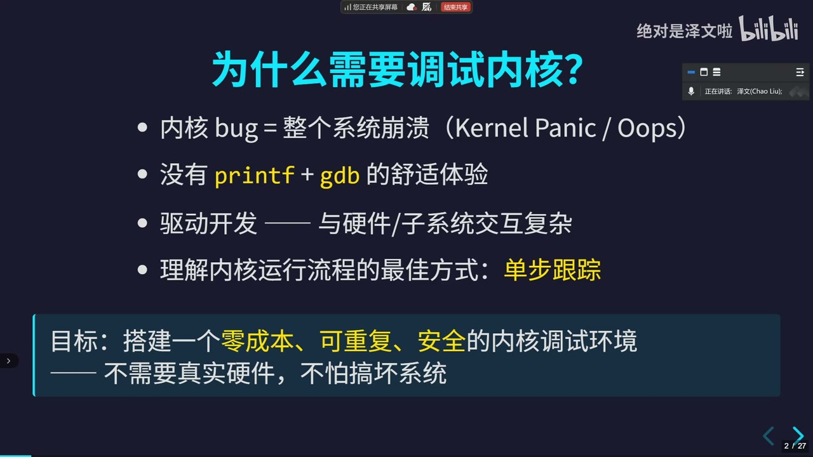

🎥 讲者：
- 内核 bug 可能导致 `Kernel Panic / Oops`
- 没有用户态那种 `printf + gdb` 的舒适体验
- 驱动开发与硬件/子系统交互复杂
- 单步跟踪是理解内核运行流程的最佳方式之一

🧠 我：这一页其实是在回答一个很现实的问题：
- 为什么不靠 `printk` 混过去？

答案是：
- `printk` 更像“插探针看局部”
- `GDB + QEMU` 更像“把系统暂停下来，直接看执行现场”

如果你后面要研究驱动注册、probe、MMIO 访问、中断路径，后者会强很多。

## 2. 调试架构长什么样

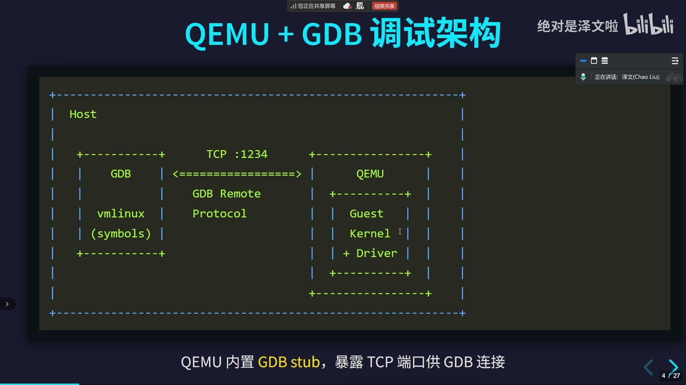

🎥 讲者：
- `QEMU` 内置 `GDB stub`
- 它通过 TCP 端口把 guest kernel 暴露给 host 上的 GDB
- Host 侧 GDB 用 `vmlinux` 符号文件连过去

🧠 我：这张图的关键认知是：
- 你调的不是 “QEMU 自己”
- 你调的是 “QEMU 里跑起来的 guest kernel / driver”

也就是说：
- `QEMU` 负责模拟机器和暴露调试入口
- `GDB` 负责理解 `vmlinux` 和模块符号

这套关系一旦想清楚，后面很多命令就都顺了。

## 3. 内核编译配置是成败关键

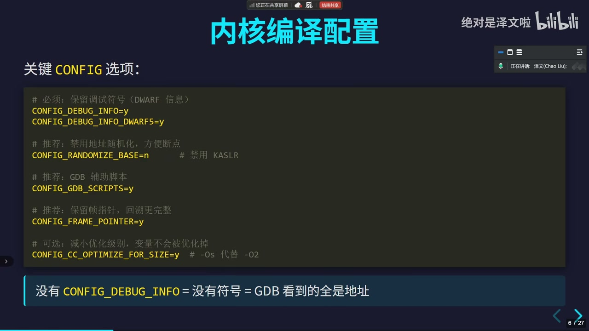

🎥 讲者：关键配置包括：
- `CONFIG_DEBUG_INFO=y`
- `CONFIG_DEBUG_INFO_DWARF5=y`
- `CONFIG_RANDOMIZE_BASE=n`
- `CONFIG_GDB_SCRIPTS=y`
- `CONFIG_FRAME_POINTER=y`
- 可考虑降低优化影响，避免变量被过度优化掉

🧠 我：这页你一定要记牢三件事：

1. 没有 `CONFIG_DEBUG_INFO`，GDB 基本就瞎了  
2. 没关 `KASLR`，断点/地址大概率会飘  
3. 没开 `CONFIG_GDB_SCRIPTS`，Linux 自带的 GDB helper 用不上

✅ 你现在就做：
- 后面你真搭环境时，优先确认这几项，而不是先怀疑 GDB 命令写错了

## 4. QEMU 启动参数怎么配

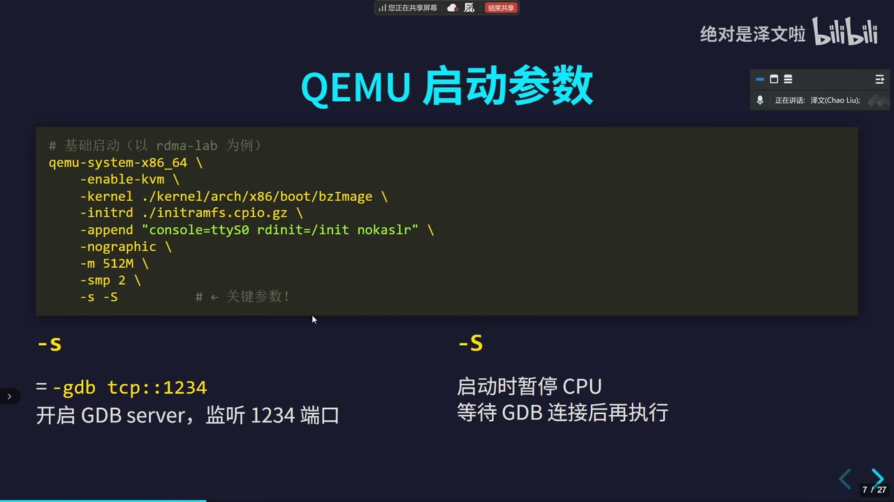

🎥 讲者：示例里重点参数是：
- `-kernel .../bzImage`
- `-initrd ...`
- `-append "console=ttyS0 rdinit=/init nokaslr"`
- `-nographic`
- `-m 512M`
- `-smp 2`
- `-s -S`

🎥 讲者：
- `-s` 等价于开启 GDB server，监听 `1234`
- `-S` 表示启动后先暂停 CPU，等待 GDB 接入

🧠 我：你可以把这页浓缩成一句：

`nokaslr` 让地址稳定，`-s -S` 让你来得及接管现场。

这两个参数是最容易漏、但又最伤调试体验的。

## 5. GDB 连接内核的最小步骤

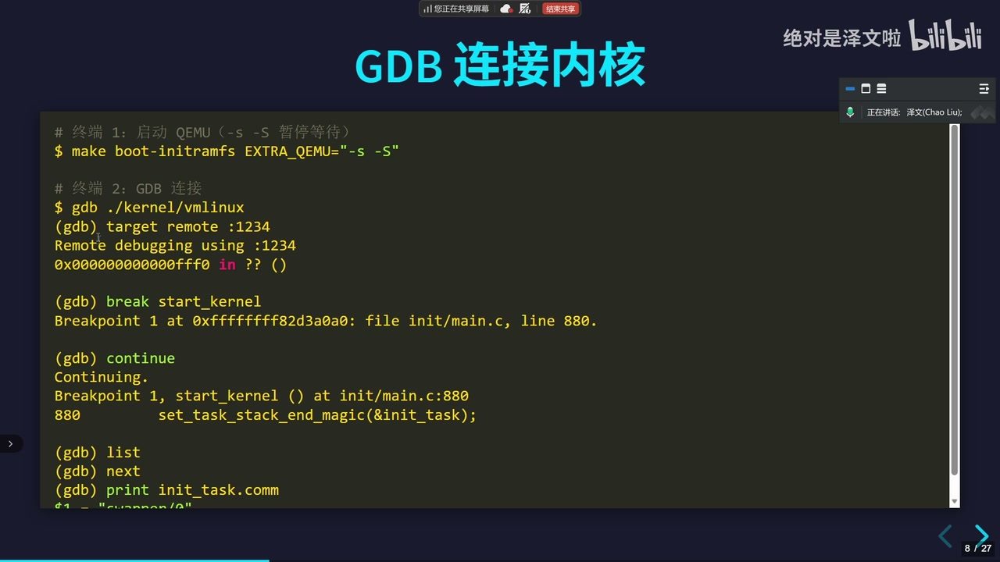

🎥 讲者：典型步骤是：
- 先用 `-s -S` 启动 QEMU
- 再在 host 上执行 `gdb ./kernel/vmlinux`
- `target remote :1234`
- 给 `start_kernel` 下断点
- `continue`

🧠 我：这就是最小可跑链路。

如果你以后只想快速验证“QEMU + GDB 环境通没通”，最小检查标准不是别的，就是：
- 能否 `target remote :1234`
- 能否在 `start_kernel` 断住
- 能否 `list / next / print`

只要这三步通了，你的基础环境就基本通了。

## 6. 调试内核模块时，记住 `add-symbol-file`

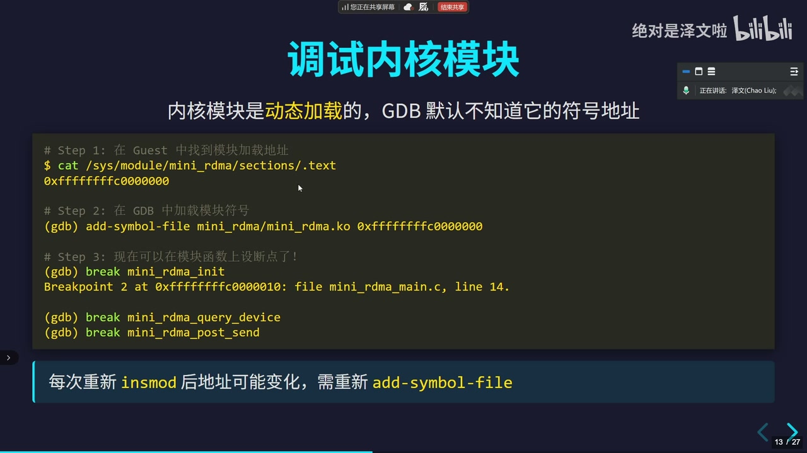

🎥 讲者：模块是动态加载的，GDB 默认不知道模块符号地址。步骤是：
- 在 guest 中查看模块 `.text` 地址
- 在 GDB 里执行 `add-symbol-file mini_rdma/mini_rdma.ko <addr>`
- 再给模块函数下断点

🧠 我：这一页特别重要，因为它解决的是很多人第一次调模块时最容易踩的坑：
- “为什么函数名能补全，但断点就是不准？”

答案通常就是：
- 模块符号没有按真实加载地址重新映射

✅ 你现在就做：
- 以后只要是 `insmod` 的模块，都默认检查一次 `.text` 地址
- 每次重新加载模块后，都假设地址可能变了

## 7. Linux 自带的 GDB 辅助脚本非常值钱

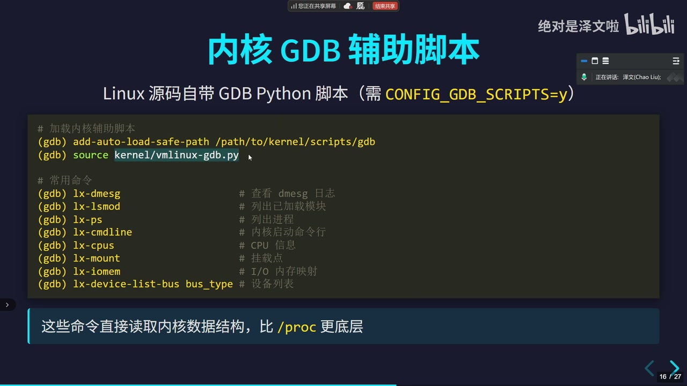

🎥 讲者：
- Linux 源码自带 GDB Python 脚本
- 需要 `CONFIG_GDB_SCRIPTS=y`
- 常用命令包括：
  - `lx-dmesg`
  - `lx-lsmod`
  - `lx-ps`
  - `lx-cmdline`
  - `lx-cpus`
  - `lx-mount`
  - `lx-iomem`

🧠 我：这块你可以把它理解成“GDB 里的内核观察面板”。

它的意义不是少打几条命令，而是：
- 直接从内核内存结构里拿信息
- 很多时候比 `/proc`、`/sys` 更底层
- 系统半死不活时，仍然可能有用

## 8. `ftrace` 适合全局观察，和 GDB 互补

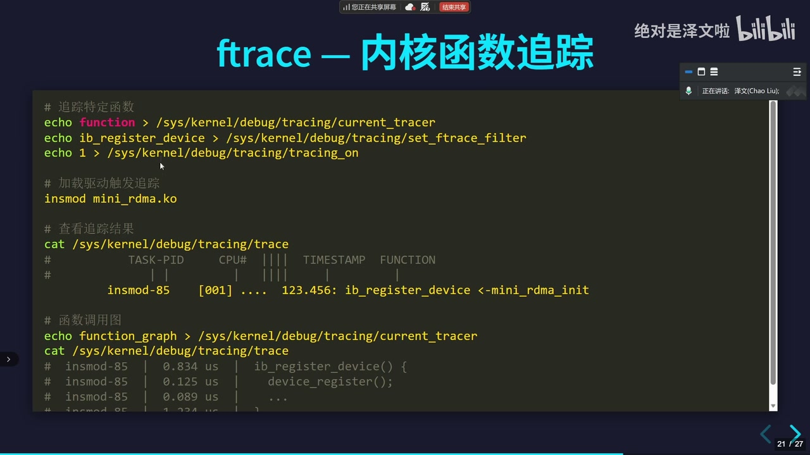

🎥 讲者：
- 可以通过 `current_tracer`
- `set_ftrace_filter`
- `tracing_on`
- `trace`
来指定追踪函数并查看调用结果

🧠 我：这页非常值得你记住一个方法论：

- `GDB` 更适合“断点级、现场级、单步级”问题
- `ftrace` 更适合“全局调用流、性能、行为路径”问题

换句话说：
- 我想看“这个函数为什么这里值不对” -> `GDB`
- 我想看“到底有没有走到这个路径、走了几次、谁调用了谁” -> `ftrace`

## 9. 常见问题与解决

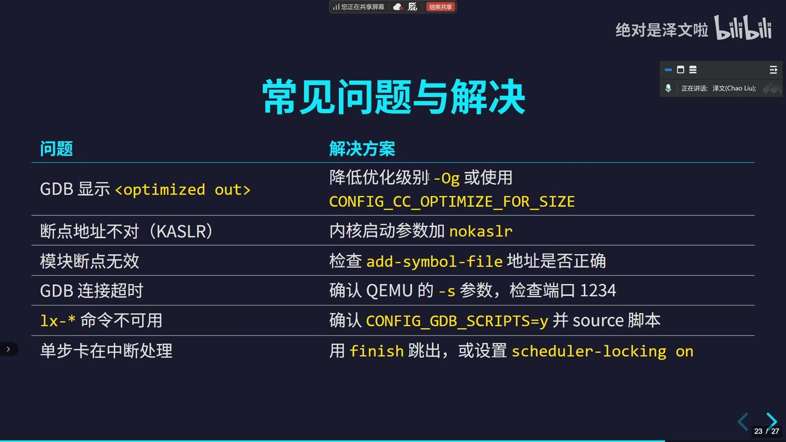

🎥 讲者：视频里列出的典型问题包括：
- `GDB 显示 <optimized out>`
- 断点地址不对（KASLR）
- 模块断点无效
- GDB 连接超时
- `lx-*` 命令不可用
- 单步卡在中断处理

🎥 讲者：对应思路包括：
- 调低优化级别
- 启动参数加 `nokaslr`
- 检查 `add-symbol-file`
- 检查 `-s` 和 `1234` 端口
- 确认 `CONFIG_GDB_SCRIPTS=y`

🧠 我：这页其实就是一份排障 checklist。

后面你只要调试不顺，优先按这个顺序查：
1. 符号有没有
2. 地址稳不稳
3. 模块符号有没有重载
4. GDB 真连上没有
5. helper script 有没有生效

## 10. 推荐工作流

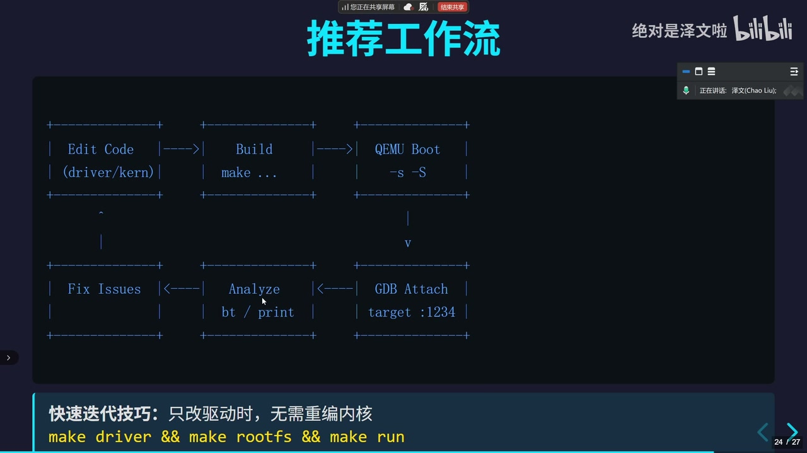

🎥 讲者：推荐的循环是：
- Edit Code
- Build
- QEMU Boot
- GDB Attach
- Analyze
- Fix Issues

而且只改驱动时，可以只重构建驱动和 rootfs，不一定每次都重编内核。

🧠 我：这张图是整条视频里最工程化的一页。

它告诉你的不是“怎么调一次”，而是“怎么持续调很多次”。

你后面做训练营项目时，真正拉开效率差距的往往不是会不会下断点，而是：
- 你是不是有稳定可复现的工作流
- 你是不是知道改驱动时不必每次重编内核

## 11. 讲者最终总结

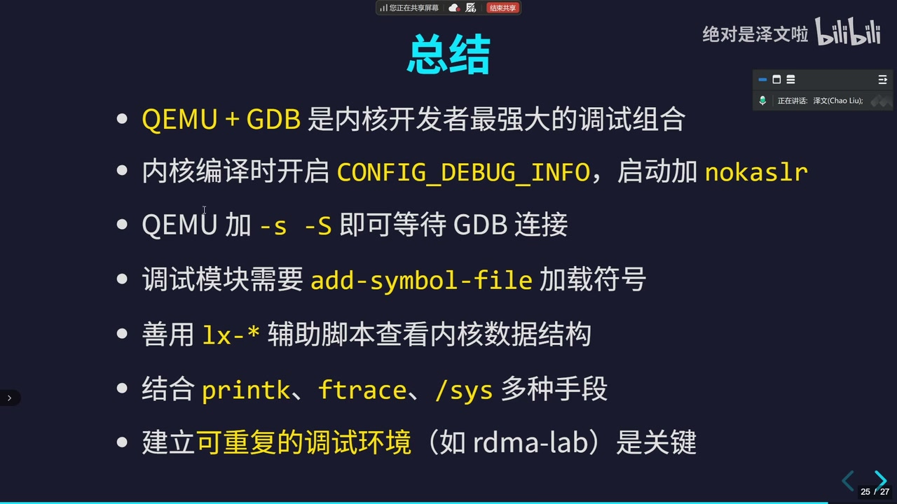

🎥 讲者总结要点：
- `QEMU + GDB` 是很强的内核调试组合
- 编译时开 `CONFIG_DEBUG_INFO`
- 启动时加 `nokaslr`
- QEMU 用 `-s -S`
- 模块调试用 `add-symbol-file`
- 善用 `lx-*`
- 配合 `printk`、`ftrace`、`/sys`
- 建立可重复调试环境很关键

🧠 我：我完全赞同最后一点。

对长期做底层开发的人来说，最有复利的不是某个单一命令，而是：
- 你能否把调试环境做成“别人一条命令也能复现”
- 你能否把构建、启动、调试接入脚本化

这也是为什么视频里 `rdma-lab` 这个思路很值得借。

## 12. 这条视频对你最有价值的学习点

🧠 我：结合你的背景，我觉得这条视频最值得你吸收的是这 5 件事：

1. 调试内核时，`QEMU + GDB` 不只是教学方案，也完全可以是日常开发方案。
2. `内核本体` 和 `内核模块` 的符号处理方式不一样，模块一定要记住 `add-symbol-file`。
3. `GDB` 和 `ftrace` 不是替代关系，而是互补关系。
4. 一定要追求可复现调试环境，不要靠临时手敲命令。
5. 你后面做 QEMU/驱动项目时，应该尽早把“构建-启动-调试”做成脚本和模板。

## 13. VS Code + QEMU 可以直接调吗？

🧠 我：可以，而且是我比较推荐你的路线之一。

更准确地说：
- `QEMU` 负责提供 `gdbstub`
- `GDB` 负责连接和解释 `vmlinux` / 模块符号
- `VS Code` 负责当一个更舒服的 GDB 前端

### 最实用的结论

🧠 我：
- 能直接调
- 但本质上不是 “VS Code 直接调 QEMU”
- 而是 “VS Code 通过 GDB 去调 QEMU 里暂停的 guest kernel”

### 我建议的搭配

🧠 我：
- 日常源码单步：`VS Code + GDB + QEMU`
- 函数调用链/trace 可视化：`ftrace + KernelShark`
- 轻量级浏览器前端：`gdbgui`

### 你最可能喜欢的工作方式

🧠 我：如果是你这种既想学明白、又想后面做项目的人，我建议：
- 编辑器用 `VS Code`
- 目标内核用 `QEMU -s -S`
- 调试入口走 `GDB`
- 内核数据结构观察走 `vmlinux-gdb.py`
- 行为流分析走 `ftrace`
- 需要图形化 trace 再上 `KernelShark`

### 为什么我推荐这个组合

🧠 我：
- `VS Code` 适合看源码、断点、变量、调用栈
- `GDB helper` 适合看内核对象
- `KernelShark` 适合看 trace 时间线和函数流
- 这几样拼起来，比纯命令行舒服很多，也比只靠 IDE 更贴近内核开发的真实工作方式

## 14. 可视化工具我怎么建议你选

🧠 我：如果你问“有没有更好的可视化工具”，我会按用途分：

### A. 代码级调试界面

优先：
- `VS Code C/C++ Debug`

适合：
- 源码断点
- 单步
- watch
- call stack
- 线程/栈帧查看

### B. Trace 可视化

优先：
- `KernelShark`

适合：
- 分析 `ftrace` / `trace-cmd` 结果
- 看时间线、函数流、调度行为

### C. 轻量 GDB UI

可选：
- `gdbgui`

适合：
- 你想要比纯终端更舒服，但又不想整套 IDE 工作流的时候

## 15. 我给你的最终建议

🧠 我：如果你后面真要把这套东西长期用起来，我建议分两步走：

1. 先把 `QEMU + GDB + Linux helper script` 跑通  
2. 再把它接到 `VS Code` 里，最后按需要补 `KernelShark`

原因很简单：
- 先跑通底层链路，能确保你不是“IDE 看起来很高级，但底层其实没通”
- 再上 VS Code，你就知道它只是前端，不会被界面牵着走

✅ 你现在就做：
- 先把这条视频里的最小链路吃透
- 后面如果你愿意，我可以直接帮你在这个仓库里给你搭一版
  - `QEMU + GDB`
  - `VS Code launch.json / tasks.json`
  - 可选的 `KernelShark` / `trace-cmd` 工作流

## 16. 官方参考链接

这些是我额外核对过、后面很值得你直接看的资料：

- VS Code C/C++ 调试文档  
  `https://code.visualstudio.com/docs/cpp/cpp-debug`
- QEMU 官方 GDB 文档  
  `https://www.qemu.org/docs/master/system/gdb.html`
- Linux Kernel 官方 GDB 调试文档  
  `https://docs.kernel.org/process/debugging/gdb-kernel-debugging.html`
- KernelShark 官方站点  
  `https://kernelshark.org/`
- gdbgui 官方站点  
  `https://www.gdbgui.com/`

---

## 附：这份笔记用到的关键截图

- `frame-0004.jpg` 为什么需要调试内核
- `frame-0016.jpg` QEMU + GDB 调试架构
- `frame-0021.jpg` 内核编译配置
- `frame-0033.jpg` QEMU 启动参数
- `frame-0041.jpg` GDB 连接内核
- `frame-0060.jpg` 调试内核模块
- `frame-0074.jpg` 内核 GDB 辅助脚本
- `frame-0093.jpg` ftrace 内核函数追踪
- `frame-0100.jpg` 常见问题与解决
- `frame-0106.jpg` 推荐工作流
- `frame-0110.jpg` 总结

## 附：原始素材位置

仅供追溯，不建议平时直接依赖这些中间文件：
- 视频缓存：`V:\CodexHome\tmp\video-study\BV14NAPzjEPW\BV14NAPzjEPW.mp4`
- 音频：`V:\CodexHome\tmp\video-study\BV14NAPzjEPW\audio.wav`
- 转写：`V:\CodexHome\tmp\video-study\BV14NAPzjEPW\transcript.txt`
- 转写 JSON：`V:\CodexHome\tmp\video-study\BV14NAPzjEPW\transcript.segments.json`
- 抽帧：`V:\CodexHome\tmp\video-study\BV14NAPzjEPW\frames`
- OCR：`V:\CodexHome\tmp\video-study\BV14NAPzjEPW\ocr`
