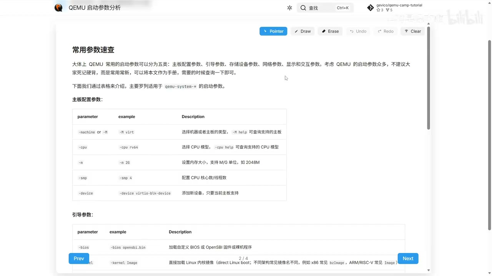
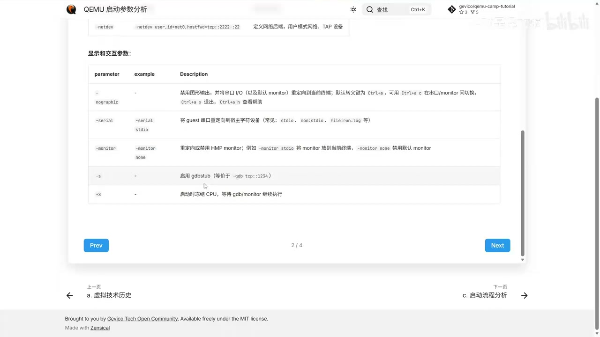
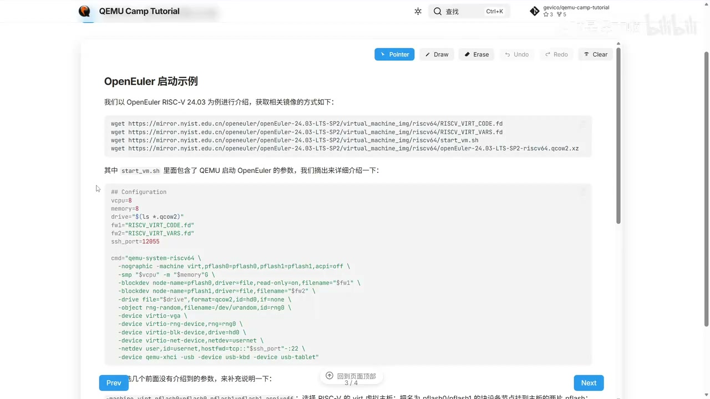
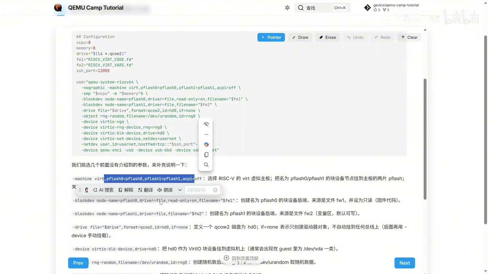
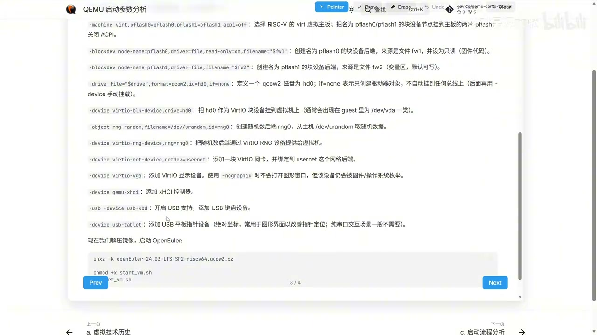
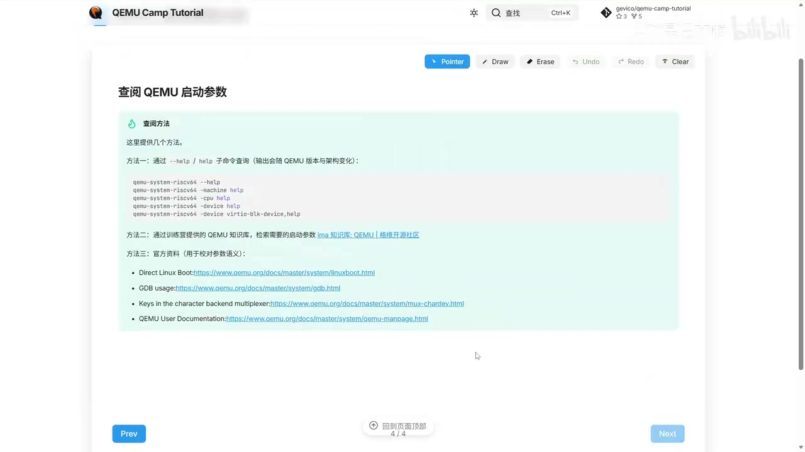

# QEMU 启动参数分析学习资料

来源：
- 视频：`https://www.bilibili.com/video/BV1aVwMzYE8a`
- 配套讲义：`https://qemu.gevico.online/tutorial/2026/ch1/qemu-startup-param/`
- 主题：`基础阶段 / 启动参数分析`

阅读说明：
- `🎥 视频/作者`：讲者在视频里重点讲了什么
- `📘 讲义`：网页文档里可以直接当手册查的内容
- `🧠 我的理解`：我替你提炼的真正重点
- `✅ 你现在就做`：你学这一章时最值得立刻动手的部分

## 一句话结论

🎥 视频/作者：这一章不是让你背完所有 QEMU 参数，而是建立一个“参数分层 + 查阅方法 + 启动脚本组织方式”的整体认知。

📘 讲义：整章围绕 4 件事展开：
- 常用参数速查
- OpenEuler RISC-V 启动示例
- 启动脚本/配置组织方式
- 如何查阅 QEMU 参数

🧠 我的理解：这一章最重要的不是“知道多少参数”，而是知道：
- 一条 QEMU 启动命令是在拼一台什么机器
- 参数应该按什么层次去看
- 遇到陌生参数时该怎么自查

## 本章结构

1. 五类常用启动参数
2. OpenEuler RISC-V 启动示例
3. 启动脚本是怎么组织的
4. 怎么自己查参数，不靠死记硬背

## 1. 五类常用参数



🎥 视频/作者：讲者把常用参数分成 5 类：
- 主板配置参数
- 引导参数
- 存储设备参数
- 网络参数
- 显示和交互参数

📘 讲义：文档明确建议把这页当“手册”用，而不是硬背。这里给了很多典型参数，例如：
- `-machine` / `-M`
- `-cpu`
- `-m`
- `-smp`
- `-device`
- `-bios`
- `-kernel`
- `-initrd`
- `-append`
- `-drive`
- `-netdev`
- `-nographic`
- `-serial`
- `-monitor`
- `-s`
- `-S`

🧠 我的理解：这 5 类其实可以再压缩成 3 层思维：
- “机器长什么样”：
  - `-machine`
  - `-cpu`
  - `-m`
  - `-smp`
  - `-device`
- “怎么启动系统”：
  - `-bios`
  - `-kernel`
  - `-initrd`
  - `-append`
- “怎么和它交互/调试”：
  - `-nographic`
  - `-serial`
  - `-monitor`
  - `-s`
  - `-S`

🧠 我的理解：如果你以后做内核/驱动/QEMU 相关开发，最常碰到的不是“所有参数平均使用”，而是：
- `-machine/-cpu/-m/-smp`
- `-kernel/-append`
- `-device/-drive/-netdev`
- `-nographic/-serial/-monitor`
- `-s/-S`

✅ 你现在就做：
- 先把上面这几个高频参数熟悉起来，不用追求全记住。
- 把“参数”理解成硬件装配和启动链控制，不要把它们当零散选项表。

## 2. 你最该记住的几类参数

### 主板与硬件配置

🎥 视频/作者：
- `-machine virt`：选择机器/主板类型
- `-cpu rv64` 这类参数：选择 CPU 模型/特性
- `-m 2G`：设置内存大小
- `-smp 4`：设置 CPU 核心数
- `-device virtio-blk-device`：添加设备

🧠 我的理解：这一组参数决定的是“虚拟机的硬件轮廓”。你可以把它当成：
- 先选板子
- 再选 CPU
- 再插内存
- 再挂设备

🧠 我的理解：这和驱动开发里“先明确平台、总线、设备枚举关系”很像。你以后看到一大串启动命令，先别慌，先把它按这层拆开。

### 引导参数

🎥 视频/作者：
- `-bios`：加载 BIOS / OpenSBI / 固件
- `-kernel`：直接加载 Linux 内核镜像
- `-initrd`：指定 initramfs / initrd
- `-append`：传 kernel command line

🧠 我的理解：这组参数控制的是“guest 从哪开始启动”。尤其是：
- 做裸机/固件链路时，`-bios` 很重要
- 做 Linux 内核快速调试时，`-kernel + -append` 很重要

🧠 我的理解：你后面只要做内核 bring-up、驱动验证、最小 rootfs 启动，这一组一定会高频出现。

### 显示与交互参数



🎥 视频/作者：
- `-nographic`：禁用图形输出，把串口 I/O 和默认 monitor 重定向到终端
- `Ctrl+a c`：串口和 monitor 之间切换
- `Ctrl+a x`：退出 QEMU
- `Ctrl+a h`：查看帮助
- `-serial stdio`：把 guest 串口接到宿主字符设备
- `-monitor none`：禁用默认 monitor
- `-s`：启用 gdbstub
- `-S`：启动时先冻结 CPU，等调试器接入

🧠 我的理解：这是最“工程上立刻能救命”的一组。

🧠 我的理解：如果你后面做的是内核启动、驱动调试、QEMU 模型验证，那这组参数的价值通常比图形界面还大。因为它决定了：
- 你能不能看见启动日志
- 你能不能切到 monitor 看状态
- 你能不能挂 GDB 调试 guest

✅ 你现在就做：
- 把 `Ctrl+a c / x / h` 记住。
- 以后所有纯终端场景，优先理解 `-nographic + -serial + -monitor + -s + -S` 这一组。

## 3. OpenEuler RISC-V 启动示例



🎥 视频/作者：讲者以 `OpenEuler RISC-V 24.03` 为例，给出了一套完整可跑的启动方案，并说明需要的几个文件：
- `RISCV_VIRT_CODE.fd`
- `RISCV_VIRT_VARS.fd`
- `start_vm.sh`
- `openEuler-24.03-LTS-SP2-riscv64.qcow2.xz`

📘 讲义：网页文档里直接给了 `wget` 下载方式和示例脚本入口。

🧠 我的理解：这部分不是让你盯着“OpenEuler”本身，而是让你学会一个范式：
- 固件文件
- 变量区
- 磁盘镜像
- 启动脚本
- QEMU 命令本体

🧠 我的理解：以后你换成别的系统、别的 rootfs、别的板级仿真时，思路仍然是这一套。

## 4. 启动脚本怎么读



🎥 视频/作者：示例脚本把配置和命令拼装拆开了，先定义变量，再拼成 `qemu-system-riscv64` 启动命令。

📘 讲义：脚本里关键变量包括：

```bash
vcpu=8
memory=8
drive="$(ls *.qcow2)"
fw1="RISCV_VIRT_CODE.fd"
fw2="RISCV_VIRT_VARS.fd"
ssh_port=12055
```

然后再组织成一条主命令，大致包含这些关键段落：

```bash
qemu-system-riscv64 \
  -nographic \
  -machine virt,pflash0=pflash0,pflash1=pflash1,acpi=off \
  -smp "$vcpu" -m "${memory}G" \
  -blockdev ... \
  -drive ... \
  -object rng-random,... \
  -device virtio-vga \
  -device virtio-rng-device,... \
  -device virtio-blk-device,... \
  -device virtio-net-device,... \
  -netdev user,id=usernet,hostfwd=tcp::${ssh_port}-:22
```

🧠 我的理解：读这种脚本时，不要从左到右逐字符看。最好的方法是先分层：

1. 环境/变量层
   - 有几个文件
   - 内存和 CPU 怎么配
   - 端口怎么配
2. 机器层
   - `-machine`
   - `-smp`
   - `-m`
3. 块设备/固件层
   - `-blockdev`
   - `-drive`
4. 外设层
   - `-device`
   - `-object`
5. 网络与交互层
   - `-netdev`
   - `-nographic`

🧠 我的理解：一旦你这样拆，你就会发现 QEMU 启动脚本本质上是在“声明一台虚拟机器”，而不是单纯拼命令行。

## 5. 这几个参数为什么关键



🎥 视频/作者：讲者专门挑了几个前面没展开的参数继续解释，比如：
- `-machine virt,pflash0=pflash0,pflash1=pflash1,acpi=off`
- `-blockdev node-name=pflash0,...`
- `-blockdev node-name=pflash1,...`
- `-drive file=...,if=none`
- `-device virtio-blk-device,drive=hd0`
- `-object rng-random,...`

🧠 我的理解：这里最值钱的是 3 个建模思路。

🧠 我的理解：
1. `if=none`
   - 只创建后端对象
   - 暂时不挂总线
   - 后面再用 `-device` 手动接上

2. `-blockdev / -drive / -device`
   - 后端资源
   - 驱动器/镜像对象
   - 前端设备
   - 这三者是分层的，不是一个东西

3. `pflash0/pflash1`
   - 你不是简单“加载个文件”
   - 而是在把固件/变量区挂到主板对应的 flash 槽位上

🧠 我的理解：这也是很多人一开始最容易糊涂的点。看起来都是“加个文件”，其实语义完全不同：
- 有的是固件
- 有的是变量区
- 有的是磁盘镜像
- 有的是一个设备实例

✅ 你现在就做：
- 重点吃透 `if=none` 和 “后端对象 -> 前端设备”的关系。
- 以后看到复杂 QEMU 命令时，先问自己：这段是在“创建资源”，还是在“挂设备”。

## 6. 怎么自己查参数



🎥 视频/作者：讲者给了 3 种查阅方式：
- 命令行 `--help / help`
- 训练营知识库
- QEMU 官方文档

📘 讲义：文档里给的几个典型查询命令是：

```bash
qemu-system-riscv64 --help
qemu-system-riscv64 -machine help
qemu-system-riscv64 -cpu help
qemu-system-riscv64 -device help
qemu-system-riscv64 -device virtio-blk-device,help
```

📘 讲义：同时还给了几个官方资料入口：
- Direct Linux Boot
- GDB usage
- Keys in the character backend multiplexer
- QEMU User Documentation

🧠 我的理解：这是整章最重要的一页。

🧠 我的理解：因为真实开发里，最常见的不是“我完全不知道参数”，而是：
- 我知道大概有这么个参数
- 但不确定当前版本支持什么
- 不确定当前架构支持什么
- 不确定具体设备有哪些子参数

🧠 我的理解：这时候最靠谱的顺序是：
1. 先用当前机器上的 `qemu-system-xxx --help`
2. 再用 `-machine help / -cpu help / -device help`
3. 最后拿官方文档核对语义

🧠 我的理解：讲者在视频里特地强调了一点，这些输出会随 `QEMU 版本` 和 `架构` 变化，所以要查你当前安装的版本，而不是背别人的截图。

✅ 你现在就做：
- 以后别第一反应去搜旧博客。
- 第一反应应该是：`--help`、子命令 `help`、当前版本官方文档。

## 7. 这章真正想让你建立什么能力

🎥 视频/作者：讲者最后的结论是，不要死记硬背，而是把讲义当成手册，按需查询。

🧠 我的理解：这章真正训练的是 4 个能力：
- 看懂一条 QEMU 启动命令的层次结构
- 知道不同类别参数分别控制什么
- 知道如何把一个系统镜像真正启动起来
- 知道如何在自己环境里查询参数

🧠 我的理解：这对你后面的价值非常直接。因为你再往后学：
- 启动流程
- QOM
- MemoryRegion
- 外设建模

这些都默认你已经能看懂启动命令，不会被命令行本身绊住。

## 8. 你现在最该记住的最小清单

✅ 你现在就做：
- 记住五类参数的划分，不用背全表。
- 重点熟悉：
  - `-machine`
  - `-cpu`
  - `-m`
  - `-smp`
  - `-device`
  - `-kernel`
  - `-append`
  - `-nographic`
  - `-serial`
  - `-monitor`
  - `-s`
  - `-S`
- 会看一个真实的 `start_vm.sh`
- 会用 `--help`、`-device help` 这类方式自查

## 9. 我建议你怎么学这一章

🧠 我的理解：按你的基础，我建议这样学，不要只看完就算：

1. 先把这份笔记完整读一遍
2. 再打开网页文档，自己顺着表格看一遍
3. 手动把启动示例按层拆开
4. 自己解释一遍：
   - 哪些参数在定义机器
   - 哪些参数在定义启动链
   - 哪些参数在定义设备
   - 哪些参数在定义交互/调试
5. 最后去终端上跑：

```bash
qemu-system-riscv64 --help
qemu-system-riscv64 -machine help
qemu-system-riscv64 -cpu help
qemu-system-riscv64 -device help
qemu-system-riscv64 -device virtio-blk-device,help
```

🧠 我的理解：如果你能做到“看到一条长启动命令，不再觉得它是一坨字符串”，那这一章就学到了。

## 10. 最小练习

✅ 你现在就做：
1. 从文档里抄出 `start_vm.sh` 的主命令。
2. 把它按下面格式重新整理一遍：
   - 机器配置
   - 固件配置
   - 磁盘配置
   - 外设配置
   - 网络配置
   - 交互/显示配置
3. 对每一段写一句话解释它在干什么。
4. 标出你最不懂的 3 个参数，下一轮直接丢给我。

## 11. 下一章怎么接

🧠 我的理解：这一章之后，最自然的下一步就是：
- `启动流程分析`

因为参数分析解决的是“你怎么把机器配出来”，而启动流程分析解决的是“QEMU 收到这些参数之后，内部到底怎么启动起来”。

这两章最好连着学，效果会明显更好。

---

## 附：这份学习资料的中间素材

仅作追溯，不建议平时直接看：
- 视频缓存：`V:\CodexHome\tmp\video-study\BV1aVwMzYE8a\BV1aVwMzYE8a.mp4`
- 语音转写：`V:\CodexHome\tmp\video-study\BV1aVwMzYE8a\transcript.txt`
- 转写分段：`V:\CodexHome\tmp\video-study\BV1aVwMzYE8a\transcript.segments.json`
- 网页抓取：`V:\CodexHome\tmp\video-study\BV1aVwMzYE8a\qemu-startup-param.html`
- 网页抽取：`V:\CodexHome\tmp\video-study\BV1aVwMzYE8a\doc.extracted.txt`
